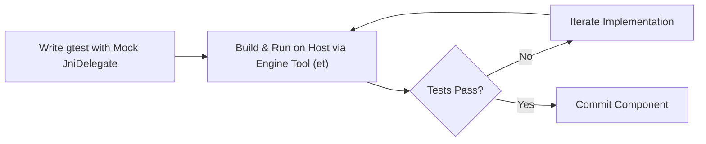

# Host-Executable Embedder Unit Tester Skill

A major architectural innovation of **RFC 410.0000** is the introduction of `JniRouter`, `JniDelegate`, and `JvmInvoker` with injectable provider interfaces:
- `FlutterJniProvider`
- `HardwareBufferProvider`
- `SurfaceControlProvider`
- `SurfaceTransactionProvider`
- `ChoreographerProvider`

By decoupling outbound C++-to-Java JNI invocations from live Android `JNIEnv*` state, the entire C-API Android embedder (`flutter_embedder_native_unittests`) can be executed directly on the host development machine without an Android device or emulator.

## Host TDD Workflow



### 1. Test Harness Pattern

```cpp
#include <gtest/gtest.h>
#include "flutter/shell/platform/android/android_surface_control.h"
#include "flutter/shell/platform/android/testing/mock_jni_delegate.h"

TEST(AndroidSurfaceControlTest, SynchronousSurfaceDestructionContract) {
  auto mock_jni = std::make_shared<MockJniDelegate>();
  FlutterEngineProcTable mock_proc_table = {};
  
  bool notify_destroyed_called = false;
  mock_proc_table.NotifyDestroyed = [](FlutterEngine engine) -> FlutterEngineResult {
    return kSuccess;
  };

  AndroidSurfaceControl surface_control(mock_jni, mock_proc_table);
  surface_control.OnSurfaceCreated(/*view_id=*/0, /*native_window=*/nullptr);
  
  // Verify synchronous destruction
  EXPECT_TRUE(surface_control.OnSurfaceDestroyed(/*view_id=*/0));
}
```

### 2. Executing Host Unit Tests

Execute the host test target using the Engine Tool (`et`):
```bash
# Compile and run host unit tests:
et test -c host_debug_unopt //flutter/shell/platform/android:flutter_embedder_native_unittests

# Run a specific filter:
et test -c host_debug_unopt //flutter/shell/platform/android:flutter_embedder_native_unittests --gtest_filter="AndroidSurfaceControlTest.*"
```

Running on host Linux takes ~1.5 seconds, providing an immediate feedback loop for pair programming with an LLM.
