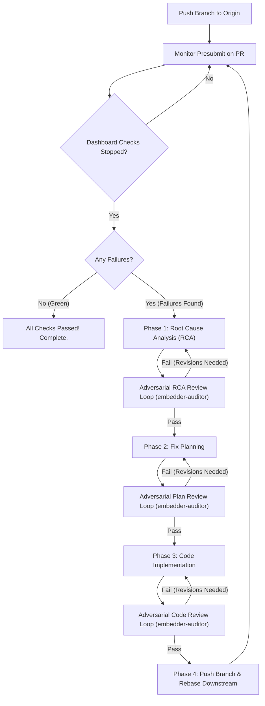

# Presubmit Monitor & Remediation Loop Skill

This skill automates the full lifecycle of monitoring CI presubmits, detecting builder failures, performing rigorous root cause analyses (RCA), and executing an adversarial remediation cycle across stacked git branches until all dashboard checks turn green.

## Architectural State Machine



---

## The Workflow

### Phase 1: Monitor Presubmit on PR `<PR_NUM>`
1. Resolve the commit SHA associated with the pull request:
   ```bash
   gh pr view <PR_NUM> --json headRefOid -q .headRefOid
   ```
2. Monitor all LUCI / Buildbucket and Cocoon builds using the automated CLI tool:
   ```bash
   dart .agents/skills/presubmit-monitor-loop/scripts/presubmit_monitor_loop.dart <PR_NUM>
   ```
3. Wait until `Dashboard Checks` stops (all builds completed, `runningCount == 0`).
4. If `failureCount == 0`: Presubmit is **GREEN**. Conclude monitoring and notify user.
5. If `failureCount > 0`: Collect all failing builders, failed steps, and raw LUCI log URLs.

---

### Phase 2: Root Cause Analysis (RCA) & Adversarial Review
1. **Analyze Failures**:
   - For each failing builder, retrieve the raw stdout/stderr logs from Buildbucket.
   - Deterministically categorize failures into distinct technical root causes (e.g. compiler error, linter violation, missing asset resolver, runtime test timeout, host environment flake).
2. **Draft RCA Artifact**:
   - Write comprehensive RCA document in the artifact directory (`rca_presubmit_<PR_NUM>_<TIMESTAMP>.md`).
   - Include complete build accounting, failing step names, raw log excerpts, and identified culprit source files.
3. **Adversarial RCA Review Loop**:
   - Spawn an independent adversarial reviewer subagent (`embedder-auditor`):
     ```text
     Conduct an adversarial review of the Root Cause Analysis (RCA) artifact at:
     file:///.../rca_presubmit_<PR_NUM>_<TIMESTAMP>.md

     Verify:
     1. Does the RCA account for every failing build?
     2. Are the identified failure mechanisms supported by compiler or runtime logs?
     3. Are the culprit source files and target branch mappings accurate?
     Provide verdict: [PASS] or [FAIL] with itemized feedback.
     ```
   - If the reviewer returns `[FAIL]`, refine the RCA and re-submit for review. Repeat until `[PASS]`.

---

### Phase 3: Fix Planning & Adversarial Review
1. **Develop Fix Plan**:
   - For every approved root cause, construct a concrete, minimal remediation.
   - Assign each fix to the earliest topologically appropriate branch in the stack.
   - Specify local verification commands (e.g., NDK compile, host unit tests, `dev/bots/analyze.dart`, `et format`).
   - Save plan artifact (`plan_presubmit_<PR_NUM>_<TIMESTAMP>.md`).
2. **Adversarial Plan Review Loop**:
   - Spawn independent reviewer subagent (`embedder-auditor`):
     ```text
     Conduct an adversarial review of the remediation plan at:
     file:///.../plan_presubmit_<PR_NUM>_<TIMESTAMP>.md

     Verify:
     1. Does the plan address all root causes without introducing regressions?
     2. Does it maintain repository invariants and compile firewalls?
     3. Is the cascading rebase sequence topologically sound?
     Provide verdict: [PASS] or [FAIL] with itemized feedback.
     ```
   - If `[FAIL]`, adjust the plan until `[PASS]`.

---

### Phase 4: Code Implementation & Adversarial Review
1. **Implement Fixes**:
   - Checkout the target branch in the stack.
   - Apply the approved code modifications.
   - Run formatting (`et format` or `dart format`).
   - Run local unit tests and static analysis.
   - Commit changes to the branch (`git commit --amend` or new commit).
2. **Adversarial Code Review Loop**:
   - Provide full git diff of modified files to `embedder-auditor`:
     ```text
     Conduct an adversarial code review of the changes on branch <BRANCH_NAME>:
     Verify:
     1. Compliance with coding standards, memory safety, and thread invariants.
     2. Absence of memory or file descriptor leaks.
     3. Adherence to GN compile firewalls and no-prototype rules.
     Provide verdict: [PASS] or [FAIL].
     ```
   - If `[FAIL]`, fix the code and re-review until `[PASS]`.

---

### Phase 5: Push Branch & Cascade Rebase
1. **Cascade Downstream Rebase**:
   - Rebase all downstream branches in the stack onto the updated parent branch:
     ```bash
     dart .agents/skills/pr-chain-manager/scripts/pr_chain.dart rebase
     ```
2. **Verify Stack Alignment**:
   ```bash
   dart .agents/skills/pr-chain-manager/scripts/pr_chain.dart verify
   ```
3. **Push to Origin with Lease**:
   ```bash
   dart .agents/skills/pr-chain-manager/scripts/pr_chain.dart push
   ```

---

### Phase 6: Repeat Loop
1. Automatically return to **Phase 1** with the newly pushed commit SHA.
2. Continue the presubmit monitoring loop until presubmit is **GREEN**.
