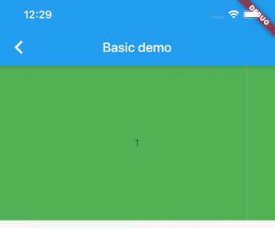
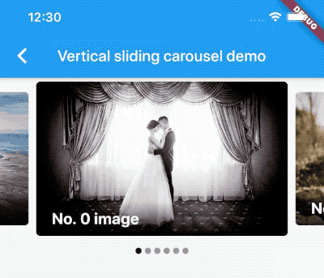
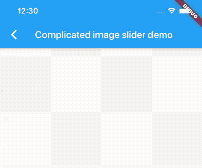

# carousel_slider

A carousel slider widget.

## Features 

* Infinite scroll 
* Custom child widgets
* Auto play

## Supported platforms

* Flutter Android
* Flutter iOS
* Flutter web
* Flutter desktop

## Live preview

https://serenader2014.github.io/flutter_carousel_slider/#/

Note: this page is built with flutter-web. For a better user experience, please use a mobile device to open this link.

## Installation

Add `carousel_slider: ^4.2.1` to your `pubspec.yaml` dependencies. And import it:

```dart
import 'package:carousel_slider/carousel_slider.dart';
```

## How to use

Simply create a `CarouselSlider` widget, and pass the required params:

```dart
CarouselSlider(
  options: CarouselOptions(height: 400.0),
  items: [1,2,3,4,5].map((i) {
    return Builder(
      builder: (BuildContext context) {
        return Container(
          width: MediaQuery.of(context).size.width,
          margin: EdgeInsets.symmetric(horizontal: 5.0),
          decoration: BoxDecoration(
            color: Colors.amber
          ),
          child: Text('text $i', style: TextStyle(fontSize: 16.0),)
        );
      },
    );
  }).toList(),
)
```

## Params

```dart

CarouselSlider(
   items: items,
   options: CarouselOptions(
      height: 400,
      aspectRatio: 16/9,
      viewportFraction: 0.8,
      initialPage: 0,
      enableInfiniteScroll: true,
      reverse: false,
      autoPlay: true,
      autoPlayInterval: Duration(seconds: 3),
      autoPlayAnimationDuration: Duration(milliseconds: 800),
      autoPlayCurve: Curves.fastOutSlowIn,
      enlargeCenterPage: true,
      enlargeFactor: 0.3,
      onPageChanged: callbackFunction,
      scrollDirection: Axis.horizontal,
   )
 )
```

Since `v2.0.0`, you'll need to pass the options to `CarouselOptions`. For each option's usage you can refer to [carousel_options.dart](./lib/carousel_options.dart).

**If you pass the `height` parameter, the `aspectRatio` parameter will be ignored.**

## Build item widgets on demand

This method will save memory by building items once it becomes necessary. This way they won't be built if they're not currently meant to be visible on screen.
It can be used to build different child item widgets related to content or by item index.

```dart

CarouselSlider.builder(
  itemCount: 15,
  itemBuilder: (BuildContext context, int itemIndex, int pageViewIndex) =>
    Container(
      child: Text(itemIndex.toString()),
    ),
)
```

## Carousel controller

In order to manually control the pageview's position, you can create your own `CarouselController`, and pass it to `CarouselSlider`. Then you can use the `CarouselController` instance to manipulate the position.

```dart 
class CarouselDemo extends StatelessWidget {
  CarouselController buttonCarouselController = CarouselController();

 @override
  Widget build(BuildContext context) => Column(
    children: <Widget>[
      CarouselSlider(
        items: child,
        carouselController: buttonCarouselController,
        options: CarouselOptions(
          autoPlay: false,
          enlargeCenterPage: true,
          viewportFraction: 0.9,
          aspectRatio: 2.0,
          initialPage: 2,
        ),
      ),
      RaisedButton(
        onPressed: () => buttonCarouselController.nextPage(
            duration: Duration(milliseconds: 300), curve: Curves.linear),
        child: Text('→'),
      )
    ]
  );
}
```

### `CarouselController` methods

#### `.nextPage({Duration duration, Curve curve})`

Animate to the next page

#### `.previousPage({Duration duration, Curve curve})`

Animate to the previous page

#### `.jumpToPage(int page)`

Jump to the given page.

#### `.animateToPage(int page, {Duration duration, Curve curve})`

Animate to the given page.

## Screenshot

Basic text carousel demo:



Basic image carousel demo:


A more complicated image carousel slider demo:


Fullscreen image carousel slider demo:


Image carousel slider with custom indicator demo:



Custom `CarouselController` and manually control the pageview position demo:


Vertical carousel slider demo:


Simple on-demand image carousel slider, with image auto prefetch demo:



No infinite scroll demo:


All screenshots above can be found at the example project.

## License

MIT
