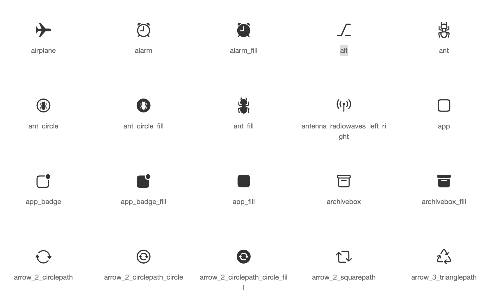

# Cupertino Icons

This is an asset repo containing the default set of icon assets used by
Flutter's [Cupertino widgets](https://github.com/flutter/flutter/tree/master/packages/flutter/lib/src/cupertino).

# Usage

https://pub.dev/packages/cupertino_icons

[](https://pub.dev/packages/cupertino_icons)

```yaml
dependencies:
  cupertino_icons: ^<latest-version>
```

# Issues

For issues, file directly in the [main Flutter repo](https://github.com/flutter/flutter).

# Icons

[](https://api.flutter.dev/flutter/cupertino/CupertinoIcons-class.html)

For a list of all icons, see
[`CupertinoIcons` class documentation constants](https://api.flutter.dev/flutter/cupertino/CupertinoIcons-class.html#constants).

For versions 0.1.3 and below, see this [glyph map](https://raw.githubusercontent.com/flutter/packages/main/third_party/packages/cupertino_icons/map.png).
