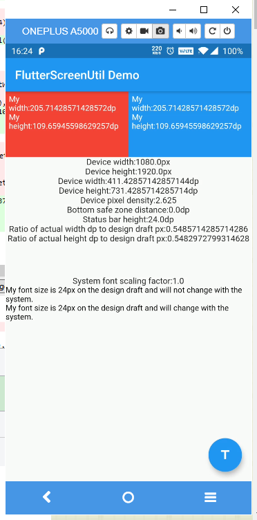

# flutter_screenutil

[](https://pub.dev/packages/flutter_screenutil)
[](https://pub.dev/packages/flutter_screenutil/score)
[](https://pub.dev/packages/flutter_screenutil/score)
[](https://www.codefactor.io/repository/github/openflutter/flutter_screenutil)

**A flutter plugin for adapting screen and font size.Let your UI display a reasonable layout on different screen sizes!**

*Note*: This plugin is still under development, and some APIs might not be available yet.

[中文文档](https://github.com/OpenFlutter/flutter_screenutil/blob/master/README_CN.md)  

[README em Português](https://github.com/OpenFlutter/flutter_screenutil/blob/master/README_PT.md)

[github](https://github.com/OpenFlutter/flutter_screenutil)

[Update log](https://github.com/OpenFlutter/flutter_screenutil/blob/master/CHANGELOG.md)

## Usage

### Add dependency

Please check the latest version before installation.
If there is any problem with the new version, please use the previous version

```yaml
dependencies:
  flutter:
    sdk: flutter
  # add flutter_screenutil
  flutter_screenutil: ^{latest version}
```

### Add the following imports to your Dart code

```dart
import 'package:flutter_screenutil/flutter_screenutil.dart';
```

### Property

| Property        | Type         | Default Value | Description                                                                 |
| --------------- | ------------ | ------------- | --------------------------------------------------------------------------- |
| deviceSize      | Size         | null          | The size of the physical device                                             |
| designSize      | Size         | Size(360,690) | The size of the device screen in the design draft, in dp                    |
| builder         | Function     | null          | Return widget that uses the library in a property (ex: MaterialApp's theme) |
| child           | Widget       | null          | A part of builder that its dependencies/properties don't use the library    |
| rebuildFactor   | Function     | *default*     | Returns whether to rebuild or not when screen metrics changes.              |
| orientation     | Orientation  | portrait      | screen orientation                                                          |
| splitScreenMode | bool         | false         | support for split screen                                                    |
| minTextAdapt    | bool         | false         | Whether to adapt the text according to the minimum of width and height      |
| context         | BuildContext | null          | Get physical device data if not provided, by MediaQuery.of(context)         |

**Note : You must either provide builder, child or both.**

### Initialize and set the fit size and font size to scale according to the system's "font size" accessibility option 

Please set the size of the design draft before use, the width and height of the design draft.

#### The first way (You must use it once in your app)

```dart
void main() => runApp(MyApp());

class MyApp extends StatelessWidget {
  const MyApp({Key? key}) : super(key: key);

  @override
  Widget build(BuildContext context) {
    //Set the fit size (Find your UI design, look at the dimensions of the device screen and fill it in,unit in dp)
    return ScreenUtilInit(
      designSize: const Size(360, 690),
      minTextAdapt: true,
      splitScreenMode: true,
      builder: (context , child) {
        return MaterialApp(
          debugShowCheckedModeBanner: false,
          title: 'First Method',
          // You can use the library anywhere in the app even in theme
          theme: ThemeData(
            primarySwatch: Colors.blue,
            textTheme: Typography.englishLike2018.apply(fontSizeFactor: 1.sp),
          ),
          home: child,
        );
      },
      child: const HomePage(title: 'First Method'),
    );
  }
}
```

#### The second way:You need a trick to support font adaptation in the textTheme of app theme

**Hybrid development uses the second way**

not support this:

```dart
MaterialApp(
  ...
  //To support the following, you need to use the first initialization method
  theme: ThemeData(
    textTheme: TextTheme(
      button: TextStyle(fontSize: 45.sp)
    ),
  ),
)
```

but you can do this:

```dart
void main() async {
  // Add this line
  await ScreenUtil.ensureScreenSize();
  runApp(MyApp());
}
...
MaterialApp(
  ...
  builder: (ctx, child) {
    ScreenUtil.init(ctx);
    return Theme(
      data: ThemeData(
        primarySwatch: Colors.blue,
        textTheme: TextTheme(bodyText2: TextStyle(fontSize: 30.sp)),
      ),
      child: HomePage(title: 'FlutterScreenUtil Demo'),
    );
  },
)
```

```dart
class MyApp extends StatelessWidget {
  @override
  Widget build(BuildContext context) {
    return MaterialApp(
      debugShowCheckedModeBanner: false,
      title: 'Flutter_ScreenUtil',
      theme: ThemeData(
        primarySwatch: Colors.blue,
      ),
      home: HomePage(title: 'FlutterScreenUtil Demo'),
    );
  }
}

class HomePage extends StatefulWidget {
  const HomePage({Key key, this.title}) : super(key: key);

  final String title;

  @override
  _HomePageState createState() => _HomePageState();
}

class _HomePageState extends State<HomePage> {
  @override
  Widget build(BuildContext context) {
    //Set the fit size (fill in the screen size of the device in the design) 
    //If the design is based on the size of the 360*690(dp)
    ScreenUtil.init(context, designSize: const Size(360, 690));
    ...
  }
}
```

### API

#### Pass the dp size of the design draft

```dart
    ScreenUtil().setWidth(540)  (dart sdk>=2.6 : 540.w) //Adapted to screen width
    ScreenUtil().setHeight(200) (dart sdk>=2.6 : 200.h) //Adapted to screen height , under normal circumstances, the height still uses x.w
    ScreenUtil().radius(200)    (dart sdk>=2.6 : 200.r)    //Adapt according to the smaller of width or height
    ScreenUtil().setSp(24)      (dart sdk>=2.6 : 24.sp) //Adapter font
    12.sm   //return min(12,12.sp)

    ScreenUtil().pixelRatio       //Device pixel density
    ScreenUtil().screenWidth   (dart sdk>=2.6 : 1.sw)    //Device width
    ScreenUtil().screenHeight  (dart sdk>=2.6 : 1.sh)    //Device height
    ScreenUtil().bottomBarHeight  //Bottom safe zone distance, suitable for buttons with full screen
    ScreenUtil().statusBarHeight  //Status bar height , Notch will be higher
    ScreenUtil().textScaleFactor  //System font scaling factor

    ScreenUtil().scaleWidth //The ratio of actual width to UI design
    ScreenUtil().scaleHeight //The ratio of actual height to UI design

    ScreenUtil().orientation  //Screen orientation
    0.2.sw  //0.2 times the screen width
    0.5.sh  //50% of screen height
    20.setVerticalSpacing  // SizedBox(height: 20 * scaleHeight)
    20.horizontalSpace  // SizedBox(height: 20 * scaleWidth)
    const RPadding.all(8)   // Padding.all(8.r) - take advantage of const key word
    EdgeInsets.all(10).w    //EdgeInsets.all(10.w)
    REdgeInsets.all(8)       // EdgeInsets.all(8.r)
    EdgeInsets.only(left:8,right:8).r // EdgeInsets.only(left:8.r,right:8.r).
    BoxConstraints(maxWidth: 100, minHeight: 100).w    //BoxConstraints(maxWidth: 100.w, minHeight: 100.w)
    Radius.circular(16).w          //Radius.circular(16.w)
    BorderRadius.all(Radius.circular(16)).w  
```

#### Adapt screen size

Pass the dp size of the design draft((The unit is the same as the unit at initialization))：

Adapted to screen width: `ScreenUtil().setWidth(540)`,

Adapted to screen height: `ScreenUtil().setHeight(200)`, In general, the height is best to adapt to the width

If your dart sdk>=2.6, you can use extension functions:

example:

instead of :

```dart
Container(
  width: ScreenUtil().setWidth(50),
  height:ScreenUtil().setHeight(200),
)
```

you can use it like this:

```dart
Container(
  width: 50.w,
  height:200.h
)
```

#### `Note`

The height can also use setWidth to ensure that it is not deformed(when you want a square)

The setHeight method is mainly to adapt to the height, which is used when you want to control the height of a screen on the UI to be the same as the actual display.

Generally speaking, 50.w!=50.h.

```dart
//for example:

//If you want to display a rectangle:
Container(
  width: 375.w,
  height: 375.h,
),
            
//If you want to display a square based on width:
Container(
  width: 300.w,
  height: 300.w,
),

//If you want to display a square based on height:
Container(
  width: 300.h,
  height: 300.h,
),

//If you want to display a square based on minimum(height, width):
Container(
  width: 300.r,
  height: 300.r,
),
```

#### Adapter font

``` dart
//Incoming font size(The unit is the same as the unit at initialization)
ScreenUtil().setSp(28) 
28.sp

//for example:
Column(
  crossAxisAlignment: CrossAxisAlignment.start,
  children: <Widget>[
    Text(
      '16sp, will not change with the system.',
      style: TextStyle(
        color: Colors.black,
        fontSize: 16.sp,
      ),
      textScaleFactor: 1.0,
    ),
    Text(
      '16sp,if data is not set in MediaQuery,my font size will change with the system.',
      style: TextStyle(
        color: Colors.black,
        fontSize: 16.sp,
      ),
    ),
  ],
)
```

#### Setting font does not change with system font size

APP global:

```dart
MaterialApp(
  debugShowCheckedModeBanner: false,
  title: 'Flutter_ScreenUtil',
  theme: ThemeData(
    primarySwatch: Colors.blue,
  ),
  builder: (context, widget) {
    return MediaQuery(
      ///Setting font does not change with system font size
      data: MediaQuery.of(context).copyWith(textScaleFactor: 1.0),
      child: widget,
    );
  },
  home: HomePage(title: 'FlutterScreenUtil Demo'),
),
```

Specified Text:

```dart
Text("text", textScaleFactor: 1.0)
```

Specified Widget:

```dart
MediaQuery(
  // If there is no context available you can wrap [MediaQuery] with [Builder]
  data: MediaQuery.of(context).copyWith(textScaleFactor: 1.0),
  child: AnyWidget(),
)
```

[widget test](https://github.com/OpenFlutter/flutter_screenutil/issues/115)

### Example

[example demo](https://github.com/OpenFlutter/flutter_screenutil/blob/master/example/lib)

To use second method run: `flutter run --dart-define=method=2`

### Effect



