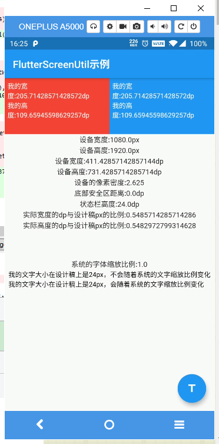

# flutter_screenutil

[](https://pub.dartlang.org/packages/flutter_screenutil)
[](https://pub.dev/packages/flutter_screenutil/score)
[](https://pub.dev/packages/flutter_screenutil/score)

**flutter 屏幕适配方案，用于调整屏幕和字体大小的flutter插件，让你的UI在不同尺寸的屏幕上都能显示合理的布局!**


*注意*：此插件仍处于开发阶段，某些API可能尚不可用。

[README of English](https://github.com/OpenFlutter/flutter_ScreenUtil/blob/master/README.md)

[README em Português](https://github.com/OpenFlutter/flutter_screenutil/blob/master/README_PT.md)

[github](https://github.com/OpenFlutter/flutter_screenutil)

[csdn博客工具介绍](https://blog.csdn.net/u011272795/article/details/82795477)

[更新日志](https://github.com/OpenFlutter/flutter_screenutil/blob/master/CHANGELOG.md)

## 使用方法:

### 安装依赖：

安装之前请查看最新版本
新版本如有问题请使用以前的版本
```yaml
dependencies:
  flutter:
    sdk: flutter
  # 添加依赖
  flutter_screenutil: ^{latest version}
```
### 在每个使用的地方导入包：
```dart
import 'package:flutter_screenutil/flutter_screenutil.dart';
```

### 属性

|属性|类型|默认值|描述|
|:---|:---|:---|:---|
|designSize|Size|Size(360, 690)|设计稿中设备的尺寸(单位随意,建议dp,但在使用过程中必须保持一致)|
| deviceSize      | Size         | null          | 物理设备的大小                                             |
|builder|Widget Function()|Container()|一般返回一个MaterialApp类型的Function()|
|orientation|Orientation|portrait|屏幕方向|
|splitScreenMode|bool|false|支持分屏尺寸|
|minTextAdapt|bool|false|是否根据宽度/高度中的最小值适配文字|
|context|BuildContext|null|传入context会更灵敏的根据屏幕变化而改变|
| child           | Widget       | null          | builder的一部分，其依赖项属性不使用该库    |
| rebuildFactor   | Function     | *default*     | 返回屏幕指标更改时是否重建。          |

注意：builder和child中必须填写至少一项

### 初始化并设置适配尺寸及字体大小是否根据系统的“字体大小”辅助选项来进行缩放
在使用之前请设置好设计稿的宽度和高度，传入设计稿的宽度和高度(单位随意,但在使用过程中必须保持一致)
一定要进行初始化(只需设置一次),以保证在每次使用之前设置好了适配尺寸:

#### 方式一（您必须在app中使用它一次）:
```dart
void main() => runApp(MyApp());

class MyApp extends StatelessWidget {
  @override
  Widget build(BuildContext context) {
    //填入设计稿中设备的屏幕尺寸,单位dp
    return ScreenUtilInit(
      designSize: const Size(360, 690),
      minTextAdapt: true,
      splitScreenMode: true,
      builder: (context , child) {
        return MaterialApp(
          debugShowCheckedModeBanner: false,
          title: 'First Method',
          // You can use the library anywhere in the app even in theme
          theme: ThemeData(
            primarySwatch: Colors.blue,
            textTheme: Typography.englishLike2018.apply(fontSizeFactor: 1.sp),
          ),
          home: child,
        );
      },
      child: const HomePage(title: 'First Method'),
    );
  }
}
```

#### 方式二: 你需要一个技巧来支持文字自适应主题

**混合开发使用方式二**

不支持这样做：
```dart
MaterialApp(
  ...
  //如果你想这样做，你应该选择方式一
  theme: ThemeData(
    textTheme: TextTheme(
      button: TextStyle(fontSize: 45.sp)
    ),
  ),
)
```

正确的方法应当是这样：
```dart
void main() async {
  // Add this line
  await ScreenUtil.ensureScreenSize();
  runApp(MyApp());
}
...
MaterialApp(
  ...
  builder: (ctx, child) {
    ScreenUtil.init(ctx);
    return Theme(
      data: ThemeData(
        primarySwatch: Colors.blue,
        textTheme: TextTheme(bodyText2: TextStyle(fontSize: 30.sp)),
      ),
      child: HomePage(title: 'FlutterScreenUtil Demo'),
    );
   },
)
```
```dart
class MyApp extends StatelessWidget {
  @override
  Widget build(BuildContext context) {
    return MaterialApp(
      debugShowCheckedModeBanner: false,
      title: 'Flutter_ScreenUtil',
      theme: ThemeData(
        primarySwatch: Colors.blue,
      ),
      home: HomePage(title: 'FlutterScreenUtil Demo'),
    );
  }
}

class HomePage extends StatefulWidget {
  const HomePage({Key key, this.title}) : super(key: key);

  final String title;

  @override
  _HomePageState createState() => _HomePageState();
}

class _HomePageState extends State<HomePage> {
  @override
  Widget build(BuildContext context) {
    //设置尺寸（填写设计中设备的屏幕尺寸）如果设计基于360dp * 690dp的屏幕
    ScreenUtil.init(context, designSize: const Size(360, 690));
    ...
  }
}
```

### 使用

### API
#### 传入设计稿的dp尺寸
```dart
    ScreenUtil().setWidth(540)  (dart sdk>=2.6 : 540.w)   //根据屏幕宽度适配尺寸
    ScreenUtil().setHeight(200) (dart sdk>=2.6 : 200.h)   //根据屏幕高度适配尺寸(一般根据宽度适配即可)
    ScreenUtil().radius(200)    (dart sdk>=2.6 : 200.r)   //根据宽度或高度中的较小者进行调整
    ScreenUtil().setSp(24)      (dart sdk>=2.6 : 24.sp)   //适配字体
    12.sm   // 取12和12.sp中的最小值

    ScreenUtil.pixelRatio       //设备的像素密度
    ScreenUtil.screenWidth   (dart sdk>=2.6 : 1.sw)   //设备宽度
    ScreenUtil.screenHeight  (dart sdk>=2.6 : 1.sh)   //设备高度
    ScreenUtil.bottomBarHeight  //底部安全区距离，适用于全面屏下面有按键的
    ScreenUtil.statusBarHeight  //状态栏高度 刘海屏会更高
    ScreenUtil.textScaleFactor //系统字体缩放比例

    ScreenUtil().scaleWidth  // 实际宽度设计稿宽度的比例
    ScreenUtil().scaleHeight // 实际高度与设计稿高度度的比例

    ScreenUtil().orientation  //屏幕方向

    0.2.sw  //屏幕宽度的0.2倍
    0.5.sh  //屏幕高度的50%
    20.setVerticalSpacing  // SizedBox(height: 20 * scaleHeight)
    20.horizontalSpace  // SizedBox(height: 20 * scaleWidth)
    const RPadding.all(8)   // Padding.all(8.r) - 获取到const的优点
    EdgeInsets.all(10).w    //EdgeInsets.all(10.w)
    REdgeInsets.all(8)       // EdgeInsets.all(8.r)
    EdgeInsets.only(left:8,right:8).r // EdgeInsets.only(left:8.r,right:8.r).
    BoxConstraints(maxWidth: 100, minHeight: 100).w    //BoxConstraints(maxWidth: 100.w, minHeight: 100.w)
    Radius.circular(16).w          //Radius.circular(16.w)
    BorderRadius.all(Radius.circular(16)).w  
```


#### 适配尺寸

传入设计稿的尺寸(单位与初始化时的单位相同)：

根据屏幕宽度适配 `width: ScreenUtil().setWidth(540)`,

根据屏幕高度适配 `height: ScreenUtil().setHeight(200)`, 一般来说，控件高度也根据宽度进行适配

如果您的 dart sdk>=2.6，则可以使用一些特殊的函数：

例子：

你不应当这样做：
```dart
Container(
  width: ScreenUtil().setWidth(50),
  height:ScreenUtil().setHeight(200),
)
```
正确的方法应当是这样使用：
```dart
Container(
  width: 50.w,
  height:200.h
)
```

`注意`

高度也根据setWidth来做适配可以保证不变形(当你想要一个正方形的时候)

setHeight方法主要是在高度上进行适配, 在你想控制UI上一屏的高度与实际中显示一样时使用.

一般来说，50.w!=50.h

例如:

```dart
//如果你想显示一个矩形:
Container(
  width: 375.w,
  height: 375.h,
),

//如果你想基于宽显示一个正方形:
Container(
  width: 300.w,
  height: 300.w,
),

//如果你想基于高显示一个正方形:
Container(
  width: 300.h,
  height: 300.h,
),

//如果你想基于高或宽中的较小值显示一个正方形:
Container(
  width: 300.r,
  height: 300.r,
),
```

**适配字体**

```dart
//输入字体大小（单位与初始化时的单位相同）
ScreenUtil().setSp(28) 
28.sp

//例子:
Column(
  crossAxisAlignment: CrossAxisAlignment.start,
  children: <Widget>[
    Text(
      '16sp, 因为设置了`textScaleFactor`，不会随系统变化.',
      style: TextStyle(
        color: Colors.black,
        fontSize: 16.sp,
      ),
      textScaleFactor: 1.0,
    ),
    Text(
      '16sp,如果未设置，我的字体大小将随系统而变化.',
      style: TextStyle(
        color: Colors.black,
        fontSize: 16.sp,
      ),
    ),
  ],
)
```

#### 设置字体不随系统字体大小进行改变

APP全局:
```dart
       MaterialApp(
        debugShowCheckedModeBanner: false,
        title: 'Flutter_ScreenUtil',
        theme: ThemeData(
          primarySwatch: Colors.blue,
        ),
        builder: (context, widget) {
          return MediaQuery(
            ///设置文字大小不随系统设置改变
            data: MediaQuery.of(context).copyWith(textScaleFactor: 1.0),
            child: widget,
          );
        },
        home: HomePage(title: 'FlutterScreenUtil Demo'),
      ),
```
单独的Text:
```dart
Text("text", textScaleFactor: 1.0)
```

指定的小部件：
```dart
MediaQuery(
  // 如果这里context不可用，你可以新建一个 [Builder] 将 [MediaQuery] 放入其中
  data: MediaQuery.of(context).copyWith(textScaleFactor: 1.0),
  child: AnyWidget(),
)
```

[小部件测试](https://github.com/OpenFlutter/flutter_screenutil/issues/115)

### 使用示例:

[示例演示](https://github.com/OpenFlutter/flutter_ScreenUtil/blob/master/example/lib/main_zh.dart)

要使用第二种方法，请运行：`flutter run --dart-define=method=2`

效果:



