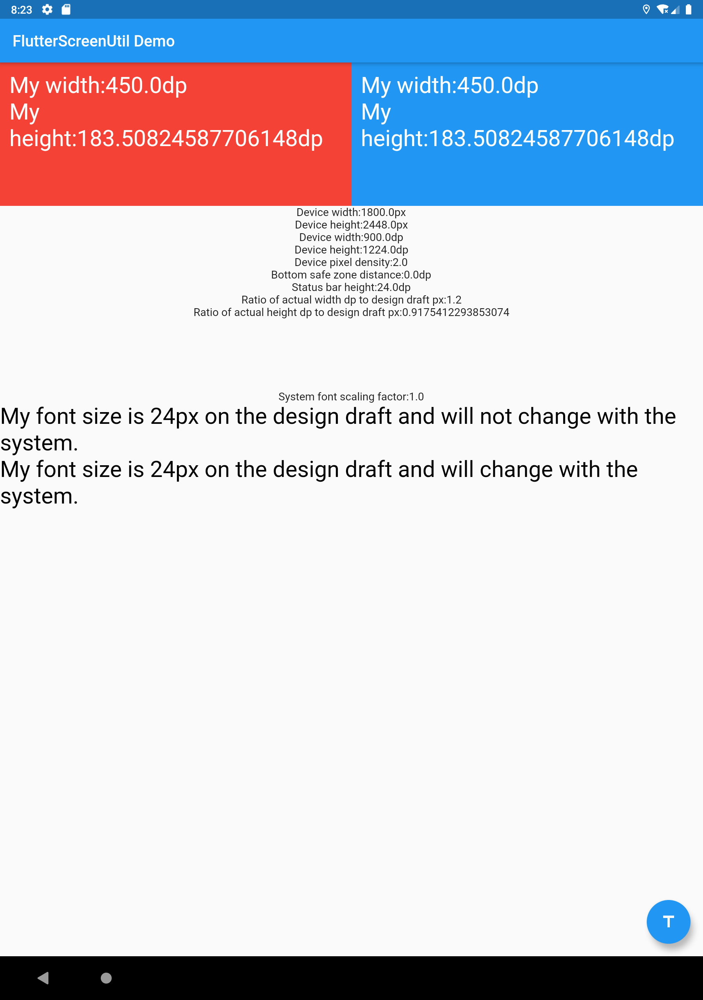

# I don’t speak Portuguese, and other developers have translated the first version. I later modified it based on the translation software. It is recommended to read the English/Chinese version.
# flutter_screenutil
[](https://pub.dartlang.org/packages/flutter_screenutil)
[](https://pub.dev/packages/flutter_screenutil/score)
[](https://pub.dev/packages/flutter_screenutil/score)

**Um plugin Flutter para adaptação de tamanho de tela e fontes. Deixe sua UI exibir um layout aceitável em diferentes tamanhos de tela!**

*Nota*: Este plugin ainda está em desenvolvimento e algumas APIs podem ainda não estar disponíveis.

[中文文档](https://github.com/OpenFlutter/flutter_screenutil/blob/master/README_CN.md)  

[README of English](https://github.com/OpenFlutter/flutter_ScreenUtil/blob/master/README.md)

[github](https://github.com/OpenFlutter/flutter_screenutil)

[Histórico de atualizações](https://github.com/OpenFlutter/flutter_screenutil/blob/master/CHANGELOG.md)

## Como usar:

### Adicionando a dependência：
Por favor, verifique a última versão antes da instalação.
Se houver algum problema com a nova versão, use a versão anterior
```yaml
dependencies:
  flutter:
    sdk: flutter
  # add flutter_screenutil
  flutter_screenutil: ^{latest version}
```

### Adicione o seguinte import em seu código Dart:
```dart
import 'package:flutter_screenutil/flutter_screenutil.dart';
```

### Propriedades
   
|Propriedade|Tipo|Valor Padrão|Descrição|
|:---|:---|:---|:---| 
|designSize|Size|Size(360, 690)|The size of the device screen in the design draft, in dp|
|builder|Widget Function()|Container()|Generally returning a Function of MaterialApp type|
|orientation|Orientation|portrait|screen orientation|
|minTextAdapt|bool|false|Whether to adapt the text according to the minimum of width and height|
|context|BuildContext|null|传入context会更灵敏的根据屏幕变化而改变|
| splitScreenMode | bool          | false           | support for split screen                                               |

### Inicialize e defina o tamanho de ajuste e tamanho da fonte para dimensionar de acordo com a opção "tamanho de fonte" na acessibilidade do sistema
Por favor, defina a largura e altura do protótipo de design antes de usar (em pixels).
Certifique-se de definir as dimensões na paginal inicial do MaterialApp (ou seja, no arquivo de entrada, defina apenas uma vez) para garantir que o tamanho de ajuste seja o mesmo antes de cada uso:

The first way:
```dart
void main() => runApp(MyApp());

class MyApp extends StatelessWidget {
  @override
  Widget build(BuildContext context) {
    //Set the fit size (Find your UI design, look at the dimensions of the device screen and fill it in,unit in dp)
    return ScreenUtilInit(
      designSize: Size(360, 690),
      minTextAdapt: true,
      splitScreenMode: true,
      builder: () =>
          MaterialApp(
            //... other code
            builder: (context, widget) {
              //add this line
              ScreenUtil.setContext(context);
              return MediaQuery(
                //Setting font does not change with system font size
                data: MediaQuery.of(context).copyWith(textScaleFactor: 1.0),
                child: widget!,
              );
            },
            theme: ThemeData(
              textTheme: TextTheme(
                //To support the following, you need to use the first initialization method
                  button: TextStyle(fontSize: 45.sp)
              ),
            ),
          ),
    );
  }
}
```

The second way:Does not support font adaptation in the textTheme of MaterialApp's theme.
**Hybrid development uses the second way**

```
class MyApp extends StatelessWidget {
  @override
  Widget build(BuildContext context) {
    return MaterialApp(
      debugShowCheckedModeBanner: false,
      title: 'Flutter_ScreenUtil',
      theme: ThemeData(
        primarySwatch: Colors.blue,
      ),
      home: HomePage(title: 'FlutterScreenUtil Demo'),
    );
  }
}

class HomePage extends StatefulWidget {
  const HomePage({Key key, this.title}) : super(key: key);

  final String title;

  @override
  _HomePageState createState() => _HomePageState();
}

class _HomePageState extends State<HomePage> {
  @override
  Widget build(BuildContext context) {
    //Set the fit size (Find your UI design, look at the dimensions of the device screen and fill it in,unit in dp)
    ScreenUtil.init(
        BoxConstraints(
            maxWidth: MediaQuery.of(context).size.width,
            maxHeight: MediaQuery.of(context).size.height),
        designSize: Size(360, 690),
        context: context,
        orientation: Orientation.portrait);
    return Scaffold();
  }
}
```

### Uso：

### API

```dart
    ScreenUtil().setWidth(540)  (sdk>=2.6 : 540.w) //Adapted to screen width
    ScreenUtil().setHeight(200) (sdk>=2.6 : 200.h) //Adapted to screen height
    ScreenUtil().radius(200) (dart sdk>=2.6 : 200.r)    //Adapt according to the smaller of width or height
    ScreenUtil().setSp(24)      (sdk>=2.6 : 24.sp)  //Adapter font

    ScreenUtil.pixelRatio       //Device pixel density
    ScreenUtil.screenWidth     (sdk>=2.6 : 1.sw)  //Device width
    ScreenUtil.screenHeight    (sdk>=2.6 : 1.sh)  //Device height
    ScreenUtil.bottomBarHeight  //Bottom safe zone distance, suitable for buttons with full screen
    ScreenUtil.statusBarHeight  //Status bar height , Notch will be higher
    ScreenUtil.textScaleFactor  //System font scaling factor

    ScreenUtil().scaleWidth //The ratio of actual width to UI design
    ScreenUtil().scaleHeight //The ratio of actual height to UI design

    ScreenUtil().orientation  //Screen orientation

    0.2.sw  //0,2 vezes a largura da tela
    0.5.sh  //50% altura da tela
    20.setVerticalSpacing  // SizedBox(height: 20 * scaleHeight)
    20.horizontalSpace  // SizedBox(height: 20 * scaleWidth)
    const RPadding.all(8)   // Padding.all(8.r) - take advantage of const key word
    REdgeInsts.all(8)       // EdgeInsets.all(8.r)
    EdgeInsets.only(left:8,right:8).r // EdgeInsets.only(left:8.r,right:8.r).
```

#### Adaptar o tamanho da tela：

Informe o tamanho em pixels do protótipo de design:

Adaptado à largura da tela: `ScreenUtil().setWidth(540)`,

Adaptado à altura da tela: `ScreenUtil().setHeight(200)`,

If your dart sdk>=2.6, you can use extension functions:

example:
instead of :
```
Container(
width: ScreenUtil().setWidth(50),
height:ScreenUtil().setHeight(200),
)
```
you can use it like this:
```
Container(
width: 50.w,
height:200.h
)
```

**Nota** 

Altura também é adaptada de acordo com o setWidth para garantir que não tenha deformação (quando quiser um quadrado)

O método setHeight é a principal forma de adaptar a altura, se quiser controlar a altura e a realidade de uma tela na UiUsed quando a mesma for exibida.

Generally speaking, 50.w!=50.h.

```dart
//Exemplo:
//Retângulo
Container(
           width: 375.w,
           height: 200.w,
           ...
            ),
            
////Se quiser exibir um quadrado:
Container(
           width: 300.r,
           height: 300.r,
            ),
            
```

#### Adaptar fonte:
``` dart
//Tamanho da fonte informado, em dp

ScreenUtil().setSp(28)    
     
//Tamanho da fonte informado，em pixels，a fonte irá dimensionar respeitando a opção "Tamanho de Fonte" nas configurações de acessibilidade
ScreenUtil().setSp(24)

//Exemplo:

Column(
              crossAxisAlignment: CrossAxisAlignment.start,
              children: <Widget>[
                Text(
                    'Minha fonte tem 24px no protótipo de design e não irá mudar com o sistema.',
                    style: TextStyle(
                      color: Colors.black,
                      fontSize: ScreenUtil().setSp(24),
                    ),
                    textScaleFactor: 1.0,),
                Text(
                    'Minha fonte tem 24px no protótipo de design e poderá mudar com o sistema.',
                    style: TextStyle(
                        color: Colors.black,
                        fontSize: ScreenUtil()
                            .setSp(24))),
              ],
            )
```

#### Outras APIs relacionadas：
```dart
    ScreenUtil.pixelRatio       //Densidade de pixels do dispositivo
    ScreenUtil.screenWidth      //Largura da tela do dispositivo
    ScreenUtil.screenHeight     //Altura da tela do dispositivo
    ScreenUtil.bottomBarHeight  //Distância segura do rodapé, adequada para botões em tela cheia
    ScreenUtil.statusBarHeight  //Altura da status bar em pixels, Notch será maior
    ScreenUtil.textScaleFactor //Fator de escala da fonte do sistema

    ScreenUtil().scaleWidth //Razão entre a largura atual e a largura do protótipo de design em pixels
    ScreenUtil().scaleHeight //Razão entre a altura atual e a altura do protótipo de design em pixels

```

```dart
...
import 'package:flutter/material.dart';
import 'package:flutter_screenutil/flutter_screenutil.dart';

void main() => runApp(MyApp());

class MyApp extends StatelessWidget {
  @override
  Widget build(BuildContext context) {
    return LayoutBuilder(
      builder: (context, constraints) {
        //Set the fit size (fill in the screen size of the device in the design) If the design is based on the size of the iPhone6 ​​(iPhone6 ​​750*1334)
        ScreenUtil.init(constraints, designSize: Size(750, 1334));

        return MaterialApp(
          debugShowCheckedModeBanner: false,
          title: 'Flutter_ScreenUtil',
          theme: ThemeData(
            primarySwatch: Colors.blue,
          ),
          home: HomePage(title: 'FlutterScreenUtil Demo'),
        );
      },
    );
  }
}

class HomePage extends StatefulWidget {
  const HomePage({Key key, this.title}) : super(key: key);

  final String title;

  @override
  _HomePageState createState() => _HomePageState();
}

class _HomePageState extends State<HomePage> {
  @override
  Widget build(BuildContext context) {
    //Set the fit size (fill in the screen size of the device in the design) If the design is based on the size of the iPhone6 ​​(iPhone6 ​​750*1334)

    printScreenInformation();
    return Scaffold(
      appBar: AppBar(
        title: Text(widget.title),
      ),
      body: SingleChildScrollView(
        child: Column(
          crossAxisAlignment: CrossAxisAlignment.center,
          children: <Widget>[
            Row(
              children: <Widget>[
                // Using Extensions
                Container(
                  padding: EdgeInsets.all(10.w),
                  width: 0.5.sw,
                  height: 200.h,
                  color: Colors.red,
                  child: Text(
                    'My width:${0.5.sw}dp \n'
                    'My height:${200.h}dp',
                    style: TextStyle(
                      color: Colors.white,
                      fontSize: 24.sp,
                    ),
                  ),
                ),
                // Without using Extensions
                Container(
                  padding: EdgeInsets.all(ScreenUtil().setWidth(10)),
                  width: ScreenUtil().screenWidth * 0.5,
                  height: ScreenUtil().setHeight(200),
                  color: Colors.blue,
                  child: Text(
                    'My width:${ScreenUtil().screenWidth * 0.5}dp \n'
                    'My height:${ScreenUtil().setHeight(200)}dp',
                    style: TextStyle(
                      color: Colors.white,
                      fontSize: ScreenUtil().setSp(24),
                    ),
                  ),
                ),
              ],
            ),
            Text('Device width:${ScreenUtil().screenWidthPx}px'),
            Text('Device height:${ScreenUtil().screenHeightPx}px'),
            Text('Device width:${ScreenUtil().screenWidth}dp'),
            Text('Device height:${ScreenUtil().screenHeight}dp'),
            Text('Device pixel density:${ScreenUtil().pixelRatio}'),
            Text('Bottom safe zone distance:${ScreenUtil().bottomBarHeight}dp'),
            Text('Status bar height:${ScreenUtil().statusBarHeight}dp'),
            Text(
              'Ratio of actual width dp to design draft px:${ScreenUtil().scaleWidth}',
              textAlign: TextAlign.center,
            ),
            Text(
              'Ratio of actual height dp to design draft px:${ScreenUtil().scaleHeight}',
              textAlign: TextAlign.center,
            ),
            SizedBox(
              height: 5.h,
            ),
            Text('System font scaling factor:${ScreenUtil().textScaleFactor}'),
            Column(
              crossAxisAlignment: CrossAxisAlignment.start,
              children: <Widget>[
                Text(
                  'My font size is 24px on the design draft and will not change with the system.',
                  style: TextStyle(
                    color: Colors.black,
                    fontSize: 24.sp,
                  ),
                ),
                Text(
                  'My font size is 24px on the design draft and will change with the system.',
                  style: TextStyle(
                    color: Colors.black,
                    fontSize: 24.ssp,
                  ),
                ),
              ],
            )
          ],
        ),
      ),
    );
  }

  void printScreenInformation() {
    print('Device width dp:${1.sw}'); //Device width
    print('Device height dp:${1.sh}'); //Device height
    print('Device pixel density:${ScreenUtil().pixelRatio}'); //Device pixel density
    print(
        'Bottom safe zone distance dp:${ScreenUtil().bottomBarHeight}'); //Bottom safe zone distance，suitable for buttons with full screen
    print(
        'Status bar height px:${ScreenUtil().statusBarHeight}dp'); //Status bar height , Notch will be higher Unit px
    print('Ratio of actual width dp to UI Design:${ScreenUtil().scaleWidth}');
    print('Ratio of actual height dp to UI Design:${ScreenUtil().scaleHeight}');
    print('System font scaling:${ScreenUtil().textScaleFactor}');
    print('0.5 times the screen width:${0.5.sw}');
    print('0.5 times the screen height:${0.5.sh}');
  }
}

```

#### Setting font does not change with system font size

APP global:
```
 MaterialApp(
        debugShowCheckedModeBanner: false,
        title: 'Flutter_ScreenUtil',
        theme: ThemeData(
          primarySwatch: Colors.blue,
        ),
        builder: (context, widget) {
          return MediaQuery(
            ///Setting font does not change with system font size
            data: MediaQuery.of(context).copyWith(textScaleFactor: 1.0),
            child: widget,
          );
        },
        home: HomePage(title: 'FlutterScreenUtil Demo'),
      ),
```

Separate Text:
```dart
Text("text", textScaleFactor: 1.0)
```


[widget test](https://github.com/OpenFlutter/flutter_screenutil/issues/115)

### Exemplo:

[Demonstração](https://github.com/OpenFlutter/flutter_screenutil/blob/master/example/lib/main.dart)
 
Efeito:



