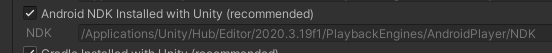
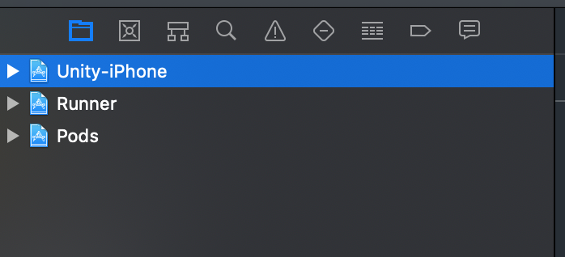
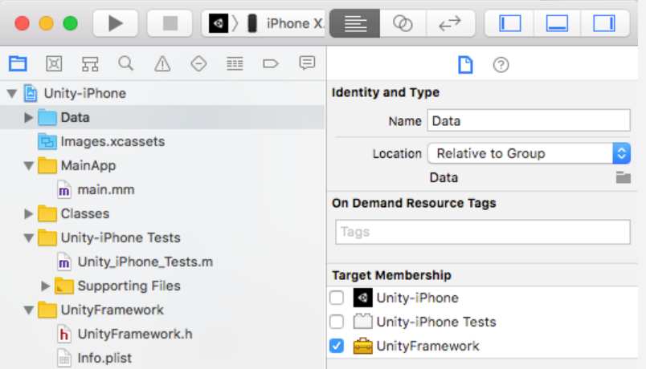
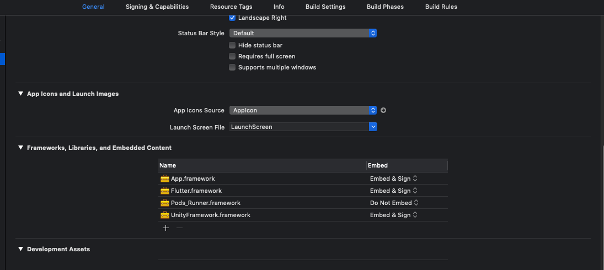

# flutter_unity_widget
[](#contributors-)

[![version][version-badge]][package]
[![MIT License][license-badge]][license]
[![PRs Welcome][prs-badge]](https://makeapullrequest.com)

[![Watch on GitHub][github-watch-badge]][github-watch]
[![Star on GitHub][github-star-badge]][github-star]

[](https://gitter.im/flutter-unity/community?utm_source=badge&utm_medium=badge&utm_campaign=pr-badge)
[](https://discord.gg/KmMqD7Sv3K)

Flutter unity 3D widget for embedding unity in flutter. Now you can make awesome gamified features of your app in Unity and get it rendered in a Flutter app both in fullscreen and embeddable mode. Works great on `Android, iPad OS, iOS, Web, with Windows` nearing completion. There are now two unity app examples in the unity folder, one with the default scene and another based on Unity AR foundation samples.
<br />
Note: Supports only Unity 2019.4.3 or later. UnityFramework does not support emulator.
Note: Please use OpenGLES3 as Graphics API only for now (Android only).
<br />


## Notice
Need me to respond, tag me [Rex Isaac Raphael](www.github.com/juicycleff). 
Always use the matching FUW unitypackage for the unity version your are using.

This plugin expects you to atleast know how to use Unity Engine. If you have issues with how unity widget is presented, you can please modify your unity project build settings as you seem fit.

Moving forward, versioning of the package will change to match unity releases after proper test. Mind you this does not mean the package
is not compatible with other versions, it just mean it's been tested to work with a unity version.

Windows coming soon.

^2022.1.0+5 supports Flutter 3.0.0 and can only work with `PlatformViewSurface` for now. The implications of this is
you have to pass `useAndroidViewSurface: true` to UnityWidget. You can track this [issue](https://github.com/flutter/flutter/issues/103630).
Currently working on supporting AndroidView.

## Installation

First depend on the library by adding this to your packages `pubspec.yaml`:
 -  Flutter 3.0.0
```yaml
dependencies:
  flutter_unity_widget: ^2022.2.0
```


 -  Pre Flutter 3.0.0 (This version will gradually be deprecated)
```yaml
dependencies:
  flutter_unity_widget: ^2022.1.0+7
```

Now inside your Dart code you can import it.

```dart
import 'package:flutter_unity_widget/flutter_unity_widget.dart';
```

## Preview

30 fps gifs, showcasing communication between Flutter and Unity:


<br />

## Setup 

For this, there is also a video tutorial, which you can find a [here](https://www.youtube.com/watch?v=exNPmv_7--Q).

In the tutorial below, there are steps specific to each platform, denoted by a :information_source: icon followed by
the platform name (Android or iOS). You can click on its icon to expand it.

### Prerequisites

- An existing Flutter project (if there is none, you can [create a new one](https://flutter.dev/docs/get-started/test-drive#create-app))

- An existing Unity project (if there is none, you can [create a new one](https://learn.unity.com/tutorial/create-your-first-unity-project)).

- A [`FlutterUnityPackage.unitypackage`](https://raw.githubusercontent.com/juicycleff/flutter-unity-view-widget/master/unitypackages/fuw-2022.1.1.unitypackage) 
  file (you can access the Unity packages in the [*unitypackages*](https://github.com/juicycleff/flutter-unity-view-widget/tree/master/unitypackages) folder too)
  Remeber to always check the match unitypackage for your project.

#### NDK

If your project requires Android NDK, you have to setup following:

Your android project needs to know the path of the NDK Unity uses. You can find the path to the NDK under `Preferences -> External Tools`:



Copy the path by right click and paste the path here in your `android/local.properties`:

```properties
    ndk.dir=/Applications/Unity/Hub/Editor/2020.3.19f1/PlaybackEngines/AndroidPlayer/NDK
```

That's it! You don't need to tell your Android App in your `app/build.gradle` the NDK version or other NDK settings. It's all connected to Unity now.

### Steps

1. Create a folder named *unity* and move the Unity project into there.

> The expected path is *unity/__project-name__/...*

2. Copy the *FlutterUnityPackage.unitypackage* file into the Unity project folder.

> The expected path is *unity/__project-name__/FlutterUnityPackage.unitypackage*

3. Using Unity, open the Unity project, go to **File > Build Settings > Player Settings**
    and change the following under the **Configuration** section:

- In **Scripting Backend**, change to IL2CPP

- In **Target Architectures**, select ARMv7 and ARM64

<details>
 <summary>:information_source: <b>iOS</b></summary>
  
  Select the appropriate SDK on **Target SDK** depending on where you want to test or run your app (simulator or physical device).
</details>


> Be sure you have at least one scene added to your build.

4. Go to **Assets > Import Package > Custom Package** and select the 
    *FlutterUnityPackage.unitypackage* file. Click on **Import**.

5. After importing, click on **Flutter** and select the **Export Android Debug** or **Export Android Release** option (will export to *android/unityLibrary*) or the **Export iOS Debug** or **Export iOS Release**
option (will export to *ios/UnityLibrary*).

> Do not use **Flutter > Export _Platform_ plugin** as it was specially added to work with [`flutter_unity_cli`](https://github.com/juicycleff/flutter_unity_cli) for larger projects.


<details>
 <summary>:information_source: <b>Android</b></summary>
  
  The export script automatically sets things up for you, so you don't have to do anything for Android. But if you want to manually set it up, continue.
  
6.1. Open the *android/settings.gradle* file and change the following:

```diff
+    include ":unityLibrary"
+    project(":unityLibrary").projectDir = file("./unityLibrary")
```

6.2. Open the *android/app/build.gradle* file and change the following:

```diff
     dependencies {
+        implementation project(':unityLibrary')
     }
```

6.3. If you need to build a release package, open the *android/app/build.gradle* file and change the following:

```diff
     buildTypes {
         release {
             signingConfig signingConfigs.debug
         }
+        debug {
+            signingConfig signingConfigs.debug
+        }
+        profile {
+            signingConfig signingConfigs.debug
+        }
+        innerTest {
+            matchingFallbacks = ['debug', 'release']
+        }
+   }
```

> The code above use the `debug` signConfig for all buildTypes, which can be changed as you well if you need specify signConfig.

6.4. If you use `minifyEnabled true` in your *android/app/build.gradle* file, open the *android/unityLibrary/proguard-unity.txt* and change the following:

```diff
+    -keep class com.xraph.plugin.** {*;}
```

6.5. If you want Unity in it's own activity as an alternative, open the *android/app/src/main/AndroidManifest.xml* and change the following:

```diff
+    <activity
+        android:name="com.xraph.plugin.flutter_unity_widget.OverrideUnityActivity"
+        android:theme="@style/UnityThemeSelector"
+        android:screenOrientation="fullSensor"
+        android:launchMode="singleTask"
+        android:configChanges="mcc|mnc|locale|touchscreen|keyboard|keyboardHidden|navigation|orientation|screenLayout|uiMode|screenSize|smallestScreenSize|fontScale|layoutDirection|density"
+        android:hardwareAccelerated="false"
+        android:process=":Unity">
+    <meta-data android:name="com.xraph.plugin.flutter_unity_widget.OverrideUnityActivity" android:value="true" />
+    </activity>
```

</details>


<details>
 <summary>:information_source: <b>iOS</b></summary>
  
  6.1. Open the *ios/Runner.xcworkspace* (workspace, not the project) file in Xcode, right-click on the Navigator (not on an item), go to **Add Files to "Runner"** and add
  the *ios/UnityLibrary/Unity-Iphone.xcodeproj* file.
  
  
  
  6.2. (Optional) Select the *Unity-iPhone/Data* folder and change the Target Membership for Data folder to UnityFramework.
  
  
  
  6.3.1. If you're using Swift, open the *ios/Runner/AppDelegate.swift* file and change the following:

```diff
     import UIKit
     import Flutter
+    import flutter_unity_widget

     @UIApplicationMain
     @objc class AppDelegate: FlutterAppDelegate {
         override func application(
             _ application: UIApplication,
             didFinishLaunchingWithOptions launchOptions: [UIApplication.LaunchOptionsKey: Any]?
         ) -> Bool {
+            InitUnityIntegrationWithOptions(argc: CommandLine.argc, argv: CommandLine.unsafeArgv, launchOptions)

             GeneratedPluginRegistrant.register(with: self)
             return super.application(application, didFinishLaunchingWithOptions: launchOptions)
         }
     }
```

   6.3.2. If you're using Objective-C, open the *ios/Runner/main.m* file and change the following:
```diff
+    #import "flutter_unity_widget.swift.h"

     int main(int argc, char * argv[]) {
          @autoreleasepool {
+             InitUnityIntegration(argc, argv);
              return UIApplicationMain(argc, argv, nil, NSStringFromClass([AppDelegate class]));
          }
     }
```

  6.4. Open the *ios/Runner/Info.plist* and change the following:

```diff
     <dict>
+        <key>io.flutter.embedded_views_preview</key>
+        <string>YES</string>
     </dict>
```

  6.5. Add the *UnityFramework.framework* file as a library to the Runner project.
  
  

</details>


#### Setup AR Foundation


> Check out the Unity AR Foundation samples in the [demo repository](https://github.com/juicycleff/flutter-unity-arkit-demo).
> This repository is not guaranteed to be up-to-date with the latest ``flutter-unity-view-widget`` master. Make sure to follow
> the steps listed below for setting up AR Foundation on iOS and Android in your project.


<details>
 <summary>:information_source: <b>Android</b></summary>

  7. Open the *lib/__architecture__/* folder and check if there are both *libUnityARCore.so* and *libarpresto_api.so* files.
  There seems to be a bug where a Unity export does not include all lib files. If they are missing, use Unity to build a standalone .apk
  of your AR project, unzip the resulting apk, and copy over the missing .lib files to the `unityLibrary` module. 
  
  8. Repeat steps 6.1 and 6.2 for Android, replacing `unityLibrary` with `arcore_client`, `unityandroidpermissions` and `UnityARCore`.
  
  9. When using `UnityWidget` in Flutter, set `fullscreen: false` to disable fullscreen.

</details>

<details>
 <summary>:information_source: <b>iOS</b></summary>

7. Open the *ios/Runner/Info.plist* and change the following:

```diff
     <dict>
+        <key>Privacy - Camera Usage Description</key>
+        <string>$(PRODUCT_NAME) uses Cameras</string>
     </dict>
```

</details>

#### Setup Vuforia

Thanks to [@PiotrxKolasinski](https://github.com/PiotrxKolasinski) for writing down the exact steps:

7. Open the *android/unityLibrary/build.gradle* file and change the following: 

```diff
-    implementation(name: 'VuforiaWrapper', ext: 'aar')
+    implementation project(':VuforiaWrapper')
```

8. Using Android Studio, go to **File > Open** and select the *android/* folder. A
    new project will open.
    
> Don't worry if the error message "Project with path ':VuforiaWrapper' could not be 
> found in project ':unityLibrary'" appears. The next step will fix it.

9. In this new project window, go to **File > New > New Module > Import .JAR/.AAR package**
    and select the *android/unityLibrary/libs/VuforiaWrapper.aar* file. A new folder
    named *VuforiaWrapper* will be created inside *android/*. You can now close this
    new project window.

## Communicating 

### Flutter-Unity

1. On a `UnityWidget` widget, get the `UnityWidgetController` received by the `onUnityCreated` callback.

2. Use the method `postMessage` to send a string, using the GameObject name and the name of a behaviour method that should be called.

### Unity-Flutter

1. Select the GameObject that should execute the communication and go to **Inspector > Add Component > Unity Message Manager**.


2. Create a new `MonoBehaviour` subclass and add to the same GameObject as a script.

3. On this new behaviour, call `GetComponent<UnityMessageManager>()` to get a `UnityMessageManager`.

4. Use the method `SendMessageToFlutter` to send a string. Receive this message using the `onUnityMessage` callback of a `UnityWidget`.


## Troubleshooting

**Location:** Unity

**Error:**

```
InvalidOperationException: The build target does not support build appending.
```

**Solution:**

1. Open the *unity/__project-name__/Assets/FlutterUnityIntegration/Editor/Build.cs* file.

1.1. On line 48, change the following:

```diff
-    var options = BuildOptions.AcceptExternalModificationsToPlayer;
+    var options = BuildOptions.AllowDebugging;
+    EditorUserBuildSettings.exportAsGoogleAndroidProject = true;
```

1.2. On line 115, change the following:

```diff
-    var options = BuildOptions.AcceptExternalModificationsToPlayer;
+    var options = BuildOptions.AllowDebugging;
```

---

**Location:** Android Studio

**Error:**

```
minSdkVersion XX cannot be smaller than version 19 declared in library 
    \ [:flutter_unity_widget] .../AndroidManifest.xml as the library might be using 
    \ APIs not available in XX
```

**Solution:**

1. Open the *android/app/build.gradle* file and change the following:

```diff
-    minSdkVersion XX
+    minSdkVersion 19
```

---

**Location**: Android Studio

**Error:**

```
e: .../FlutterUnityWidgetBuilder.kt: (15, 42): Expecting a parameter declaration
e: .../FlutterUnityWidgetBuilder.kt: (23, 25): Expecting an argument
e: .../FlutterUnityWidgetController.kt: (22, 44): Expecting a parameter declaration
e: .../FlutterUnityWidgetFactory.kt: (13, 58): Expecting a parameter declaration
```

**Solution:** 

1. Open the *android/build.gradle* file and change the following:

```diff
-    ext.kotlin_version = '1.3.50'
+    ext.kotlin_version = '1.4.31'
```

---

**Location:** Android Studio

**Error:**

```
Unable to find a matching variant of project :unityLibrary:
```

**Solution:**

1. Open the *android/app/build.gradle* file and change the following:

```diff
     lintOptions {
         disable 'InvalidPackage'
+        checkReleaseBuilds false
     }
```


## Examples
### Simple Example

```dart
import 'package:flutter/material.dart';
import 'package:flutter/services.dart';
import 'package:flutter_unity_widget/flutter_unity_widget.dart';

void main() {
  runApp(MaterialApp(
    home: UnityDemoScreen()
  ));
}

class UnityDemoScreen extends StatefulWidget {

  UnityDemoScreen({Key key}) : super(key: key);

  @override
  _UnityDemoScreenState createState() => _UnityDemoScreenState();
}

class _UnityDemoScreenState extends State<UnityDemoScreen>{
  static final GlobalKey<ScaffoldState> _scaffoldKey =
      GlobalKey<ScaffoldState>();
  UnityWidgetController _unityWidgetController;

  Widget build(BuildContext context) {

    return Scaffold(
      key: _scaffoldKey,
      body: SafeArea(
        bottom: false,
        child: WillPopScope(
          onWillPop: () {
            // Pop the category page if Android back button is pressed.
          },
          child: Container(
            color: colorYellow,
            child: UnityWidget(
              onUnityCreated: onUnityCreated,
            ),
          ),
        ),
      ),
    );
  }

  // Callback that connects the created controller to the unity controller
  void onUnityCreated(controller) {
    this._unityWidgetController = controller;
  }
}
```
<br />

### Communicating with and from Unity

```dart
import 'package:flutter/material.dart';
import 'package:flutter_unity_widget/flutter_unity_widget.dart';

void main() => runApp(MyApp());

class MyApp extends StatefulWidget {
  @override
  _MyAppState createState() => _MyAppState();
}

class _MyAppState extends State<MyApp> {
  static final GlobalKey<ScaffoldState> _scaffoldKey =
      GlobalKey<ScaffoldState>();
  UnityWidgetController _unityWidgetController;
  double _sliderValue = 0.0;

  @override
  void initState() {
    super.initState();
  }

  @override
  Widget build(BuildContext context) {
    return MaterialApp(
      home: Scaffold(
        key: _scaffoldKey,
        appBar: AppBar(
          title: const Text('Unity Flutter Demo'),
        ),
        body: Card(
          margin: const EdgeInsets.all(8),
          clipBehavior: Clip.antiAlias,
          shape: RoundedRectangleBorder(
            borderRadius: BorderRadius.circular(20.0),
          ),
          child: Stack(
            children: <Widget>[
              UnityWidget(
                  onUnityCreated: onUnityCreated,
                  onUnityMessage: onUnityMessage,
                  onUnitySceneLoaded: onUnitySceneLoaded,
                  fullscreen: false,
              ),
              Positioned(
                bottom: 20,
                left: 20,
                right: 20,
                child: Card(
                  elevation: 10,
                  child: Column(
                    children: <Widget>[
                      Padding(
                        padding: const EdgeInsets.only(top: 20),
                        child: Text("Rotation speed:"),
                      ),
                      Slider(
                        onChanged: (value) {
                          setState(() {
                            _sliderValue = value;
                          });
                          setRotationSpeed(value.toString());
                        },
                        value: _sliderValue,
                        min: 0,
                        max: 20,
                      ),
                    ],
                  ),
                ),
              ),
            ],
          ),
        ),
      ),
    );
  }

  // Communcation from Flutter to Unity
  void setRotationSpeed(String speed) {
    _unityWidgetController.postMessage(
      'Cube',
      'SetRotationSpeed',
      speed,
    );
  }

  // Communication from Unity to Flutter
  void onUnityMessage(message) {
    print('Received message from unity: ${message.toString()}');
  }

  // Callback that connects the created controller to the unity controller
  void onUnityCreated(controller) {
    this._unityWidgetController = controller;
  }

  // Communication from Unity when new scene is loaded to Flutter
  void onUnitySceneLoaded(SceneLoaded sceneInfo) {
    print('Received scene loaded from unity: ${sceneInfo.name}');
    print('Received scene loaded from unity buildIndex: ${sceneInfo.buildIndex}');
  }

}

```

## Props
 - `fullscreen` (Enable or disable fullscreen mode on Android)

## API
 - `pause()` (Use this to pause unity player)
 - `resume()` (Use this to resume unity player)
 - `unload()` (Use this to unload unity player) *Requires Unity 2019.4.3 or later
 - `quit()` (Use this to quit unity player)
 - `postMessage(String gameObject, methodName, message)` (Allows you invoke commands in Unity from flutter)
 - `onUnityMessage(data)` (Unity to flutter binding and listener)
 - `onUnityUnloaded()` (Unity to flutter listener when unity is unloaded)
 - `onUnitySceneLoaded(String name, int buildIndex, bool isLoaded, bool isValid,)` (Unity to flutter binding and listener when new scene is loaded)

## Flavors

### Recommendation

The easiest way to apply flavors for your app would be: [flutter_flavorizr](https://pub.dev/packages/flutter_flavorizr).

If you use flavors in your app you will notice that especially iOS crashes while running or building your app! 
Here are the necessary steps for flavored apps:

### Android

No changes needed. Flavors are applied without any additional setups.

### iOS

For your Unity iOS-Build you have to add your flavors to your Unity iOS Configuration.

1. Check your actual `Runner` (your app) configurations. If you have for example the flavors:

- dev
- prod

Your `Runner` configurations are looking like this:


So you have the flavors:

- `Debug-dev`
- `Profile-dev`
- `Release-dev`
- `Debug-prod`
- `Profile-prod`
- `Release-prod`

These flavors needs to be added to your `Unity-IPhone` project.

2. Go into your `Unity-IPhone` project -> PROJECT `Unity-IPhone` -> Info:


Here you can see in the Configurations section only:

- `Release`
- `ReleaseForProfiling`
- `ReleaseForRunning`
- `Debug`

3. Copy `Debug` configuration twice and rename them to `Debug-dev` and the second to `Debug-prod`.

You can do that by selecting `+` and duplicate the configuration like this:


4. Repeat this with `Release` to `Release-dev` and `Release-prod`.

5. Repeat this with `Release` to `Profile-dev` and `Profile-prod`.

6. Your `Unity-IPhone` configurations should now look like this:


### Web

Flutter on default doesn't support `--flavor` for building web. But you can set your target `main.dart` entrypoint (with `-t main.dart`) while running and building. So if you setup your flavors properly there're also no changes needed for web to apply changes for your Flutter-Unity web App.

## Known issues
 - Remember to disabled fullscreen in unity player settings to disable unity fullscreen.
 - Unity freezes and crashes on Android, please use OpenGL3 as Graphics API.
 - Project fails to build due to some native dependencies in your unity project, please integrate the native libraries for those dependencies on Android or iOS
 - App crashes on screen exit and re-entry do this
   > Build Setting - iOS - Other Settings - Configuration - Enable Custom Background Behaviors or iOS
 - Android builds takes forever to complete Unity 2022.1.*, remove these lines from unityLibrary/build.gradle file
   > commandLineArgs.add("--enable-debugger")
   > commandLineArgs.add("--profiler-report")
   > commandLineArgs.add("--profiler-output-file=" + workingDir + "/build/il2cpp_"+ abi + "_" + configuration + "/il2cpp_conv.traceevents")

### Web GL

> If you develop and ship Flutter with Unity WebGL then you will first notice, that stacked Widgets over your UnityWidget are not tappable!

This is actually a Flutter related Issue (See: https://github.com/flutter/flutter/issues/72273).

To solve this, Flutter-Team already got a solution for this. Use: [PointerInterceptor](https://pub.dev/packages/pointer_interceptor)!

Example usage:


Note: We already integrated this into our [Examples](/example/lib/screens/) in the `/example` folder.


#### Sponsors

Support this project with your organization. Your donations will be used to help children first and then those in need. Your logo will show up here with a link to your website. [[Contribute](https://opencollective.com/ultimate-backend/contribute)]

<a href="https://opencollective.com/ultimate-backend/sponsor/0/website"></a>
<a href="https://opencollective.com/ultimate-backend/sponsor/1/website"></a>
<a href="https://opencollective.com/ultimate-backend/sponsor/2/website"></a>
<a href="https://opencollective.com/ultimate-backend/sponsor/3/website"></a>
<a href="https://opencollective.com/ultimate-backend/sponsor/4/website"></a>
<a href="https://opencollective.com/ultimate-backend/sponsor/5/website"></a>
<a href="https://opencollective.com/ultimate-backend/sponsor/6/website"></a>
<a href="https://opencollective.com/ultimate-backend/sponsor/7/website"></a>
<a href="https://opencollective.com/ultimate-backend/sponsor/8/website"></a>
<a href="https://opencollective.com/ultimate-backend/sponsor/9/website"></a>

[version-badge]: https://img.shields.io/pub/v/flutter_unity_widget.svg?style=flat-square
[package]: https://pub.dartlang.org/packages/flutter_unity_widget/
[license-badge]: https://img.shields.io/github/license/juicycleff/flutter-unity-view-widget.svg?style=flat-square
[license]: https://github.com/juicycleff/flutter-unity-view-widget/blob/master/LICENSE
[prs-badge]: https://img.shields.io/badge/PRs-welcome-brightgreen.svg?style=flat-square
[prs]: https://makeapullrequest.com
[github-watch-badge]: https://img.shields.io/github/watchers/juicycleff/flutter-unity-view-widget.svg?style=social
[github-watch]: https://github.com/juicycleff/flutter-unity-view-widget/watchers
[github-star-badge]: https://img.shields.io/github/stars/juicycleff/flutter-unity-view-widget.svg?style=social
[github-star]: https://github.com/juicycleff/flutter-unity-view-widget/stargazers

## Contributors ✨

Thanks goes to these wonderful people ([emoji key](https://allcontributors.org/docs/en/emoji-key)):

<!-- ALL-CONTRIBUTORS-LIST:START - Do not remove or modify this section -->
<!-- prettier-ignore-start -->
<!-- markdownlint-disable -->
<table>
  <tr>
    <td align="center"><a href="https://www.xraph.com"><br /><sub><b>Rex Raphael</b></sub></a><br /><a href="https://github.com/juicycleff/flutter-unity-view-widget/commits?author=juicycleff" title="Code">💻</a> <a href="https://github.com/juicycleff/flutter-unity-view-widget/commits?author=juicycleff" title="Documentation">📖</a> <a href="#question-juicycleff" title="Answering Questions">💬</a> <a href="https://github.com/juicycleff/flutter-unity-view-widget/issues?q=author%3Ajuicycleff" title="Bug reports">🐛</a> <a href="#review-juicycleff" title="Reviewed Pull Requests">👀</a> <a href="#tutorial-juicycleff" title="Tutorials">✅</a></td>
    <td align="center"><a href="https://stockxit.com"><br /><sub><b>Thomas Stockx</b></sub></a><br /><a href="https://github.com/juicycleff/flutter-unity-view-widget/commits?author=thomas-stockx" title="Code">💻</a> <a href="https://github.com/juicycleff/flutter-unity-view-widget/commits?author=thomas-stockx" title="Documentation">📖</a> <a href="#question-thomas-stockx" title="Answering Questions">💬</a> <a href="#tutorial-thomas-stockx" title="Tutorials">✅</a></td>
    <td align="center"><a href="https://krispypen.github.io/"><br /><sub><b>Kris Pypen</b></sub></a><br /><a href="https://github.com/juicycleff/flutter-unity-view-widget/commits?author=krispypen" title="Code">💻</a> <a href="https://github.com/juicycleff/flutter-unity-view-widget/commits?author=krispypen" title="Documentation">📖</a> <a href="#question-krispypen" title="Answering Questions">💬</a> <a href="#tutorial-krispypen" title="Tutorials">✅</a></td>
    <td align="center"><a href="https://github.com/lorant-csonka-planorama"><br /><sub><b>Lorant Csonka</b></sub></a><br /><a href="https://github.com/juicycleff/flutter-unity-view-widget/commits?author=lorant-csonka-planorama" title="Documentation">📖</a> <a href="#video-lorant-csonka-planorama" title="Videos">📹</a></td>
  </tr>
</table>

<!-- markdownlint-enable -->
<!-- prettier-ignore-end -->
<!-- ALL-CONTRIBUTORS-LIST:END -->

This project follows the [all-contributors](https://github.com/all-contributors/all-contributors) specification. Contributions of any kind welcome!
