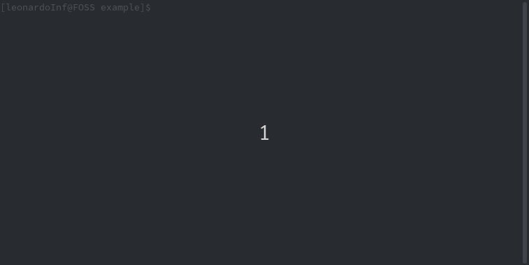

# cli_dialog

[](https://travis-ci.com/leonardoInf/cli_dialog)

[](https://coveralls.io/github/leonardoInf/cli_dialog)

A Dart package which allows you to use [Inquirer.js](https://github.com/SBoudrias/Inquirer.js/) prompts with some additional features.

The following GIF shows a CLI dialog which was created using this library. You can also visit the library page on [pub.dev](https://pub.dev/packages/cli_dialog).



You can find the source for this example [here](example/lib/main.dart)

- [Usage](#usage)
  - [Basic usage](#basic-Usage)
  - [Boolean questions](#boolean-questions)
  - [List questions](#list-questions)
  - [Messages](#messages)
  - [Order](#order)
  - [Navigation mode](#navigation-mode)
- [Testing](#testing)
- [How it works](#how-it-works)
- [Contributing](#contributing)
- [Windows](#windows)
- [Acknowledgements and Alternatives](#acknowledgements-and-alternatives)

## Usage

### Basic Usage

```dart
import 'package:cli_dialog/cli_dialog.dart';

void main() {
  final dialog = CLI_Dialog(questions: [
    ['What is your name?', 'name']
  ]);
  final name = dialog.ask()['name'];
}
```

Whenever you want to create a CLI dialog you create a `CLI_Dialog()` instance.

The `CLI_Dialog` class supports multiple keyword arguments amongst which `questions` is the most basic one.
`questions` is a list of questions and corresponding keys to retreive the answers.

Thus, each list entry for `questions` has the following syntax:
`[<question>, <key<]`.

Then you will want to call the `ask()` method. It performs the CLI dialog and returns a map with the keys you provided and the values it received from the user.

### Boolean questions

```dart
import 'package:cli_dialog/cli_dialog.dart';

void main() {
  final dialog = CLI_Dialog(booleanQuestions: [
    ['Are you happy with this package?', 'isHappy']
  ]);
  final answer = dialog.ask()['isHappy'];
}
```

As the name suggests, boolean questions just asks the user for (y/N) answers and always returns `bool` values.

The N in (y/N) indicates that the default answer is no. You can change this by passing `trueByDefault: true` to the constructor.

### List questions

```dart
import 'package:cli_dialog/cli_dialog.dart';

void main() {
  const listQuestions = [
    [
      {
        'question': 'What is your favourite colour?',
        'options': ['Red', 'Blue', 'Green']
      },
      'colour'
    ]
  ];

  final dialog = CLI_Dialog(listQuestions: listQuestions);
  final answer = dialog.ask();
  final colour = answer['colour'];
}
```

List questions allow the user to make a selection amongst several strings. `'question'` is the question that will be printed before the selection. `'options'` are the options from which the user chooses exactly one. `'colour'` is the key used to retreive the answer.

### Messages

Messages were added in 0.2.0. They are used to display information to users without prompting them for an answer.

You can use them like any other question using the `messages` keyword parameter or `addQuestion(message, is_message: true)`. It is only optional to include a key if you are not using order.

### Order

```dart
import 'package:cli_dialog/cli_dialog.dart';

void main() {
  const listQuestions = [
    [
      {
        'question': 'Where are you from?',
        'options': ['Africa', 'Asia', 'Europe', 'North America', 'South Africa']
      },
      'origin'
    ]
  ];

  const booleanQuestions = [
    ['Do you want to continue?', 'continue']
  ];

  final dialog = CLI_Dialog(
      booleanQuestions: booleanQuestions,
      listQuestions: listQuestions,
      order: ['origin', 'continue']);

  dialog.ask();
}
```

The optional keyword parameter `order` for the constructor allows you to set a custom order for your questions in the dialog by passing a list with keys in your required order.

If you do not indicate any order then the standard order is applied:

1. All messages are displayed to the user.
2. All regular questions.
3. All boolean questions.
4. All list questions.

We used the `order` parameter in this example because otherwise the question 'Do you want to continue' would be asked before 'Where are you from?' according to standard order.

### Navigation mode

Navigation mode was added in 0.2.0. It allows users to freely navigate through the prompt and repeadetly answer questions if the want to. For the developer it is a matter of setting `navigationMode` to `true`:

```dart
final dialog = CLI_Dialog(navigationMode: true);
```

In navigation mode, each question is prepended by an index which shows the user which question he currently answers.
The user can then prepend a colon to his answer and use these indices to jump to another question, even those he has not answered yet. For instance, answering `:2` makes the user jump to the second question. After answering it, the user will be prompted with the third question (again) etc. Entering a question number which is out of scope finishes the CLI_Dialog and makes it return the answer map.

## Testing

This package also provides a small infrastructure for testing your dialogs.

For this purpose, there is the named constructor `CLI_Dialog.std()` which has two required arguments:

- std_input = a StdinService
- std_output = a StdoutService

`StdinService` and `StdoutService` are classes which are provided with this library. There are always used internally for i/o. If you explicitly use these classes then you will probably want to set the `mock` parameter to `true` which will make these services mock objects.

Furtermore, it is mostly advised to pass `std_output` to `std_input` using the `informStdout` and `isTest` parameter to inform the StdoutService about standard input in echo mode.
Details can be checked out in the tests I have written (`test/`).

## How it works

This library uses ANSI/XTerm escape sequences and regular escape sequences. You can take a look at them in [this file](lib/src/xterm.dart)

## Contributing

Of course you are welcome to contribute to this project by issuing a pull request on Github.

Please write unit tests (`test/`) for new functionality and make sure that `test.sh` and `lint.sh` (`tool/`) run succesfully before submitting.

Please format your code using `dartfmt -w .` (this is also covered by `lint.sh`).

## Windows

cli_dialog supports Windows.

- Colors look a bit different in command prompt
- The UTF-16 right indicator is replaced by a simple >

## Acknowledgements and Alternatives

This library is more a less a Dart port of [Inquirer.js](https://github.com/SBoudrias/Inquirer.js/).

There is [dart_inquirer](https://pub.dev/packages/dart_inquirer) which is not developed any more
(even the Github repository was deleted by the author). It works fine but it has less features than this package
(no colors, no navigation, no resume, no question mark etc.).

I also found [interact](https://pub.dev/packages/interact) but I have not tested it.