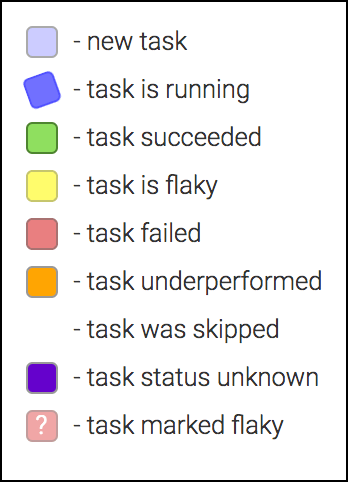

# Flutter devicelab

"Devicelab" (a.k.a. "cocoon") is a physical lab that tests Flutter on real
Android and iOS devices.

This package contains the code for test framework and the tests. More generally
the tests are referred to as "tasks" in the API, but since we primarily use it
for testing, this document refers to them as "tests".

Build results are available at https://flutter-dashboard.appspot.com.

# Reading the dashboard

## The build page

The build page is accessible at https://flutter-dashboard.appspot.com/build.html.
This page reports the health of build servers, called _agents_, and the statuses
of build tasks.

### Agents

A green agent is considered healthy and ready to receive new tasks to build. A
red agent is broken and does not receive new tasks.

In the example below, the dashboard shows that the `linux2` agent is broken and
requires attention. All other agents are healthy.


### Tasks

The table below the agent statuses displays the statuses of build tasks. Task
statuses are color-coded. The following statuses are available:

**New task** (light blue): the task is waiting for an agent to pick it up and
start the build.

**Task is running** (spinning blue): an agent is currently building the task.

**Task succeeded** (green): an agent reported a successful completion of the
task.

**Task is flaky** (yellow): the task was attempted multiple time, but only the
latest attempt succeeded (we currently only try twice).

**Task failed** (red): the task failed all of the attempts.

**Task underperformed** (orange): currently not used.

**Task was skipped** (transparent): the task is not scheduled for a build. This
usually happens when a task is removed from `manifest.yaml` file.

**Task status unknown** (purple): currently not used.

In addition to color-coding, a task may display a question mark. This means
that the task was marked as flaky manually. The status of such task is ignored
when considering whether the build is broken or not. For example, if a flaky
task fails, GitHub will not prevent PR submissions. However, if the latest
status of a non-flaky task is red, all pending PRs will contain a warning about
the broken build and recommend caution when submitting.

Legend:



The example below shows that commit `e122d5d` caused a wide-spread breakage,
which was fixed by `bdc6f10`. It also shows that Cirrus and Chrome
Infra (left-most tasks) decided to skip building these commits. Hovering over
a cell will pop up a tooltip containing the name of the broken task. Clicking
on the cell will open the log file in a new browser tab (only visible to core
contributors as of today).


## Why is a task stuck on "new task" status?

The dashboard aggregates build results from multiple build environments,
including Cirrus, Chrome Infra, and devicelab. While devicelab
tests every commit that goes into the `master` branch, other environments
may skip some commits. For example, Cirrus will only test the
_last_ commit of a PR that's merged into the `master` branch. Chrome Infra may
skip commits when they come in too fast.

## How the devicelab runs the tasks

The devicelab agents have a small script installed on them that continuously
asks the CI server for tasks to run. When the server finds a suitable task for
an agent it reserves that task for the agent. If the task succeeds, the agent
reports the success to the server and the dashboard shows that task in green.
If the task fails, the agent reports the failure to the server, the server
increments the counter counting the number of attempts it took to run the task
and puts the task back in the pool of available tasks. If a task does not
succeed after a certain number of attempts (as of this writing the limit is 2),
the task is marked as failed and is displayed using red color on the dashboard.

# Running tests locally

Do make sure your tests pass locally before deploying to the CI environment.
Below is a handful of commands that run tests in a similar way to how the
CI environment runs them. These commands are also useful when you need to
reproduce a CI test failure locally.

## Prerequisites

You must set the `ANDROID_HOME` environment variable to run tests on Android. If
you have a local build of the Flutter engine, then you have a copy of the
Android SDK at `.../engine/src/third_party/android_tools/sdk`.

You can find where your Android SDK is using `flutter doctor`.

## Warnings

Running devicelab will do things to your environment.

Notably, it will start and stop gradle, for instance.

## Running all tests

To run all tests defined in `manifest.yaml`, use option `-a` (`--all`):

```sh
dart bin/run.dart -a
```

## Running specific tests

To run a test, use option `-t` (`--task`):

```sh
# from the .../flutter/dev/devicelab directory
dart bin/run.dart -t {NAME_OR_PATH_OF_TEST}
```

Where `NAME_OR_PATH_OF_TEST` can be either of:

- the _name_ of a task, which you can find in the `manifest.yaml` file in this
  directory. Example: `complex_layout__start_up`.
- the path to a Dart _file_ corresponding to a task, which resides in `bin/tasks`.
  Tip: most shells support path auto-completion using the Tab key. Example:
  `bin/tasks/complex_layout__start_up.dart`.

To run multiple tests, repeat option `-t` (`--task`) multiple times:

```sh
dart bin/run.dart -t test1 -t test2 -t test3
```

To run tests from a specific stage, use option `-s` (`--stage`).
Currently there are only three stages defined, `devicelab`,
`devicelab_ios` and `devicelab_win`.


```sh
dart bin/run.dart -s {NAME_OF_STAGE}
```

# Reproducing broken builds locally

To reproduce the breakage locally `git checkout` the corresponding Flutter
revision. Note the name of the test that failed. In the example above the
failing test is `flutter_gallery__transition_perf`. This name can be passed to
the `run.dart` command. For example:

```sh
dart bin/run.dart -t flutter_gallery__transition_perf
```

# Writing tests

A test is a simple Dart program that lives under `bin/tests` and uses
`package:flutter_devicelab/framework/framework.dart` to define and run a _task_.

Example:

```dart
import 'dart:async';

import 'package:flutter_devicelab/framework/framework.dart';

Future<void> main() async {
  await task(() async {
    ... do something interesting ...

    // Aggregate results into a JSONable Map structure.
    Map<String, dynamic> testResults = ...;

    // Report success.
    return new TaskResult.success(testResults);

    // Or you can also report a failure.
    return new TaskResult.failure('Something went wrong!');
  });
}
```

Only one `task` is permitted per program. However, that task can run any number
of tests internally. A task has a name. It succeeds and fails independently of
other tasks, and is reported to the dashboard independently of other tasks.

A task runs in its own standalone Dart VM and reports results via Dart VM
service protocol. This ensures that tasks do not interfere with each other and
lets the CI system time out and clean up tasks that get stuck.

# Adding tests to the CI environment

The `manifest.yaml` file describes a subset of tests we run in the CI. To add
your test edit `manifest.yaml` and add the following in the "tasks" dictionary:

```
  {NAME_OF_TEST}:
    description: {DESCRIPTION}
    stage: {STAGE}
    required_agent_capabilities: {CAPABILITIES}
```

Where:

 - `{NAME_OF_TEST}` is the name of your test that also matches the name of the
 file in `bin/tests` without the `.dart` extension.
 - `{DESCRIPTION}` is the plain English description of your test that helps
 others understand what this test is testing.
 - `{STAGE}` is `devicelab` if you want to run on Android, or `devicelab_ios` if
 you want to run on iOS.
 - `{CAPABILITIES}` is an array that lists the capabilities required of
 the test agent (the computer that runs the test) to run your test. Available
 capabilities are: `has-android-device`, `has-ios-device`.
