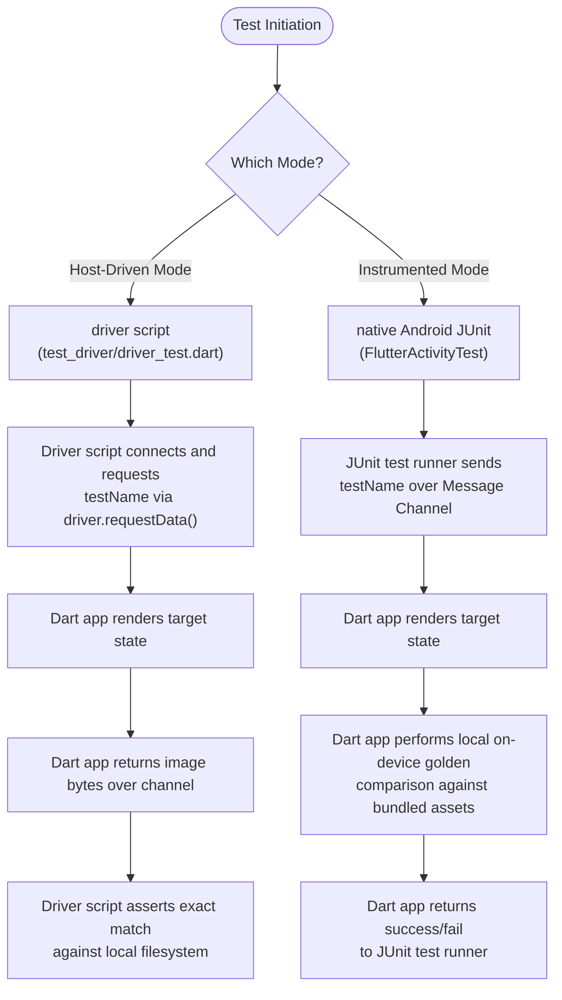
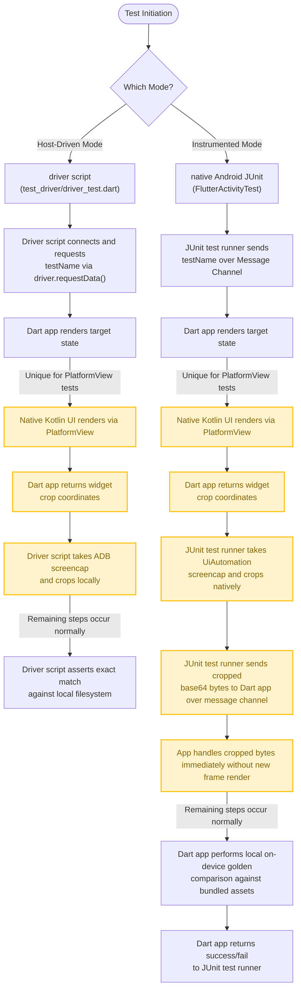

# Android Hardware Smoke Test

An integration and compatibility smoke test suite designed to verify visual rendering correctness on Android hardware.

## Prerequisites & Initial Setup

Because this integration test project follows a minimal-boilerplate pattern, standard binary Gradle wrappers and properties are not committed to the repository.

Before compiling or running any connected JUnit/instrumented tests locally for the first time, simply run the standard Flutter project regeneration command in this directory to restore the missing wrappers:

```sh
flutter create --platform=android --no-overwrite .
```

This will cleanly restore the missing wrapper scripts (`gradlew`, `gradlew.bat`) and wrapper configurations without modifying any of the customized build definitions, Java/Kotlin test harnesses, or package sources.

## 1. Overview & Purpose
The primary objective of the `android_hardware_smoke_test` is to provide a **fully self-contained Android instrumented test suite**.

This allows Android hardware manufacturers (OEMs) to run visual regression, performance, and GPU compatibility tests on a precompiled APK directly on their target devices. **The test execution requires no Flutter SDK, Dart CLI commands, or host-side orchestration.** Feedback is reported directly in standard native Android JUnit test reports.

---

## 2. Structural Differences: `android_hardware_smoke_test` vs. `android_engine_test`

While both suites verify rendering correctness, they are architected differently to support different workflows:

| Dimension | `android_engine_test` | `android_hardware_smoke_test` |
| :--- | :--- | :--- |
| **Verification Location** | **Host-Only** (CI PC) | **Dual-Mode**: On-Device (OEM) & On-Host (CI) |
| **Golden Comparison** | Host-side only against Skia Gold. | **OEM Mode**: In-App pixel comparison against bundled assets.<br>**CI Mode**: Host-side comparisons against repository files. |
| **Device Role** | Passive target rendering static views. | Active participant executing on-device JUnit orchestration. |
| **Target Audience** | Core Engine Contributors & CI Shards. | Android Hardware Manufacturers (OEMs) & CI Shards. |

---

## 3. Dual-Mode Architecture



### Host-Driven Driver Mode (CI / Host-Driven)
* **Orchestration**: Orchestrated by the host PC using `flutter drive`.
* **Execution**: The host script (`test_driver/driver_test.dart`) commands the app (`lib/main.dart` through thin wrapper `integration_test/integration_test_wrapper.dart`) to transition states. The app captures the repaint boundary, base64-encodes it, and streams the bytes back to the host the message channel. The host driver decodes the bytes and asserts visual matches against local repository baselines on the host filesystem.

### Instrumented On-Device Mode (OEM / Standalone)
* **Orchestration**: Runs purely on the device under Android `AndroidJUnit4` runner.
* **Execution**: Java JUnit code (`FlutterActivityTest.java`) launches the main activity and sends the test payload over a JSON message channel. The app (`lib/main.dart`) renders the widget, performs a local pixel-by-pixel on-device comparison against baseline images bundled within the APK assets, and replies with the status to the Java runner to pass or fail the JUnit assertion.

---

## 4. How to Run the Tests

Unlock your connected Android device or emulator and ensure it is active before executing any of these commands.

### A. Running via Host Driver (CI / Host-Driven)

This mode is used to execute visual assertions locally on your PC or in CI pipelines, and to manage the local golden baselines.

* **Command to run the driver test suite**:
  ```sh
  # Execute from the android_hardware_smoke_test root directory
  flutter drive -v \
    --driver=test_driver/driver_test.dart \
    --target=integration_test/integration_test_wrapper.dart \
    --no-dds
  ```

* **Command to capture/update reference golden baselines**:
  Running with `UPDATE_GOLDENS=true` writes or overwrites the local PNG baselines under `test_driver/goldens/` on the host.

  Because the statically compiled `AndroidManifest.xml` is the single source of truth, the app will automatically self-report its active backend variant. To capture or update the baseline for a specific graphics variant, simply edit `android/app/src/main/AndroidManifest.xml` to set the desired `io.flutter.embedding.android.ImpellerBackend` value, then execute:

  ```sh
  UPDATE_GOLDENS=true flutter drive -v \
    --driver=test_driver/driver_test.dart \
    --target=integration_test/integration_test_wrapper.dart \
    --no-dds
  ```

---

### B. Running Instrumented Tests (OEM / Self-Contained)

> [!IMPORTANT]
> **Asset Bundling Precondition**:
> Because instrumented tests run completely standalone on the device, they compare pixels against baseline images bundled as read-only assets inside the APK. You **must** first generate the local baselines under `test_driver/goldens/` using the **Host-Driven Driver Mode (with `UPDATE_GOLDENS=true`)** before compiling and building the instrumented APK.

* **Command to compile and run the native JUnit suite**:
  ```sh
  # Execute from the 'android' subdirectory
  cd android
  ./gradlew :app:connectedDebugAndroidTest \
    -Pandroid.testInstrumentationRunnerArguments.class=com.example.android_hardware_smoke_test.FlutterActivityTest \
    -s
  ```

> [!NOTE]
> **Statically Compiled Single Source of Truth**:
> The app's compiled `AndroidManifest.xml` `<meta-data>` tag is the single source of truth for the graphics backend configuration under **both** Instrumented On-Device Mode (OEM) and Host-Driven Driver Mode (CI).
>
> * **Instrumented On-Device Mode (OEM)**: The native Java JUnit harness (`FlutterActivityTest.java`) reads this value dynamically using the `PackageManager` API and routes it to Dart.
> * **Host-Driven Driver Mode (CI / Host)**: The Dart app queries the native Android embedder via a custom `MethodChannel` to self-discover its compiled backend and self-reports it to the host test script inside its JSON reply payload, completely eliminating the need for environment variables on the host PC.
>
> To switch the active graphics backend manually for local runs, open `android/app/src/main/AndroidManifest.xml` and update the `io.flutter.embedding.android.ImpellerBackend` value:
>
> ```xml
> <!-- Enable Vulkan: -->
> <meta-data android:name="io.flutter.embedding.android.ImpellerBackend" android:value="vulkan" />
>
> <!-- Enable OpenGLES: -->
> <meta-data android:name="io.flutter.embedding.android.ImpellerBackend" android:value="opengles" />
> ```

> [!NOTE]
> **Automated HTML Screenshot Embedding (`embedTestResultImages`)**:
> When running the Gradle command above, a custom Kotlin DSL task named **`embedTestResultImages`** executes automatically once the tests finish.
>
> It performs the following actions seamlessly:
> 1. Prevents Gradle from auto-uninstalling the APKs prematurely (via a `gradle.properties` injection).
> 2. Queries the device sandbox cache to discover all rendered `.png` files dynamically.
> 3. Streams the raw binary images directly onto the host PC using zero-copy ADB piping.
> 4. Dynamically parses the generated HTML reports and injects Alternative `` elements right next to the test outcome table cells.
> 5. Executes a manual `adb uninstall` cleanup to leave the target device perfectly clean.
>
> Once finished, open `app/build/reports/androidTests/connected/debug/index.html` to view the interactive report with all rendering result snapshots embedded natively!

---

### C. Manual Command-Line Debugging (Without Gradle Orchestration)

If you prefer to bypass Gradle entirely for custom debugging, you can manually build, install, and run the instrumentation using raw `adb` shell calls:

1. **Build and Install the packages manually**:
   ```sh
   # Run from the 'android' subdirectory
   cd android
   ./gradlew installDebug installDebugAndroidTest
   ```

2. **Manually launch the native Android instrumentation test**:
   ```sh
   adb shell am instrument -w \
     -e class com.example.android_hardware_smoke_test.FlutterActivityTest \
     com.example.android_hardware_smoke_test.test/androidx.test.runner.AndroidJUnitRunner
   ```

3. **Manually pull the generated snapshot off the device's sandbox**:
   Since the app remains installed during raw `adb` runs, you can copy the rendering result files manually:
   ```sh
   adb exec-out "run-as com.example.android_hardware_smoke_test cat cache/results/blueRectangleTest.png" \
     > test_driver/results/blueRectangleTest.png
   ```

---

### D. Running the CI Shard Locally

Since the test suite is registered inside the central repository test orchestrator (`dev/bots/test.dart`), you can execute the full CI runner pipeline locally using standard dev-bot scripts:

```sh
# Run the Vulkan graphics backend shard locally
SHARD=android_hardware_smoke_vulkan_tests bin/cache/dart-sdk/bin/dart dev/bots/test.dart

# Run the OpenGLES graphics backend shard locally
SHARD=android_hardware_smoke_opengles_tests bin/cache/dart-sdk/bin/dart dev/bots/test.dart
```

---

## 5. Test Suite Coverage & Technical Rationales

The suite is composed of targeted visual regression test cases designed to exercise distinct GPU graphics pipelines and verify compatibility with driver and hardware configurations:

| Test Case | Rendering Pipeline | Impeller/Hardware Mechanism Exercised | Reference/Source |
| :--- | :--- | :--- | :--- |
| **`blueRectangleTest`** | **Solid Vector Fills** | Standard vector rasterization and layout transformation. | Simple `canvas.drawRect` |
| **`trianglePathTest`** | **Complex Paths** | Path triangulation, rasterization, and hardware anti-aliasing (MSAA). | Simple `canvas.drawPath` |
| **`textTest`** | **Font Rendering** | Text layout (`TextPainter`), glyph caching, shaping, and font atlas rendering. | Simple `TextPainter.paint` |
| **`imageTest`** | **Texture Sampling** | Image decoding, GPU texture uploading, and texture sampler rendering. Uses a 32x32 4-color checkerboard PNG to verify RGB color channel correctness. | Simple `canvas.drawImage` |
| **`advancedBlendTest`** | **Advanced Blending** | Fragment shader blending and framebuffer fetch tile-memory optimizations (e.g. Vulkan subpass inputs, `EXT_shader_framebuffer_fetch` in GLES). Uses `BlendMode.difference`. | Mirrors [animated_advanced_blend.dart](/dev/benchmarks/macrobenchmarks/lib/src/animated_advanced_blend.dart). |
| **`backdropFilterBlurTest`** | **Compositing & Blur** | Offscreen texture allocation, layer downscale/upscale passes, and multi-pass Gaussian blur filter execution. Uses `ImageFilter.blur(sigmaX: 5, sigmaY: 5)`. | Mirrors [backdrop_filter.dart](/dev/benchmarks/macrobenchmarks/lib/src/backdrop_filter.dart). |
| **`platformViewTextureLayerTest`** | **Platform Views (Texture Layer)** | Embedded native Android views composition using Texture Layer Hybrid Composition (TLHC) via `PlatformViewsService.initSurfaceAndroidView`. | Mirrors texture layer composition pathways. |
| **`platformViewHybridCompositionTest`** | **Platform Views (Hybrid Composition)** | Embedded native Android views composition using legacy Hybrid Composition (HC) via `PlatformViewsService.initExpensiveAndroidView`. Uses `AndroidViewSurface` to overlay native UI. | Mirrors legacy hybrid composition pathways. |
| **`platformViewHybridCompositionPlusPlusTest`** | **Platform Views (Hybrid Composition++)** | Embedded native Android views composition using Hybrid Composition++ (HCPP) via `PlatformViewsService.initHybridAndroidView`. Skips cleanly if the device lacks HCPP hardware support. | Mirrors modern HCPP composition pathways. |


---

## 6. Platform View Screenshot Strategy

Testing platform views requires capturing a screenshot of the physical screen layout that contains both the Flutter-rendered UI and native Android views (e.g., a native `TextView` wrapped under hybrid composition).

Because these two contexts are rendered on separate hardware surface layers, standard in-process widget screenshot methods (like `RenderRepaintBoundary.toImage()`) cannot see or capture the native platform view pixels.

To address this, the test suite implements a **No-Compositing System Screenshot Strategy**:



### Flow Breakdown

The beginning and end of the test are the same as for other tests as described in Section 3 above.

* **Native UI rendering and timing**: For platform view tests (starting with `platformView` prefix), the app renders an `AndroidViewLink` or `AndroidView` widget. This causes the Android OS to render the native Kotlin UI (`NativeTextView`) via the selected composition mode ([`NativeTextView.kt`](android/app/src/main/kotlin/com/example/android_hardware_smoke_test/NativeTextView.kt)). Because the native UI is rendered by the OS, `addPostFrameCallback` is no longer sufficient to guarantee that all pixels of the test scenario have been fully rendered and composited, so `handleGoldenRequest` waits a few extra frames using `await WidgetsBinding.instance.endOfFrame`.
* **Crop coordinates and test-script-driven screenshot capture**:
  * **Both Modes:** The Dart app ([`goldens.dart`](lib/goldens.dart)) computes the bounding box of the `RepaintBoundary` in physical device pixels and returns these coordinates back to the test runner.
  * **Host-Driven Mode:** The driver script takes a full-screen screenshot of the physical device using ADB (`adb shell screencap` wrapped inside `NativeDriver.screenshot()` in [`driver_test.dart`](test_driver/driver_test.dart)). Then crops it locally to the retrieved coordinates using the Dart `image` package.
  * **Instrumented Mode:** The JUnit test runner takes a full-screen screenshot using `UiAutomation.takeScreenshot()` in [`FlutterActivityTest.kt: captureAndSendScreenshot`](android/app/src/androidTest/java/com/example/android_hardware_smoke_test/FlutterActivityTest.kt). Then crops the bitmap natively using `Bitmap.createBitmap`.
* **Extra round trip and encoding-independent pixel comparison for Instrumented Mode**:
  * **Instrumented Mode:** The Dart app is where we perform the golden comparison, so the JUnit test runner sends the cropped bytes back to the Dart app by base64-encoding them and sending them over the `BasicMessageChannel`. It sets a field on the JSON message called `command` with the value `compare_golden`. When the Dart app parses this request, it performs the golden comparison immediately instead of waiting for another frame through `addPostFrameCallback`. However, the normal `NaiveLocalFileComparator` compares all image bytes. This is a problem because the different methods of capturing screenshots may produce images with PNG encoding differences. To compare pixels regardless of encoding, we use a [PixelExactLocalFileComparator](lib/pixel_exact_local_file_comparator.dart). After comparison, it reports success or failure in the same way as it would for other tests.
  * **Host-Driven Mode:** The driver doesn't need a new round trip because it performs the comparison directly in the same way as it does for image bytes returned from the Dart app.


### Why the `PixelCopy` approach was not desirable

An alternative approach using `PixelCopy` was considered:
* **How it worked:** The native Kotlin app targeted the `FlutterSurfaceView` directly using `PixelCopy.request(surfaceView, ...)` and then manually traversed the Android sibling view hierarchy, drawing the visible native platform view boundaries on top of the captured bitmap using a Kotlin `Canvas`.

While plausible and functioning, it was **not desirable** for several reasons:
1. **Manual Compositing Replicas:** Drawing views manually onto a canvas (`child.draw(canvas)`) relies on replicating the composition steps. If the operating system or graphics drivers apply specific shader effects, blending, custom overlays, or subpixel anti-aliasing during hardware composition, the manual Kotlin reconstruction might not match what the user actually sees.
2. **Missing Real Composition Bugs:** The primary goal of this smoke test is to catch platform-specific integration and composition rendering errors in GPU drivers. If we manually draw the sibling views ourselves, we bypass the OS hardware compositor (SurfaceFlinger) entirely for the screenshot, defeating the purpose of testing the system's actual composition pipeline.
3. **Fragility:** Manually translating coordinate spaces, handling layouts, view visibility states, and Z-orders in Kotlin is highly fragile and prone to emulation/rendering bugs.

By capturing the entire screen using native system compositor APIs (`adb` / `UiAutomation`) and cropping, the test asserts on the **true, final composited image** rendered by the device's GPU and system composer.
