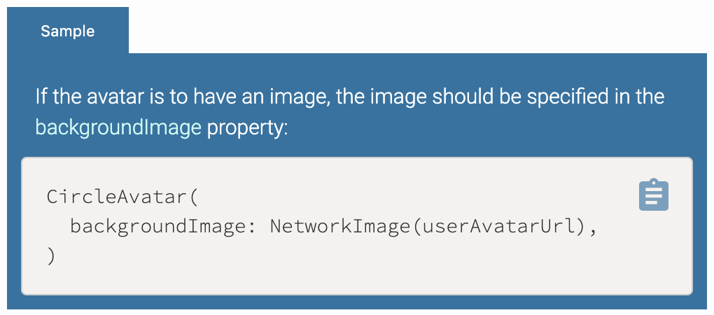
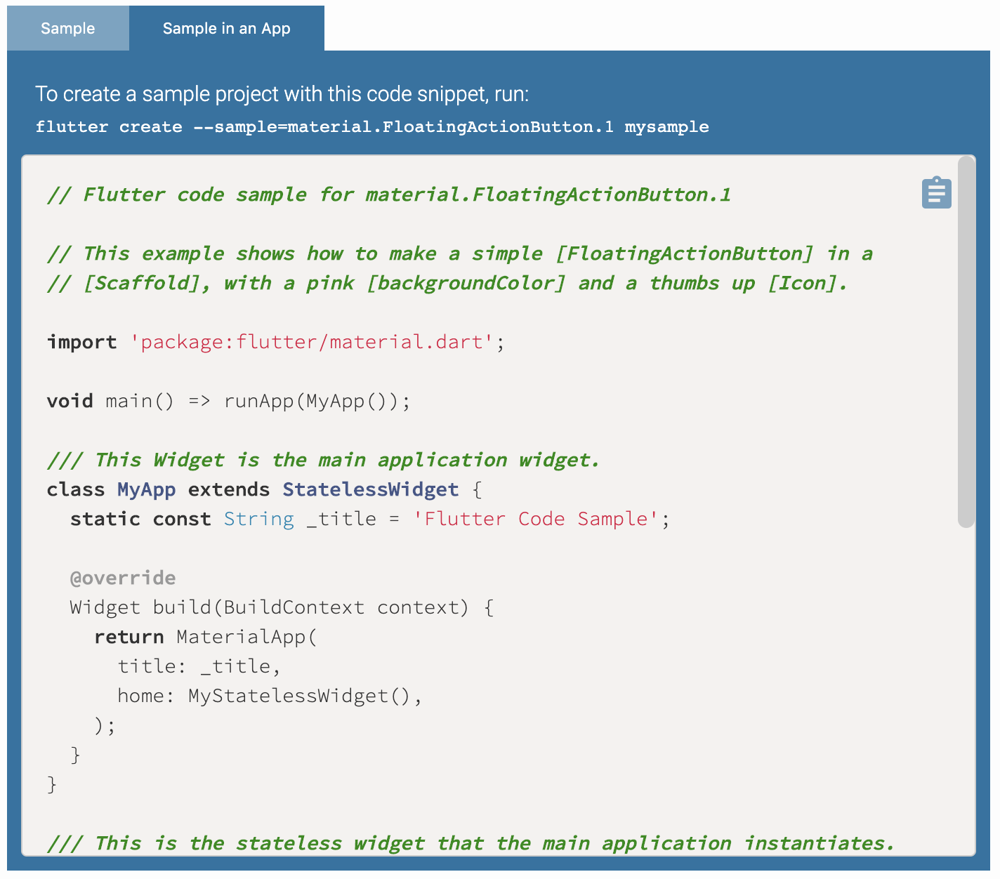

# Dartdoc Generation

The Flutter API documentation contains code blocks that help provide context or
a good starting point when learning to use any of Flutter's APIs.

To generate these code blocks, Flutter uses dartdoc tools to turn documentation
in the source code into API documentation, as seen on https://api.flutter.dev/.

## Table of Contents

- [Types of code blocks](#types-of-code-blocks)
  - [Snippet tool](#snippet-tool)
  - [Sample tool](#sample-tool)
- [Skeletons](#skeletons)
- [Test Doc Generation Workflow](#test-doc-generation-workflow)

## Types of code blocks

There are three kinds of code blocks.

* A `snippet`, which is a more or less context-free code snippet that we
  magically determine how to analyze.

* A `dartpad` sample, which gets placed into a full-fledged application, and can
  be executed inline in the documentation on the web page using
  DartPad.

* A `sample`, which gets placed into a full-fledged application, but isn't
  placed into DartPad in the documentation because it doesn't make sense to do
  so.

Ideally, every sample is a DartPad sample, but some samples don't have any visual
representation and some just don't make sense that way (for example, sample
code for setting the system UI's notification area color on Android won't do
anything on the web).

### Snippet Tool



The code `snippet` tool generates a block containing a description and example
code. Here is an example of the code `snippet` tool in use:

```dart
/// {@tool snippet}
///
/// If the avatar is to have an image, the image should be specified in the
/// [backgroundImage] property:
///
/// ```dart
/// CircleAvatar(
///   backgroundImage: NetworkImage(userAvatarUrl),
/// )
/// ```
/// {@end-tool}
```

This will generate sample code that can be copied to the clipboard and added to
existing applications.

This uses the skeleton for [snippet](config/skeletons/snippet.html) snippets
when generating the HTML to put into the Dart docs.

#### Analysis

The `../bots/analyze_sample_code.dart` script finds code inside the `@tool
snippet` sections and uses the Dart analyzer to check them.

There are several kinds of sample code you can specify:

* Constructor calls, typically showing what might exist in a build method. These
  will be inserted into an assignment expression assigning to a variable of type
  "dynamic" and followed by a semicolon, for analysis.

* Class definitions. These start with "class", and are analyzed verbatim.

* Other code. It gets included verbatim, though any line that says `// ...` is
  considered to separate the block into multiple blocks to be processed
  individually.

The above means that it's tricky to include verbatim imperative code (e.g. a
call to a method) since it won't be valid to have such code at the top level.
Instead, wrap it in a function or even a whole class, or make it a valid
variable declaration.

You can declare code that should be included in the analysis but not shown in
the API docs by adding a comment "// Examples can assume:" to the file (usually
at the top of the file, after the imports), following by one or more
commented-out lines of code. That code is included verbatim in the analysis. For
example:

```dart
// Examples can assume:
// final BuildContext context;
// final String userAvatarUrl;
```

You can assume that the entire Flutter framework and most common
`dart:*` packages are imported and in scope; `dart:math` as `math` and
`dart:ui` as `ui`.

### Sample Tool



The code `sample` and `dartpad` tools can expand sample code into full Flutter
applications. These sample applications can be directly copied and used to
demonstrate the API's functionality in a sample application, or used with the
`flutter create` command to create a local project with the sample code. The
`dartpad` samples are embedded into the API docs web page and are live
applications in the API documentation.

```dart
/// {@tool sample --template=stateless_widget_material}
/// This example shows how to make a simple [FloatingActionButton] in a
/// [Scaffold], with a pink [backgroundColor] and a thumbs up [Icon].
///
/// ```dart
/// Widget build(BuildContext context) {
///   return Scaffold(
///     appBar: AppBar(
///       title: Text('Floating Action Button Sample'),
///     ),
///     body: Center(
///       child: Text('Press the button below!')
///     ),
///     floatingActionButton: FloatingActionButton(
///       onPressed: () {
///         // Add your onPressed code here!
///       },
///       child: Icon(Icons.thumb_up),
///       backgroundColor: Colors.pink,
///     ),
///   );
/// }
/// ```
/// {@end-tool}
```

This uses the skeleton for [application](config/skeletons/sample.html)
snippets.

The `sample` and `dartpad` tools also allow for quick Flutter app generation
using the following command:

```bash
flutter create --sample=[directory.File.sampleNumber] [name_of_project_directory]
```

This command is displayed as part of the sample in the API docs.

#### Templates

To support showing an entire app when you click on the right tab of the
code sample UI, we have to be able to insert the `sample` or `dartpad` block
into the template and instantiate the right parts.

To do this, there is a [config/templates](config/templates) directory that
contains a list of templates. These templates represent an entire app that the
`sample` or `dartpad` can be placed into, basically a replacement for
`lib/main.dart` in a flutter app package.

For more information about how to create, use, or update templates, see
[config/templates/README.md](config/templates/README.md).

#### Analysis

The `../bots/analyze_sample_code.dart` script finds code inside the `@tool
sample` sections and uses the Dart analyzer to check them after applying the
specified template.

## Skeletons

A skeleton (concerning this tool) is an HTML template into which the Dart
code blocks and descriptions are interpolated.

There is currently one skeleton for
[application](config/skeletons/sample.html) samples, one for
[dartpad](config/skeletons/dartpad-sample.html), and one for
[snippet](config/skeletons/snippet.html) code samples, but there could be more.

Skeletons use mustache notation (e.g. `{{code}}`) to mark where components will
be interpolated into the template. It doesn't use the mustache
package since these are simple string substitutions, but it uses the same
syntax.

The code block generation tools that process the source input and emit HTML for
output, which dartdoc places back into the documentation. Any options given to
the `{@tool ...}` directive are passed on verbatim to the tool.

The `snippets` tool renders these examples through a combination of markdown
and HTML using the `{@inject-html}` dartdoc directive.

## Test Doc Generation Workflow

If you are making changes to an existing code block or are creating a new code
block, follow these steps to generate a local copy of the API docs and verify
that your code blocks are showing up correctly:

1. Make an update to a code block or create a new code block.
2. From the root directory, run `./dev/bots/docs.sh`. This should start
   generating a local copy of the API documentation.
3. Once complete, check `./dev/docs/doc` to check your API documentation. The
   search bar will not work locally, so open `./dev/docs/doc/index.html` to
   navigate through the documentation, or search `./dev/docs/doc/flutter` for
   your page of interest.

Note that generating the sample output will not allow you to run your code in
DartPad, because DartPad pulls the code it runs from the appropriate docs server
(master or stable).

Copy the generated code and paste it into a regular DartPad instance to test if
it runs in DartPad. To get the code that will be produced by your documentation
changes, run sample analysis locally (see the next section) and paste the output
into a DartPad at https://dartpad.dartlang.org.

## Running sample analysis locally

If all you want to do is analyze the sample code you have written locally, then
generating the entire docs output takes a long time.

Instead, you can run the analysis locally with this command from the Flutter root:

```
TMPDIR=/tmp bin/cache/dart-sdk/bin/dart dev/bots/analyze_sample_code.dart --temp=samples
```

This will analyze the samples, and leave the generated files in `/tmp/samples`

You can find the sample you are working on in `/tmp/samples`. It is named using the
path to the file it is in, and the line of the file that the `{@tool ...}` directive
is on.

For example, the file `sample.src.widgets.animated_list.52.dart` points to the sample
in `packages/flutter/src/widgets/animated_list.dart` at line 52. You can then take the
contents of that file, and paste it into [Dartpad](https://dartpad.dev) and see if it
works. If the sample relies on new features that have just landed, it may not work
until the features make it into the `dev` branch.
