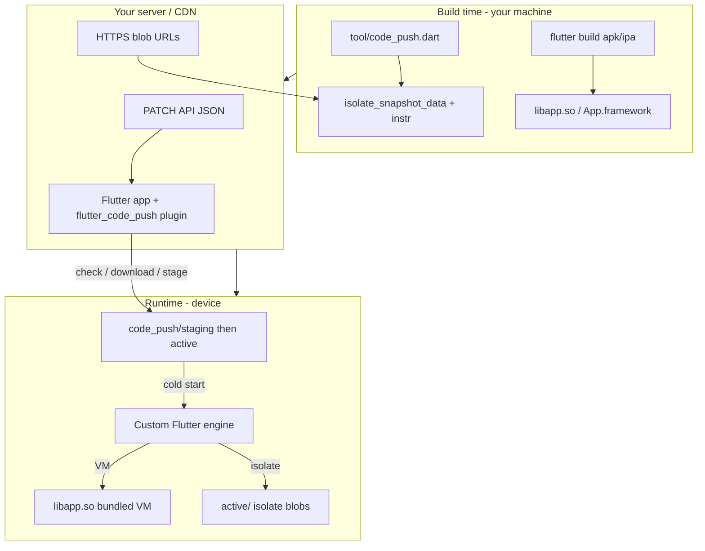

# OTA Code Push — Complete Code Walkthrough

This document explains **every file and change** added for Dart isolate snapshot over-the-air (OTA) updates in this repository. Read it top-to-bottom once for the big picture, then use the table of contents to jump to a specific file.

| Related docs | Purpose |
|--------------|---------|
| [README.md](./README.md) | How to **build** the custom Flutter engine |
| [packages/flutter_code_push/README.md](../../packages/flutter_code_push/README.md) | How to **use** the plugin in your app, server API, troubleshooting |

**Platforms:** Android and iOS only (release AOT). Desktop and web are out of scope.

---

## Table of contents

1. [What problem this solves](#1-what-problem-this-solves)
2. [Big picture architecture](#2-big-picture-architecture)
3. [Dart snapshots 101 (why only two files)](#3-dart-snapshots-101-why-only-two-files)
4. [On-disk layout on the device](#4-on-disk-layout-on-the-device)
5. [End-to-end lifecycle](#5-end-to-end-lifecycle)
6. [Engine layer (C++ / Java / Objective-C++)](#6-engine-layer)
7. [Plugin layer (Dart / Java / Swift)](#7-plugin-layer)
8. [Build tooling](#8-build-tooling)
9. [Constants and duplication](#9-constants-and-duplication)
10. [Files that are documentation-only or unused](#10-files-that-are-documentation-only-or-unused)
11. [Glossary](#11-glossary)

---

## 1. What problem this solves

Store apps ship a **release AOT build**: Dart code is compiled ahead-of-time into binary blobs inside `libapp.so` (Android) or `App.framework` (iOS). Normally you cannot change that Dart code without shipping a new store version.

**Code push** lets you download **new Dart application code** and run it on the **next cold start**, without replacing:

- `libflutter.so` / Flutter engine
- The **VM snapshot** inside `libapp.so` (Dart runtime bootstrap)
- Native plugins / JNI / platform channels compiled into the store binary

What **can** change OTA:

- The **application isolate** snapshot: two files on disk
  - `isolate_snapshot_data` — heap / constants / objects snapshot
  - `isolate_snapshot_instr` — AOT machine code for your Dart app

Stock Flutter release engines often **ignore** `--isolate-snapshot-data` when loading from `libapp.so`. This fork changes the engine and embedders so those flags work in release.

---

## 2. Big picture architecture



**Two halves:**

| Half | Responsibility |
|------|----------------|
| **Engine** (`engine/src/flutter/shell/...`) | On startup, if OTA blobs exist and are valid, pass their paths into the shell so Dart loads the patched isolate |
| **Plugin** (`packages/flutter_code_push/`) | Download blobs, verify hashes, write `staging/`, promote to `active/`, expose Dart API |

The engine never talks to your HTTP server. The plugin never parses Dart snapshots—it only moves bytes and JSON.

---

## 3. Dart snapshots 101 (why only two files)

A Flutter release build contains several snapshot pieces:

| Piece | Typical location | OTA in this project? |
|-------|------------------|----------------------|
| VM snapshot | Inside `libapp.so` | **No** — always from store build |
| Application isolate | Inside `libapp.so` **or** external files | **Yes** — `isolate_snapshot_data` + `isolate_snapshot_instr` |

The **isolate** is your app’s Dart code and heap layout at snapshot time. The **VM** is shared runtime machinery. They must stay compatible: patches must be built with the **same** engine version, target CPU, and release mode as the store binary.

---

## 4. On-disk layout on the device

All platforms use the same **logical** tree (paths differ slightly—see below).

```
<code_push_root>/
├── staging/          ← download + verify here first (safe rollback)
│   ├── isolate_snapshot_data
│   ├── isolate_snapshot_instr
│   └── patch_manifest.json
└── active/           ← promoted patch used on next cold start
    ├── isolate_snapshot_data
    ├── isolate_snapshot_instr
    └── patch_manifest.json
```

| Platform | Root directory |
|----------|----------------|
| Android | `Context.getFilesDir()/code_push/` |
| iOS | `Documents/code_push/` |

### `patch_manifest.json` fields

Written by the plugin when staging; read by Android engine resolver (iOS engine currently only checks file existence).

| Field | Meaning |
|-------|---------|
| `patch_number` | Monotonic integer; app sends this to your API as `current_patch` |
| `release_version` | Must match store build (e.g. `1.2.0+42`) |
| `isolate_data_sha256` | SHA-256 hex of data blob |
| `isolate_instr_sha256` | SHA-256 hex of instr blob |
| `isolate_data_length_bytes` | Size check on load (Android resolver) |
| `isolate_instr_length_bytes` | Size check on load (Android resolver) |
| `enabled` | If `false`, Android resolver ignores patch and uses bundled isolate |

---

## 5. End-to-end lifecycle

### Phase A — Store release (once)

1. Build app with **custom engine** (`--local-engine=...`).
2. Ship APK/IPA. Users install `libapp.so` / `App.framework` with embedded default isolate.

### Phase B — Create a patch (CI or local)

1. Change Dart code; rebuild release.
2. Run `packages/flutter_code_push/tool/code_push.dart extract` on new `app.so` to get fresh isolate blobs.
3. Run `artifact` command (or upload blobs + build manifest JSON) for your CDN/API.

### Phase C — User updates (runtime)

1. `CodePushUpdater.checkForUpdate()` → HTTP GET your API.
2. `downloadPatch()` → native code downloads to **`staging/`**, verifies SHA-256.
3. `applyStagedPatch()` → copies **`staging/` → `active/`**, clears staging.
4. User **force-quits** app and opens again (cold start required).
5. **Engine** reads `active/` and overrides isolate snapshot paths.

If anything fails validation, the engine falls back to the bundled isolate inside `libapp.so`.

---

## 6. Engine layer

Engine code runs **before** your Dart `main()`. It only configures **where** snapshot files are loaded from.

### 6.1 `engine/src/flutter/shell/common/code_push_config.h`

**Purpose:** Central list of directory and file **names** (documentation-oriented; see [§9](#9-constants-and-duplication)).

```cpp
struct CodePushConfig {
  static constexpr const char* kRootDirectoryName = "code_push";
  static constexpr const char* kActiveDirectoryName = "active";
  static constexpr const char* kStagingDirectoryName = "staging";
  static constexpr const char* kManifestFileName = "patch_manifest.json";
  static constexpr const char* kIsolateSnapshotDataFileName = "isolate_snapshot_data";
  static constexpr const char* kIsolateSnapshotInstructionsFileName = "isolate_snapshot_instr";
};
```

**Not currently `#include`d** by any `.cc` / `.mm` file. Java/Swift duplicate these strings instead.

---

### 6.2 `engine/src/flutter/shell/common/switches.cc`

**Purpose:** Parse shell command-line flags into `flutter::Settings`, including OTA isolate paths.

**Stock behavior (simplified):** If you pass `--aot-shared-library-name=libapp.so`, snapshot paths for VM/isolate often come **from inside** that library—not from separate files.

**New behavior (lines ~402–429):** After resolving `libapp.so`, if `--isolate-snapshot-data` and/or `--isolate-snapshot-instr` are set, they **override only the application isolate** paths:

```cpp
// OTA code push may override only the application isolate snapshot while the
// VM continues to be resolved from the bundled AOT shared library.
auto resolve_snapshot_path = [&snapshot_asset_path](const std::string& path) -> std::string {
  // If path is absolute (/data/... or C:\...), use as-is.
  // Else join with --snapshot-asset-path if present.
};
if (!isolate_snapshot_data_filename.empty()) {
  settings.isolate_snapshot_data_path = resolve_snapshot_path(isolate_snapshot_data_filename);
}
if (!isolate_snapshot_instr_filename.empty()) {
  settings.isolate_snapshot_instr_path = resolve_snapshot_path(isolate_snapshot_instr_filename);
}
```

**Why it matters:** Android passes **full absolute paths** like `/data/user/0/com.example/app_flutter/code_push/active/isolate_snapshot_data`. The lambda detects leading `/` and does not prepend asset paths.

**Flags involved:**

| Flag | Set by |
|------|--------|
| `--isolate-snapshot-data=` | Android `FlutterLoader`, iOS `FlutterDartProject.mm` |
| `--isolate-snapshot-instr=` | Same |
| `--aot-shared-library-name=` | Still set — VM stays in bundled `.so` |

---

### 6.3 `engine/.../FlutterEngineFlags.java`

**Purpose:** Registry of allowed engine CLI flags for Android embedding.

**Change:** Added `ISOLATE_SNAPSHOT_INSTR`:

```java
public static final Flag ISOLATE_SNAPSHOT_INSTR =
    new Flag("--isolate-snapshot-instr=", "IsolateSnapshotInstr", true);
```

The third constructor argument `true` means **allowed in release builds** (same as `ISOLATE_SNAPSHOT_DATA`). Without this, release would strip unknown flags for security.

Also registered in the static `ALL_FLAGS` array so manifest/command-line parsing recognizes it.

---

### 6.4 `engine/.../CodePushSnapshotResolver.java`

**Purpose:** Before the engine starts, decide whether an OTA patch in `active/` is valid and return absolute paths.

**Called from:** `FlutterLoader` (release/profile AOT path only).

**Algorithm (`resolveActiveIsolateSnapshotPaths`):**

1. Build paths under `getFilesDir()/code_push/active/`.
2. Require all three files: manifest, data blob, instr blob.
3. Parse `patch_manifest.json`:
   - If `enabled` is false → return `null` (use bundled isolate).
   - If `isolate_data_length_bytes` / `isolate_instr_length_bytes` are set and don’t match actual file sizes → return `null`.
4. On success, return `IsolateSnapshotPaths` with **canonical** filesystem paths.

**Does not download anything** — only reads what the plugin already promoted to `active/`.

---

### 6.5 `engine/.../FlutterLoader.java`

**Purpose:** Assemble the list of command-line arguments passed to the Flutter shell when starting the engine.

**Change (release branch, ~lines 460–471):** After building default AOT args, **before** adding `libapp.so`:

```java
CodePushSnapshotResolver.IsolateSnapshotPaths codePushSnapshots =
    CodePushSnapshotResolver.resolveActiveIsolateSnapshotPaths(applicationContext);
if (codePushSnapshots != null) {
  shellArgs.add(0, FlutterEngineFlags.ISOLATE_SNAPSHOT_DATA.engineArgument + codePushSnapshots.dataPath);
  shellArgs.add(0, FlutterEngineFlags.ISOLATE_SNAPSHOT_INSTR.engineArgument + codePushSnapshots.instructionsPath);
}
// Then add --aot-shared-library-name=libapp.so as today
```

**Insert at index 0** so isolate overrides are early in the arg list (order can matter for some flag processing).

**Debug/JIT path unchanged:** Still uses asset-packaged snapshot files, not code push.

---

### 6.6 `engine/.../FlutterDartProject.mm` (iOS)

**Purpose:** Build `flutter::Settings` for iOS, including snapshot paths.

**Change (~lines 94–108):** When running precompiled (release) code:

1. Resolve `Documents/code_push/active/`.
2. If both `isolate_snapshot_data` and `isolate_snapshot_instr` exist:
   - Set `settings.isolate_snapshot_data_path`
   - Set `settings.isolate_snapshot_instr_path`
3. Otherwise leave settings empty → engine uses bundled `App.framework`.

**Difference from Android:** iOS block does **not** read `patch_manifest.json` yet (no `enabled` flag, no size check). Android is stricter.

**Still loads** `application_library_paths` from the app bundle for VM/native code—same as stock.

---

### 6.7 `engine/.../android/BUILD.gn`

**Purpose:** GN build file listing Java sources compiled into the Android embedding.

**Change:** Added `CodePushSnapshotResolver.java` to the `embedding_java_sources` list so it ships inside `libflutter`’s Java embedding.

---

## 7. Plugin layer

Package: `packages/flutter_code_push/`

### 7.1 `lib/src/models/patch_info.dart`

**Purpose:** Typed model for your **server’s JSON** when a patch is available.

| Field | JSON key | Use |
|-------|----------|-----|
| `patchNumber` | `patch_number` | Versioning / query param |
| `releaseVersion` | `release_version` | Must match installed app |
| `dataDownloadUrl` | `data_download_url` | HTTPS URL for data blob |
| `instrDownloadUrl` | `instr_download_url` | HTTPS URL for instr blob |
| `isolateDataSha256` | `isolate_data_sha256` | Verified after download |
| `isolateInstrSha256` | `isolate_instr_sha256` | Verified after download |
| `isolateDataLengthBytes` | optional | Extra size check |
| `isolateInstrLengthBytes` | optional | Extra size check |
| `enabled` | optional, default `true` | Written into on-device manifest |

`fromJson` / `toJson` for API ↔ Dart conversion.

---

### 7.2 `lib/src/models/update_check_result.dart` (expected)

**Purpose:** Result of `checkForUpdate()` — referenced by `code_push_updater.dart`.

Defines `UpdateStatus` (`upToDate`, `updateAvailable`, `checkFailed`) and `UpdateCheckResult` with `hasUpdate`, `availablePatch`, `message`, etc.

> **Note:** If this file is missing from your tree, `code_push_updater.dart` will not analyze/compile until you add it. The README in `packages/flutter_code_push` describes the intended API.

---

### 7.3 `lib/src/code_push_updater.dart`

**Purpose:** Main Dart API for apps.

| Method | What it does |
|--------|----------------|
| `readCurrentPatchNumber()` | Platform channel → reads `patch_number` from active manifest |
| `checkForUpdate()` | HTTP GET with `release_version` + optional `current_patch`; parses `PatchInfo` |
| `downloadPatch()` | Channel → `stagePatchFromUrls` (download + verify + write staging) |
| `applyStagedPatch()` | Channel → promote staging → active |
| `downloadUpdateIfAvailable()` | Convenience: check + download only |
| `clearActivePatch()` | Remove active + staging (rollback to store isolate) |

Uses `MethodChannel('dev.flutter.codepush/updater')` — must match native plugins.

**HTTP semantics:**

- `204` → up to date
- `200` + JSON body → candidate patch; compares `releaseVersion` and `patchNumber`
- Other codes / network errors → `checkFailed`

---

### 7.4 `android/.../FlutterCodePushPlugin.java`

**Purpose:** Flutter plugin entry point on Android; bridges MethodChannel to `CodePushStorage`.

| Channel method | Native action |
|--------------|----------------|
| `readCurrentPatchNumber` | `storage.readCurrentPatchNumber()` |
| `stagePatchFromUrls` | Parse map args → `storage.stagePatchFromUrls(...)` |
| `applyStagedPatch` | `storage.applyStagedPatch()` |
| `clearActivePatch` | `storage.clearActivePatch()` |

Errors map to `code_push_io` or `code_push_error` FlutterResult codes.

---

### 7.5 `android/.../CodePushStorage.java`

**Purpose:** All filesystem and network I/O for patches on Android.

**Key methods:**

| Method | Behavior |
|--------|----------|
| `stagePatchFromUrls` | Wipe `staging/`, download both URLs with `HttpURLConnection`, stream while computing SHA-256, optional length check, write manifest |
| `applyStagedPatch` | Require complete staging; wipe `active/`; copy three files into `active/`; clear staging |
| `clearActivePatch` | Delete contents of `active/` and `staging/` |
| `readCurrentPatchNumber` | Read `active/patch_manifest.json` only |

**Security properties:**

- Failed download deletes partial file
- Hash mismatch deletes file and throws
- Staging prevents half-written patches from becoming active

---

### 7.6 `ios/Classes/FlutterCodePushPlugin.swift`

**Purpose:** Same as Android plugin—registers channel `dev.flutter.codepush/updater` and dispatches to `CodePushStorage`.

---

### 7.7 `ios/Classes/CodePushStorage.swift`

**Purpose:** iOS counterpart to `CodePushStorage.java`.

Uses `Documents/code_push/` instead of `filesDir`. Uses `URLSession` download + `CommonCrypto` SHA-256. Same staging → active promotion semantics.

---

### 7.8 `test/patch_info_test.dart`

**Purpose:** Unit test that `PatchInfo.toJson()` → `fromJson()` preserves fields. Guards API contract for server JSON.

---

## 8. Build tooling

### `packages/flutter_code_push/tool/code_push.dart`

**Purpose:** CLI for maintainers (not shipped in the app).

| Command | What it does |
|---------|----------------|
| `extract` | Uses host `nm -S` on `app.so` to find symbols `kDartIsolateSnapshotData` and `kDartIsolateSnapshotInstructions`, reads raw bytes from ELF into `isolate_snapshot_data` / `isolate_snapshot_instr` |
| `artifact` | Copies two blob files into an output folder and writes `patch_manifest.json` with hashes and sizes (for uploading to CDN) |

**Typical workflow:**

```bash
flutter build apk --release
dart run packages/flutter_code_push/tool/code_push.dart extract \
  --elf build/app/intermediates/.../app.so --output /tmp/patch_v2
# Upload /tmp/patch_v2/* to CDN; expose URLs via your API
```

---

## 9. Constants and duplication

The same string constants appear in **four places**:

| Location | Language | Used at compile time? |
|----------|----------|------------------------|
| `code_push_config.h` | C++ | **No** (not included yet) |
| `CodePushSnapshotResolver.java` | Java | Yes (Android engine) |
| `FlutterDartProject.mm` | ObjC++ | Yes (hardcoded strings) |
| `CodePushStorage.java` / `.swift` | Java / Swift | Yes (plugin) |

**Why:** C++ headers cannot be shared with Java/Swift/Dart. Until you add codegen or a shared JSON spec, keep names in sync manually.

**Recommended mental model:** `code_push_config.h` is the **intended** canonical list for engine C++; wire it into `FlutterDartProject.mm` when you refactor iOS paths.

---

## 10. Files that are documentation-only or unused

| File | Status |
|------|--------|
| `code_push_config.h` | Defined but not `#include`d; safe to use in future C++ refactors |
| Impeller `shader_lib/**/BUILD.gn` + `.glsl` changes in git status | Unrelated to code push unless you made separate engine edits—ignore for OTA |

---

## 11. Glossary

| Term | Meaning |
|------|---------|
| **AOT** | Ahead-of-time compiled Dart (release mode) |
| **VM snapshot** | Dart runtime bootstrap inside `libapp.so` |
| **Application isolate** | Your app’s Dart code snapshot |
| **Cold start** | Process was killed; engine loads snapshots from scratch |
| **Staging** | Temporary directory; bad downloads never touch `active/` |
| **Active** | Patch the engine reads on next cold start |
| **`libapp.so`** | Android AOT library containing VM + default isolate |
| **`App.framework`** | iOS equivalent |

---

## Quick reference — which file answers which question?

| Question | Read this file |
|----------|----------------|
| How does the engine load OTA blobs? | `switches.cc`, `FlutterLoader.java`, `FlutterDartProject.mm` |
| How does Android validate a patch at startup? | `CodePushSnapshotResolver.java` |
| How does the app download a patch? | `code_push_updater.dart`, `CodePushStorage.*` |
| How do I produce patch files? | `tool/code_push.dart` |
| What JSON does the server return? | `patch_info.dart`, plugin README |
| How do I build the engine? | [docs/code_push/README.md](./README.md) |

---

*Last updated to match the code-push implementation in this repository’s engine and `flutter_code_push` package.*
