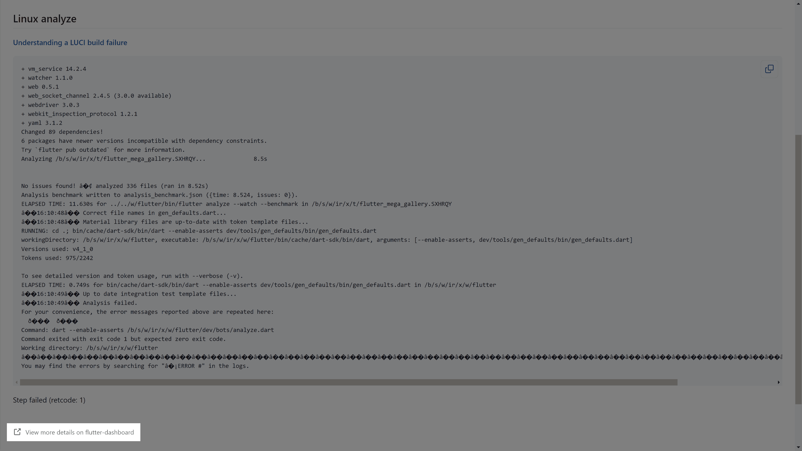
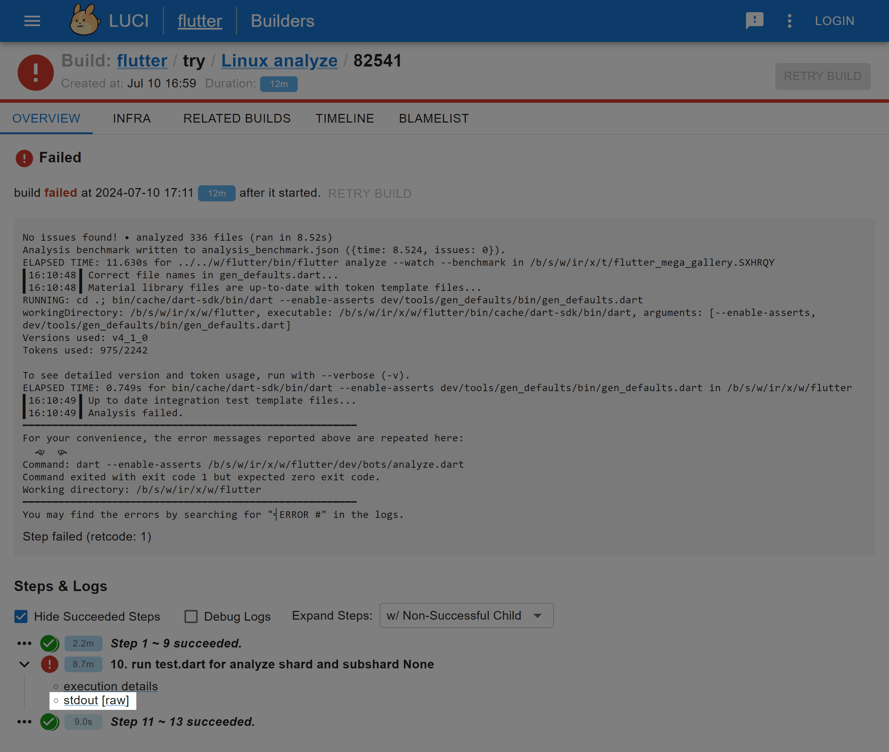
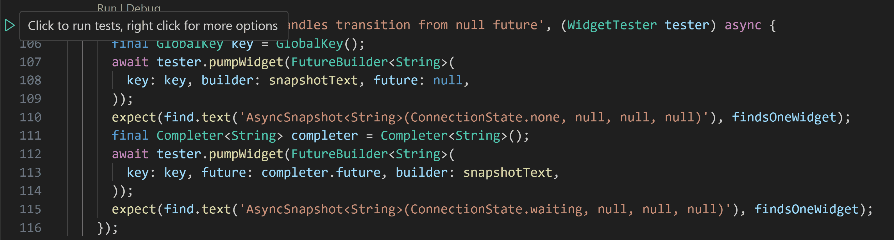
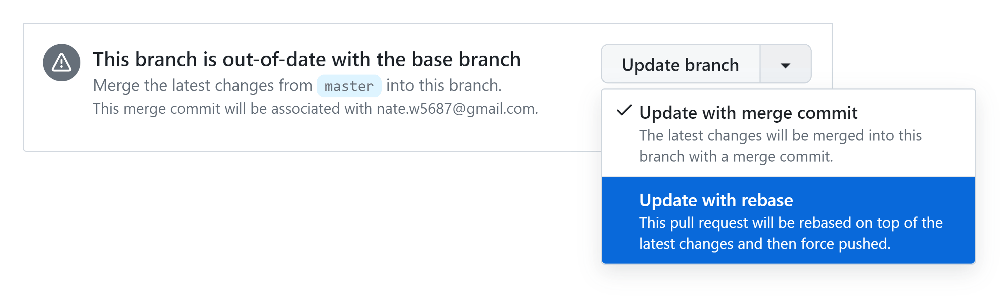

# How to fix a PR's failing checks

<br>

It's kinda disappointing when you've already put a bunch of work into your PR,
but then GitHub hits you with this:


<br>

### tree-status


If **tree-status** is failing, then there are problems on the main branch,
and we'd like to fix those before merging in anything else.
The result of this check usually goes back and forth a few times each day;
rather than merging pull requests manually, we add the
[`autosubmit`](https://github.com/flutter/flutter/pulls?q=is%3Apr+label%3Aautosubmit)
label, and then sometime later a bot will take care of it.

<br>

### Google testing


Google runs some tests that contain sensitive data, which might include
private keys and/or various evil corporate schemes.

A Google testing failure could be a flake ([see below](#flaking)), or it
might be due to changes in the PR. If 2 weeks have gone by and nobody's
looked into it, feel free to [reach out on Discord](../../Chat.md).

<br>

### A bug in the PR

If you've followed the steps for
[setting up the framework dev environment](../../Setting-up-the-Framework-development-environment.md),
most problems will be caught in static analysis, but often times
there are changes that inadvertently break existing behavior.

<br>

Click on **Details** for the failing test, and then click
**View more details on flutter-dashboard**.



The full test output is linked at the bottom of the page.



> [!IMPORTANT]
> Clicking on **[raw]** displays the output as plain text,\
> whereas **stdout** also has this fun little guy at the bottom.
>
> [](https://chromium.googlesource.com/infra/luci/luci-go/+/master/logdog/)

<br>

Often, there will be a message that resembles the one below:

```
══╡ EXCEPTION CAUGHT BY FLUTTER TEST FRAMEWORK ╞════════════════════════════════════════════════════
The following TestFailure was thrown running a test:
Expected: exactly one matching candidate
  Actual: _TextWidgetFinder:<Found 0 widgets with text
"AsyncSnapshot<String>(ConnectionState.waiting, null, null, null)": []>
   Which: means none were found but one was expected

When the exception was thrown, this was the stack:
#4      main.<anonymous closure>.<anonymous closure> (…/packages/flutter/test/widgets/async_test.dart:115:7)
<asynchronous suspension>
#5      testWidgets.<anonymous closure>.<anonymous closure> (package:flutter_test/src/widget_tester.dart:189:15)
<asynchronous suspension>
#6      TestWidgetsFlutterBinding._runTestBody (package:flutter_test/src/binding.dart:1032:5)
<asynchronous suspension>
<asynchronous suspension>
(elided one frame from package:stack_trace)

This was caught by the test expectation on the following line:
  file:///b/s/w/ir/x/w/flutter/packages/flutter/test/widgets/async_test.dart line 115
The test description was:
  gracefully handles transition from null future
════════════════════════════════════════════════════════════════════════════════════════════════════
```

From there, you can find the failing test, run it locally,
and figure out how to fix it!



> [!TIP]
> The test framework also [analyzes documentation](https://ln.hixie.ch/?start=1660174115)!\
> Make sure that *all* Dart code is in good shape, even if it's inside
> a Markdown code snippet.

<br>

### Flaking

Sometimes a check fails for reasons unrelated to the changes introduced by the PR.
When this happens, usually the best solution is to trigger the checks by pushing
some changes.

This can be as simple as pulling in the latest changes made to the main branch.\
(The [Tree hygiene](../../Tree-hygiene.md#using-git) page recommends updating
via rebase, rather than a merge commit.)


