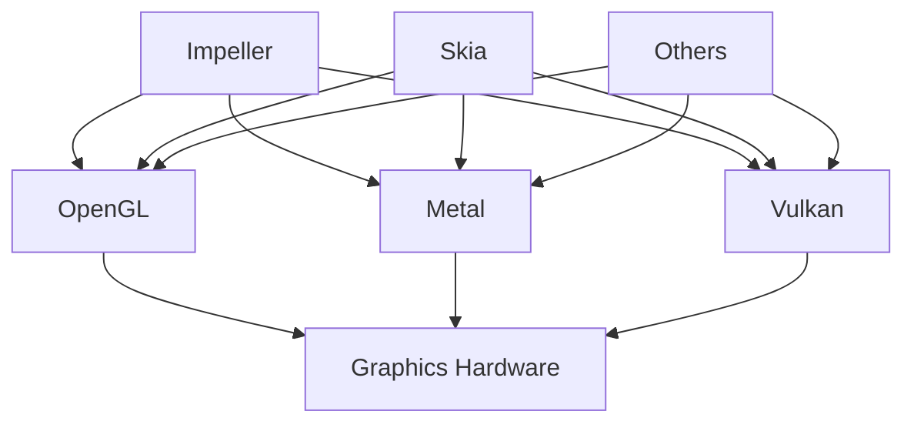
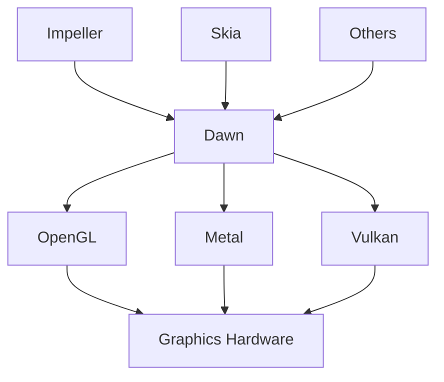

# Frequently Asked Questions

### How do I enable Impeller to try it out myself?

See the instructions in the README on how to [try Impeller in
Flutter](https://github.com/flutter/flutter/tree/main/engine/src/flutter/impeller#try-impeller-in-flutter).

Support on some platforms is further along than on others. The current priority
for the team is to support iOS, Android, Desktops, and Embedder API users (in
that rough order).

### I am running into issues when Impeller is enabled, how do I report them?

Like any other Flutter issue, you can report them on the [GitHub issue
tracker](https://github.com/flutter/flutter/issues/new/choose).

Please explicitly mention that this is an Impeller specific regression. You can
quickly swap between the Impeller and Skia backends using the command line flag
flag detailed in [section in the README on how to try
Impeller](https://github.com/flutter/flutter/tree/main/engine/src/flutter/impeller#try-impeller-in-flutter).

Reduced test cases are the most useful. Please also report any performance
regressions.

### What does it mean for an Impeller platform to be "in preview". How long will be the preview last?

The team is focused on getting one platform right at a time. This includes
ensuring all fidelity issues are fixed, performance issues addressed, and
compatibility with plugins guaranteed. When the team believes that the majority
of Flutter applications will benefit from Impeller on a specific platform, the
backend will be declared to be in preview.

During the preview, Flutter developers will need to opt-in to using Impeller.
The top priority of the team will be to address issues reported by developers
opting into the preview. The team wants the preview phase for a platform to be
as short as possible.

Once major issues reported by platforms in preview become manageable, the
preview ends and Impeller becomes the default rendering backend.

Besides working on fixing issues reported on platforms in preview, and working
on supporting additional platforms, the team is also undertaking a high-touch
exercise of migrating large existing Flutter applications to use Impeller. The
team will find and fix any issues it encounters during this exercise.

The length of the preview will depend on the number and nature of the issues
filed by developers and discovered by the team.

Even once the preview ends, the developer can opt into the legacy rendering
backend for a short period of time. The legacy backend will be removed after
this period.

### Does Impeller use Skia for rendering?

No. Impeller has no direct dependencies on Skia. When running with Impeller,
Flutter does not create a Skia graphics context.

However, while Impeller still performs text rendering, text layout and shaping
needs to be done by a separate component. This component happens to be
SkParagraph which is part of Skia. Similarly, Impeller does not perform image
decompression. Flutter uses a standard set of codecs wrapped by Skia before
querying the system supplied image formats. So, while Impeller does not use nor
is a wrapper for Skia, some Skia components are still used by Flutter when
rendering using Impeller.

### Can Skia-wrapped image codecs be removed in favor of using system supplied image codecs?

The team investigated removing codecs from Skia in favor of relying on the
system supplied decoders for supported image formats. This would have the
benefit of reducing the binary size of the engine.

Our investigations found that using the system decoders had more complications
than initially expected. It would take a significant amount of work to achieve
parity with the Skia codecs in terms of performance and reliability.

The results of our investigation are documented in
https://github.com/flutter/flutter/issues/144438 for removing codecs on iOS and
in https://github.com/flutter/flutter/issues/177863 for removing codecs on
Android.

### Is Impeller going to be supported on the Web?

The current priority for Impeller is to be amazing on all platforms targeted by
the C++ engine. This includes iOS, Android, desktops, and, all Embedder API
users. This would be by building Metal, Open GL, Open GL ES, and, Vulkan
rendering backends.

The Open GL ES backend ought to work fine to target WebGL/WebGL2 and the team
can fix any issues found in such uses of the backend.

However, in Flutter, Impeller sits behind the Display List interface in the C++
engine. Display lists apply optimizations to the Flutter rendering intent. But,
more importantly for Impeller, they also provide a generic interface with the
ability to specify "dispatchers" to different rendering packages. Today, the
engine has Skia and Impeller dispatchers for display lists.

The web engine is unique in that it doesn't use any C++ engine components. This
includes the display lists mechanism. Instead, it interfaces directly with Skia
via the CanvasKit package.

Updating the web engine to interface directly with Impeller is a non-goal at
this time. It is a significant undertaking (compared to a flag to swap
dispatchers that already exists) and also bypasses display list optimizations.

For this added implementation complexity, Web support has not been a priority at
this time for the small team working on Impeller.

We are aware that these priorities might change in the future. There have been
sanity checks to ensure that the Impeller API can be ported to WASM and also
that Impeller shaders can be [compiled to
WGSL](https://github.com/chinmaygarde/wgsl_sandbox) for eventual WebGPU support.

### How will Impeller affect the way in which Flutter applications are created and packaged?

It won't.

Impeller, like Skia, is an implementation detail of the Flutter Engine. Using a
different rendering package will not affect the way in which the Flutter Engine
is used. Like with Skia today, none of Impellers symbols will be exposed from
the Flutter Engine dynamic library.

The binary size overhead of Impeller is around 100 KB per architecture. This
includes all precompiled shaders.

Impeller is compiled into the Flutter engine. It is currently behind a flag as
development progresses.

### How do you run `impeller_unittests` with Playgrounds enabled?

Specify the `--enable_playground` command-line option. By default, tests that
don't complete in 120 seconds are assumed to be hung and the test watchdog will
tear down the test harness. To avoid this, specify the `--timeout=-1` flag.

### Describe Impeller in a Tweet.

"Impeller is ahead-of-time (AOT) mode for rendering."

### Why did the Flutter team build Impeller?

The short answer, for consistent performance, which could not be achieved with
Skia after years of effort by graphics experts. The longer answer...

Flutter applications, via their use of Skia, were susceptible to the problem of
jank (user-perceptible stuttering/choppiness in animations and interactions) due
to shader compilation. Such problems were [reported as early as
2015](https://github.com/flutter/flutter/issues/813).

Shaders are tiny programs that run on the GPU when a specific combination of
rendering intent is requested by the application. Flutter's API is extremely
expressive. During the original design of Flutter's architecture, there was an
assumption that it was infeasible to statically determine ahead-of-time the
entire set of shaders an application might need. So, applications would create
and compile these shaders just-in-time. Once they were compiled, they could be
cached.

But this led to the problem of jank during the initial run of performance
sensitive areas of the application when there were no cached shaders.

Fortunately, early on, the team was able to predict the common shaders the
application was likely going to need. A generic ["warm
up"](https://github.com/flutter/flutter/pull/27660) phase was added where these
shaders were given a chance to be compiled and cached at the launch of a Flutter
application.

As Flutter applications became more complex, the generic shader warmup was no
longer suitable for all apps. So the ability to specify shaders to warm up was
[exposed to end
users](https://api.flutter.dev/flutter/painting/ShaderWarmUp-class.html).

But, this was exceedingly hard to do and also platform specific (iOS Metal,
Android OpenGL, Fuchsia Vulkan, etc.). So much so that only a handful of
engineers (who all worked on the Flutter Engine) could effectively build the
rendering intent that would warm up the right shaders. And these shaders were
specific to the app version. If the app was updated to add or remove more
features, the warmup routines were invalid and mostly just served to slow down
application startup.

To make this process self-service, [a scheme was
devised](https://github.com/flutter/flutter/issues/53607) to run the application
and its tests during development in training phase, capture the shaders, package
them with the application, and during a new "warm up" phase,  pre-compile the
shaders.

Remember, these shaders were platform specific. The scheme detailed above
unfortunately moved the burden to developers. It also made the application sizes
a lot bigger since the shaders now had to be packaged with the application.
Application launch times were delayed as well.

Even developers who went through these steps weren't always guaranteed freedom
from shader compilation jank. If some screens (and thus, their shaders) were
missed during training runs due to incomplete automated or manual testing, jank
could be experienced. For complex applications where certain flows were blocked
behind authentication or other restrictions, this was an easy situation to get
into. Also, some animation frames could be skipped during training because jank
during previous frames in the training run. So training runs not only had to be
run over the entire app, but also multiple times (on all platforms) to ensure
success. Moreover, applications that were really effective at training began to
run into egregiously high first-frame times ([some as high as 6
seconds](http://github.com/flutter/flutter/issues/97884)). Shaders captured from
training runs weren't fully guaranteed to be consistent across devices on the
same platform either and [bugs were
common](https://github.com/flutter/flutter/issues/102655#issuecomment-1115179271).
All the while the team was [desperately trying to
reduce](https://github.com/flutter/flutter/issues/84213) the number of shader
variants that might be required.

Due to these reasons, developers abandoned this self-serve warmup mechanism. For
instance, no application in Google used this due to the all the problems
mentioned.

Flutter began to get a reputation as being hard to write performant apps with.
Consistent performance that could be expected from frameworks like UIKit on iOS.
Sadly, this wasn't a completely unwarranted reputation at the time. To us, the
state of writing graphically performant apps with Flutter wasn't good enough and
frankly unacceptable. We needed to do better.

Impeller was borne out the experience from these events. In additional to the
jank issues described above, there were other performance issues inherent in the
way Flutter held and used our original renderer. But, in truth, the mandate to
work on Impeller would never have materialized if it weren't for the issue of
shader compilation jank. In-spite of the massive sunk cost of attempting all the
workarounds shader complication jank that prevented us from delivering our
product requirement to deliver consistent 60fps even at first-run.

A very early look at how Impeller avoids the problems in the previous renderer
are [discussed in this tech-talk](https://www.youtube.com/watch?v=gKrYWC_SDxQ).
Our current renderer is way more advanced today but that talk describes the very
early thinking, motivations, and decisions.

We turned on Impeller by default for iOS in early 2023, and it has been in
production in the majority of iOS apps since then. It's currently, as of 3.22 an
opt-in option for Flutter on Android.

Since we enabled Impeller on by default for iOS, we have seen the vast majority
of open issues around shader compilation causing jank to have been fixed. We
know there is more work to do, but we're encouraged by the results we've been
hearing from our customers.

Today, Impeller outperforms the old renderer not only in worst-frame timed
benchmarks, but is also faster on average.

### What makes Impeller different, compared to Skia, for Flutter?

We want to start by saying Skia is amazing. We'd also never say Impeller is
better than Skia. It just works differently. The original design of Impeller was
based on collaboration with the Skia team and was greatly influenced by their
feedback. We also keep collaborating on an ongoing basis. Ideas such as
stencil-then-cover that Impeller now uses originated from Skia. Flutter also
continues to use Skia for text layout and its image codecs and has no plans to
migrate away from using those sub-components. We wholeheartedly recommend Skia
for most rendering needs.

All of Impellers shaders are [manually authored and
compiled](https://github.com/flutter/engine/tree/0a8de3dd3285c0b64de47630a8218ae38b8e04e1/impeller#the-offline-shader-compilation-pipeline)
during build time and packaged with the Flutter engine. There is no runtime
shader generation, reflection, or compilation. Skia can and does generate and
compile shaders at runtime.

By necessity, Impeller has a bounded set of shaders (< 50) that are known ahead
of time. Due to the way rendering intent is parameterized, Impeller also needs
way fewer shaders than Skia. All the graphics pipelines needed by Impeller are
ready well before the Flutter application's Dart isolate is launched. Skia can
generate and compile shaders during frame workloads leading to worse worst-frame
times.

Because the processing of shaders in Impeller happens at build time when
compiling the engine, Impeller's binary size impact is a fraction as that of
Skia's. Since there is no shader compilation and reflection machinery at
runtime, Impeller [adds only around
100kb](https://github.com/flutter/flutter/issues/123741#issuecomment-1553382501)
of binary size at runtime (compressed) even when all the generated shaders are
packaged in a Flutter engine. Removing Skia GPU (which includes the SKSL shader
compilation machinery) [reduces the binary size of the Flutter engine by
17%](https://github.com/flutter/engine/pull/52748). That is to say, the
machinery to generate, parse, compile, and reflect shaders is larger than the
backend specific shaders themselves. Using an Impeller-only build leads to much
smaller Flutter engines.

Impeller doesn't have a software backend unlike Skia. Instead, software
rendering using Impeller can be achieved using a Vulkan or OpenGL implementation
running in software using projects like SwiftShader, LLVMPipe, etc.

### Where did Impeller get its name?
Impeller began as a modest experiment to solve the problem of shader compilation
jank. After the theory of operation was settled on, the process of hacking
together a prototype began with a component tacked onto Flutter's compositor.
The compositor happens to be called "flow". Since impeller's modify fluid flow,
the name seemed apt. It's also an internal component and perhaps 30 seconds were
spent thinking of a name.

Why Flutter's compositor is called "flow" is left as an exercise to the reader.

### How does Graphite (a new GPU backend for Skia) relate to Impeller?

Graphite is a new backend the Skia team is building to replace its legacy
renderer (called Ganesh).

Similar to Impeller, Graphite is designed to be optimized for modern GPU APIs
(e.g Metal, Vulkan, Dawn). It aims to reduce the CPU cost of recording commands
while taking advantage of newer GPU features.

One of the goals of Graphite is to allow for easier pre-compilation of shaders
at startup time. But it still aims to support Skia’s general 2D API and has the
same spec. requirements. The design decisions made to support those requirements
make offline shader compilation impossible.

As of May 2025, Flutter has no plans to use Graphite. However, we, the
Flutter team, are in constant communication with the Skia team and freely share
insights and ideas across Impeller and Graphite.

### How does WebGPU/Dawn fit into the rendering landscape in Flutter?

To access graphics/compute accelerators on the device, you need to go through a client API like Vulkan, OpenGL, Metal, DirectX, etc… Rendering engines like Impeller, Skia, ThreeJS (we’ll call them middleware) all have the same concern. The client APIs are extremely low-level, not fully platform/device agnostic, and difficult to target/maintain individually. Depending on the application's needs, you can get away with targeting just one client API. Sometimes, client APIs can be layered on top of another. For instance, running WebGL in the browser likely uses Metal under the hood (via Angle) when the browser is running on macOS.

WebGPU, or Dawn/wgpu.rs in JS garb, purports to be a sensible and portable abstraction layer over the [client APIs](https://dawn.googlesource.com/dawn/+/HEAD/docs/support.md). For middleware, that presents an interesting value proposition. Instead of doing mostly the same thing multiple times, you just target one API and let the WebGPU library take care of the rest.

However, for middleware like Impeller, there are a few practical considerations that make Dawn unsuitable for use today. For one, the binary size of the library is larger than the entire Flutter Engine. Flutter users are incredibly sensitive to binary size and more than doubling the size of the engine is a tough pill to swallow. In comparison, Impeller adds only about 100kb of binary size to the Flutter Engine today. Next, the WebGPU abstraction locks us out of features available directly in client API that Impeller freely exploits for performance (framebuffer-fetch, fixed-rate compression for intermediate render targets, etc…). Impeller would either have to wait for official support for it in Dawn or poke holes in the API which increases our support surface. But, we are not averse to having a WebGPU backend for Flutter. In fact, we’ve already done experiments where our compiler can target [WGSL](https://github.com/chinmaygarde/wgsl_sandbox) and are ready to support WebGPU when/where it makes sense. But, right now, we are in a situation where a WebGPU backend will be **in-addition-to** the other backends and not **instead-of**. This defeats the primary value proposition of WebGPU/Dawn which is not having to maintain multiple backends in the first place.

As of May 2025, Impeller has no plans to add a WebGPU/Dawn backend. We will re-evaluate this decision if/when one or both of the following conditions hold:
* WebGPU is the only available client API on the platform capable of servicing Flutters needs. Hypothetically, this could be a path Impeller takes on the web instead of using WebGL 2. Though, we must admit it's a tough decision today.
* WebGPU is the preferred client API on a platform and is available on that platform already (negating Impellers concerns about binary size). Flutter targets no such platforms today.

We do get queries about WebGPU from the perspective of application developers, **not** middleware like Impeller. Flutter does have the ability to poke a hole in the middleware for applications to support specific rendering use-cases. For instance, plugins use it to render into a texture using client APIs directly. But as soon as you attempt to do your own rendering, you hit a massive usability cliff where you need to support all client APIs portably. WebGPU starts looking like just the thing you need. FWIW, application developers can write bindings to WebGPU using the plugin model with FFI and use those bindings to write a renderer that renders to a texture that gets composited in a Flutter application. But it's going to be very hard. And developers will likely lose the benefits of stateful hot-reload and all the other developer affordances that are part of Flutters value proposition unless significant investments are made in the developer experience. The author's role as a middleware developer with the constraints listed above disincentives them from making such an investment. So this is a call to the community for a high-quality WebGPU package.

Admittedly, a gap in Flutters rendering support is that there is no way to create a delightful 3D renderer in Flutter without also first escaping from Flutter. That an escape hatch (via FFI/plugins) exists is perhaps missing the point. Talking about how someone could use WebGPU once they use that escape hatch even more so. A potentially exciting proposal is [Flutter GPU](https://docs.google.com/document/d/1Sh1BAC5c_kkuMVreo7ymBzPoMzb7lamZRPsI7GBXv5M/edit?resourcekey=0-5w8u2V-LS41tCHeoE8bDTQ&tab=t.0). It would expose a really low-level (but still Dart) interface to accelerators in a portable manner. Package authors will then be able to write renderers in Dart (similar to ThreeJS) that integrate well with existing Canvas APIs (no platform views, no texture composition, etc…). The progress is compelling but slow given current resource constraints on the team.
