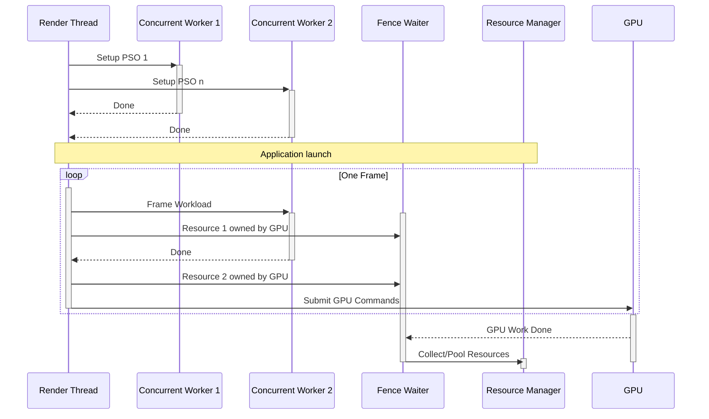

# Threading in Vulkan

The Vulkan backend uses a dedicated concurrent worker pool that is created along
with the creation of the Vulkan context.

Unlike other pools such as the IO worker pool, long running tasks may **not** be
posted to this pool. This is because frame workloads can and often are
distributed to workers in this pool. Having a potentially long running task
(such as texture decompression) may potentially block frame critical tasks. The
limitation of a separate pool for frame critical tasks is working around the
separate limitation of not being able to specify a QoS to specific tasks and may
be lifted in the future.

There is also a separate component called the fence waiter which operates on its
own thread. The purpose of the fence waiter is to ensure that the resource
reference count lives at least as long as the GPU command buffer(s) that access
this resource.

Resource collection and pooling also happens on another thread called the
resource manager. This is because touching the allocators is a potentially
expensive operation and having the collection be done in a frame workload, or on
the fence waiter thread may cause jank.

With this overview, the total number of thread used by the Impeller Vulkan
backend is the number of workers in the concurrent worker pool, and the two
threads for the fence waiter and resource manager respectively.

A summary of the interaction between the various threads is drawn below:

