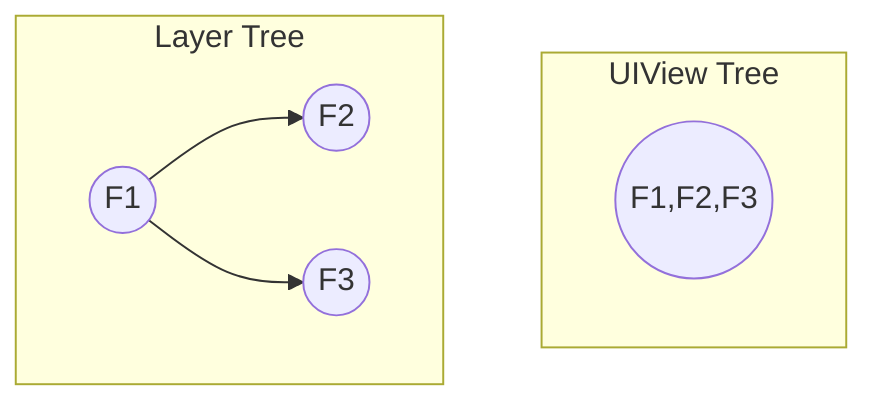
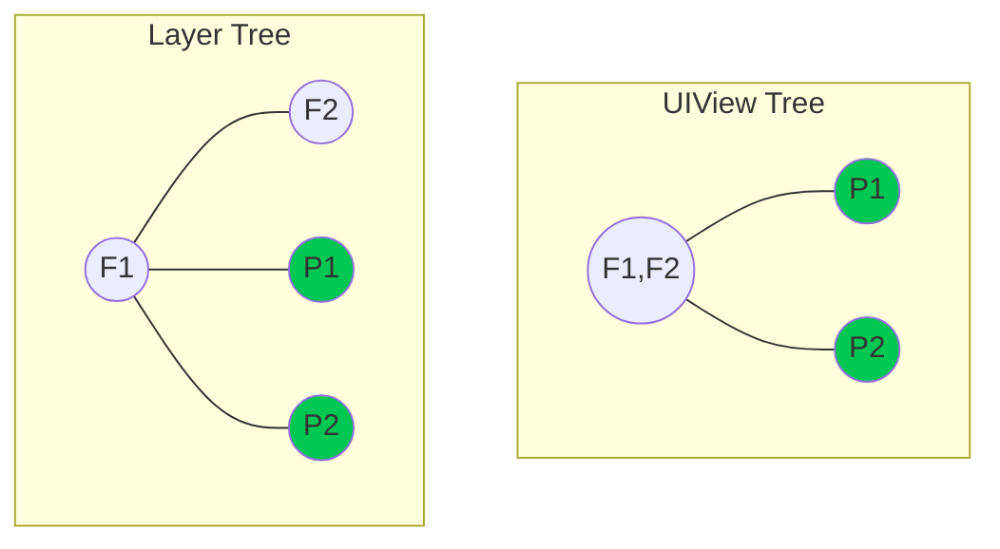
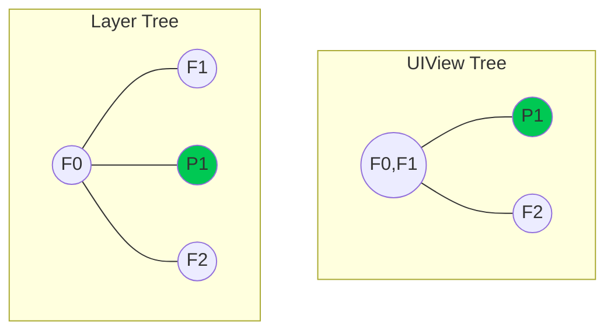
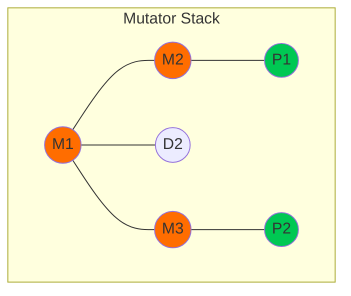
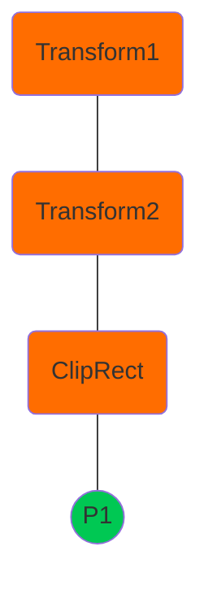
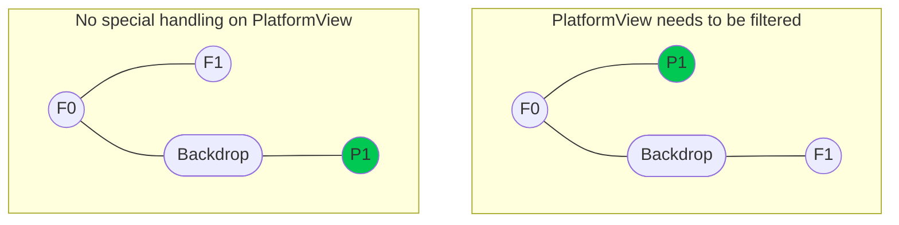

# Flutter iOS Platform View Overview

## Background

iOS PlatformView is a subsystem in the Flutter engine that allows you to embed an iOS `UIView` into a Flutter application. It provides a set of public Dart and Objective-C/Swift APIs. This document aims to explain in detail how iOS PlatformView works with Flutter's other subsystems, including composition/rendering, thread handling, gesture handling, and accessibility.

A Flutter application would use iOS PlatformView when it needs to display a UI that Flutter does not have native support for. For example, the [`webview_flutter`](https://pub.dev/packages/webview_flutter) plugin provides a set of public APIs to allow Flutter applications to composite WebView widgets. Flutter does not have a native WebView API, so the `webview_flutter` plugin uses the PlatformView API to embed iOS's `WKWebView` into a Flutter application.

### Audience

*   iOS PlatformView API users who would like to understand the underlying system of iOS PlatformView.
*   Flutter contributors who work on improving the iOS PlatformView system.

### Glossary

*   **PlatformView**: The subsystem that allows you to embed a platform-specific UI object into a Flutter application. Although most of the Flutter officially supported platforms have their own PlatformView system, this document exclusively refers to the iOS PlatformView.
*   **Frame**: An instance of Flutter rendering. For example, Flutter renders 60 frames per second or 120 frames per second on higher-end devices, meaning approximately, Flutter rendering (a frame) happens every 16 milliseconds (or 8 milliseconds).
*   **Mutator**: An abstract object that contains the information of a presentation modifier of the PlatformView. It mostly 1-to-1 matches the container layers of the layer tree. For example, a transform mutator in the world of PlatformView represents a transform layer. Some mutators are not implemented yet, such as ColorFilter.
*   **Mutator Stack**: A stack that contains all the mutators that will be applied to a PlatformView.

### Non-goals

The document serves as a reference for the up-to-date (based on the "last-updated" date) iOS PlatformView architecture in the iOS embedder. It does not focus on the Framework part of the PlatformView.

The document does not discuss potential improvements to the PlatformView. However, improvement suggestions are welcome as a comment. Any design of any improvements should be in a separate document.

Although the document may reference PlatformView from other platforms, this document is not intended to explain how PlatformView works on non-iOS platforms.

## View hierarchy

Historically, the term PlatformView has sometimes been used to describe the actual embedded view (e.g., WKWebView). However, the **PlatformView is actually a combination of multiple UIViews that includes the embedded view**.

At the root of the view hierarchy is the **ChildClippingView**, whose goal is to handle clippings. The ChildClippingView has a child view, which is a **FlutterTouchInterceptingView**. The FlutterTouchInterceptingView manages the gesture handling of the PlatformView. The embedded view is the child of the FlutterTouchInterceptingView.

See graph below:


### ChildClippingView

The `UIView` that handles clippings of the embedded view. The intersection of all the clip layers are drawn to a `FlutterClippingMaskView`. The `FlutterClippingMaskView` is added as the `maskView` of the `ChildClippingView`.

The **ChildClippingView is the root of the PlatformView hierarchy**. The frame of the ChildClippingView is the final bounding rect of the PlatformView widget.

### FlutterTouchInteceptingView

This view acts as a **gatekeeper of touch events**. It delegates the touch events to `FlutterFramework` using a `ForwardingGestureRecognizer`, while temporarily blocking the touch events reaching the embedded View using a `DelayingGestureRecognizer`. The details of the gesture blocking system are explained in the Touch Event Handling section.

All the transform matrices are applied to the `FlutterTouchInterceptingView`. The `FlutterTouchInterceptingView` has the same frame as the embedded view.

### Embedded View

This is the **`UIView` object that a Flutter application or plugin embeds to the Flutter widget tree**.

The Flutter application or plugin creates objects that conform to the `FlutterPlatformView` protocol and provides the views. The Flutter iOS embedder gets a reference of this view and is added as a subview of `FlutterTouchInterceptingView`.

All the modifications happen on the `FlutterTouchInterceptingView` or above. The embedded view is only referenced but not modified.

## Composition and Rendering

### Overview

In a frame without a PlatformView, the Flutter framework composites all the widgets into a layer tree, then sends it to the engine. The engine then uses the rendering API (Impeller) to draw all the pixels represented by the layer tree onto a single `UIView`: `FlutterView`.

Below compares a layer tree and its corresponding `UIView` tree. On the left, each node represents a layer, such as transform layer, cliprect layer and picture layer. On the right, each node represents a `UIView`. All the layers are rendered onto the same `UIView`.



When there is a PlatformView, the **PlatformView is added as a subview of the FlutterView**. The `UIView` tree expands to different parts, as shown in the right graph below.

In the layer tree (left), F1 and F2 are regular layers, while P1 and P2 are PlatformView layers. Just like in the above scenario, F2 is rendered onto the `FlutterView`. Each PlatformView layer creates a `UIView` called **ChildClippingView**, which contains the view that is desired to be embedded (e.g., WKWebView). `ChildClippingView` is added as a subview of the `FlutterView`. (The clipping mechanism is explained in the Mutator and Mutator Stack section.)



### Obstruct and Unobstruct PlatformViews.

Sometimes, an application wants to render a Flutter widget that covers the PlatformView. For example:


In this case Widget F1 is rendered on the `FlutterView` (in the same way as explained in the Overview section), Widget F2 is rendered on a `UIView` that is called Overlay. The below layer tree and `UIView` tree comparison demonstrates the `UIView` tree structure with overlays. On the `UIView` tree (right), 2 subviews are added to the `FlutterView` (F0F1): P1 and F2. P1 is the PlatformView, F2 is an overlay, which renders Widget F2.

The decision of whether to create an overlay and render F2 on the overlay depends on whether any part of F2 covers the PlatformView. If F2 does not cover the PlatformView, it is rendered on `FlutterView`. If **any part of F2 covers the PlatformView, an overlay is created** with the rect as the intersection between F2 and the PlatformView, and the part of F2 that covers the PlatformView is rendered on the overlay.

The RTree determines how many overlays need to be created. During each frame, the RTree scans through all the non-PlatformView widgets’ rect and reports all the rects that cover the PlatformView. Based on the suggestion, N numbers of the overlays are created to render each of the rects. See below example that is taken from the the [Google internal design document about Unobstructed PlatformViews Compositing Unobstructed Platform Views](go/flutter-unobstructed-platform-views). The “Background Canvas” is FlutterView and “Flutter Canvases” are Overlays,


For performance reasons, the **maximum number of overlays can be created are limited to 2**. This means if there are more than 2 rects covering a single PlatformView, an aggregated rect is created. For example, in the below scenario, the widget F1, F2 and F3 are all covering the PlatformView. The red rectangles represent the overlays. The first overlay renders the left half of Widget F1 and the second overlay renders parts of both F2 and F3. Note that there are no separate overlays for F2 and F3, due to the max limit of 2 overlays being reached.


### Mutator and Mutator Stack

The PlatformView is rendered with a **completely different render engine** with non-PlatformView Flutter widgets. Flutter Widgets are typically rendered with impeller, while PlatformViews are rendered with Apple’s rendering engine. As a result, the composition modifiers such as clipping, matrix transform and blurring of the PlatformViews are **not handled by impeller**. Applying the modifiers on PlatformViews requires 1) a data structure to store the modifier information, 2) using Apple’s rendering APIs such as UIKit to apply the modifiers.

**Mutator Stack is the data structure** to store the modifiers. Each modifier is abstracted with a Mutator object. While prerolling the layer tree (the complete traversal of the layer tree before the paint traversal), the Mutator Stack is being filled. A copy of the Mutator Stack is made to represent each PlatformView. Here is an arbitrary example of a layer tree and Mutator Stacks of the Platform Views. (Note that M layers are modifier layers. D layers are display list layers and P layers are PlatformView layers)




*Most of the Mutators are populated to the stack in the same way as mentioned above, except BackdropFilter.*

During the paint traversal, Mutators are applied to the PlatformView within the `ApplyMutator` method. `ApplyMutator` is called for each PlatformView. It traverses all Mutators in the stack and applies them to the PlatformView. In general, applying a Mutator involves steps such as 1) translate the information stored in the Mutator into UIKit objects. For example, a `ClipRect Mutator` stores a `SkRect` property, which needs to be translated into a `CGRect`. 2) Call UIKit APIs to apply the mutation to the PlatformView. Below lists a brief description of how each mutation is applied to the PlatformView.

#### Transform

Each transform Mutator contains a `SkMatrix`. The matrices are concatenated and applied to the **FlutterTouchInterceptingView** (the super view of the embedded view). A local Matrix variable tracks the combined transform matrix at any given point during the Mutator Stack traversal.

#### Clippings

Clippings, including `ClipRect`, `ClipRRect`, `ClipPath` are translated to paths. The paths are transformed with the local matrix that’s being tracked (See Transform section about the local matrix).


For example, The above graph shows a branch of the layer tree, with 2 transform layers and 1 clipRect layer above the PlatformView. Before applying the `ClipRect` to the PlatformView, the rect object inside `ClipRect` is transformed into paths. The Paths are transformed with the concatenation of Transform1 and Transform2.

The transformed paths are drawn onto a **FlutterClippingMaskView**. `FlutterClippingMaskView` is then applied to the **ChildClippingView as a `maskView`**.

#### Opacity

The opacity is applied directly to the **FlutterTouchInterceptingView**. If there are multiple opacity layers above the same PlatformView, the value of the opacities are multiplied. For example, if there are 2 opacity layers above the PlatformView and both have opacity of 0.5. The PlatformView will have 0.25 (0.5*0.5) opacity.

#### Backdrop Filter

BackdropFilter is a special filter where the filter object is applied to all the layers underneath the current layer. For example, when a BackdropFilter layer is an ancestor of the PlatformView, the filter does not apply to the PlatformView, but to all the views underneath the PlatformView. Therefore, there is nothing that needs to be handled if the BackdropFilter is the ancestor of the PlatformView. However, if the PlatformView is underneath a BackdropFilter layer, the PlatformView needs to be filtered:



*Further details about backdrop filter Mutator implementation and current limitations.*

#### Color Filter and Shader Mask

These filters have not been implemented and are tracked with the below Github issues.

*   https://github.com/flutter/flutter/issues/39271
*   https://github.com/flutter/flutter/issues/39270

## Thread Configuration

`UIView` subclasses, including PlatformView, need to layout on the **Platform thread (main thread)**. Other Flutter widgets are composited by the Rasterizer in the Flutter engine on the Raster thread. During every rendering frame with PlatformView, the **PlatformView and other Flutter widgets need to be rendered synchronously**.

The iOS embedder uses a `raster_thread_merger` to synchronize the PlatformView composition and rasterizer. The `raster_thread_merger` merges the Platform Task Queue and Raster Task Queue. When the task queues are merged, the Raster Task Queue will dispatch tasks to the Platform thread instead of the Raster thread.

Below describes the sequence of thread merging and unmerging.

### Drop First Frame While Merging

When prerolling the layer tree, Rasterizer, via the `ExternalViewEmbedder`, records whether there are PlatformView layers in this frame. If there are PlatformViews, the Rasterizer is on the wrong thread. Before drawing anything, the rasterizer copies the layer tree, inserts the layer tree to the front of the pipeline and **drops the current frame**. During the next frame, `raster_thread_merger` puts the Rasterizer on the Platform thread. The Rasterizer will render the same layer tree on the correct thread.

### Lease

**Lease** is the **maximum number of future frames** that task queues will be merged. At the beginning of each frame, if there are PlatformViews, the `IOSExternalViewEmbedder` refreshes the lease to its maximum. After a frame is rendered, if the lease is greater than 0, the lease is decreased by 1.

Essentially, the task queues are merged as long as there are PlatformViews on the scene, and will be un-merged if there are N frames rendered without PlatformViews (N being the lease).

### Unmerge The Threads

Threads are unmerged when lease reaches to 0. It happens at the end of a frame. At the next frame, the Rasterizer will start drawing on the Raster thread (if there are no new PlatformViews created at the next frame).

### Other Thread Configuration Solutions.

Another way to synchronize the Rasterizer and PlatformView is to **block the raster thread** while the PlatformView is laid out on the Platform thread and resume the raster thread when that is done. This is how macOS currently handles the thread configuration. This approach is easier to reason about and potentially has better performance (no dropped frames). iOS should validate this approach as a potential future solution.

## Touch Event Handling

In the case of a Flutter button blocking the PlatformView, the button consumes the touch event and blocks the PlatformView from the event. If the widget that blocks the PlatformView should not consume the touch event (for example a translucent widget that does not handle touch events), the PlatformView might need to consume the touch event and trigger actions. The engine does not have the information about whether a widget should consume the touch event. Such information is in the Framework (on the UI thread). So the question of “who should consume the touch event” should be answered by the framework, thus is determined on the UI thread. On iOS, however, touch events are received on the Platform thread, hence the “hittests” need to happen asynchronously.

The overlay view omits all the touch events. The touch events are either first landed on the PlatformView or the FlutterView. **FlutterTouchInterceptingView** is the part in the PlatformView that handles the touch events.

### FlutterTouchInterceptingView

`FlutterTouchInterceptingView` is the `parentView` of the embedded view. The purpose of its view is to **block the gesture on the PlatformView when necessary**.

### DelayingGestureRecognizer And ForwardingGestureRecognizer

A combination of `DelayingGestureRecognizer` and `ForwardingGestureRecognizer` is the solution that the iOS Embedder uses to asynchronously dispatch the touch events. Both gestures are attached to the `FlutterTouchInterceptingView`.

**ForwardingGestureRecognizer acts as a proxy**. It receives the touch events, and forwards them to the framework (via `FlutterViewController`).

**DelayingGestureRecognizer acts as a top priority gesture recognizer**. It inserts itself in the front of the gesture queue so all the other gestures (except ForwardingGestureRecognizer) are waiting on it.

To achieve this, it implements a `UIGestureRecognizer` delegate method to block all the gestures on the PlatformView except the `ForwardingGestureRecognizer`.

```objective-c
- (BOOL)gestureRecognizer:(UIGestureRecognizer*)gestureRecognizer
shouldBeRequiredToFailByGestureRecognizer:(UIGestureRecognizer*)otherGestureRecognizer {
  // The forwarding gesture recognizer should always get all touch events, so it should not be
  // required to fail by any other gesture recognizer.
  return otherGestureRecognizer != _forwardingRecognizer.get() && otherGestureRecognizer != self;
}
```
What this method does is this: all the other gestures on the PlatformViews are paused until one of the two things happen.
*   If the DelayingGestureRecognizer is marked as “ended”, all the other gesture recognizers ignore the event.
*   If the DelayingGestureRecognizer is marked as “failed”, all the other gesture recognizers start to compete for the gesture.

Here is the sequence of a touch event’s life cycle on PlatformViews. (Blue lines happen on the Platform thread, orange lines happen on the UI thread)
1. The touch event landed on the PlatformView.
2. The touch event is sent to the framework, via ForwardingGestureRecognizer.
3. At this moment, the DelayingGestureRecognizer is not marked as either state, so the PlatformView does not perform any action.
4. The framework determines who receives the touch event, and sends the result to the PlatformView via method channel.
    ◦ PlatformView should consume the gesture, DelayingGestureRecognizer is marked as failed. The GestureRecognizers pm the embedded view receives the gesture and performs the action.
    ◦ PlatformView should not consume the gesture, DelayingGestureRecognizer is marked as ended. All the GestureRecognizers in PlatformView are blocked.
(Diagram explaining touch event flow from Platform thread to UI thread and back)

### Other Potential Solutions
The above method only blocks UIGestureRecognizers. UIViews, however, can handle touch events without UIGestureRecognizers, specifically, using the event callbacks such as touchesBegan:withEvent:, touchesMoved:withEvent:, or touchesEnded:withEvent:. One of the examples is that the WKWebview’s “touchstart” event is not handled with UIGestureRecognizer thus currently non-blockable. Github issue: https://github.com/flutter/flutter/issues/30143.

To block such touch events, the Flutter Framework’s hittest determination has to happen synchronously. Either by merging the UI thread with Platform thread, or blocking the Platform thread while the UI thread is running the logic.

This PR demonstrates a way to block the Platform thread to synchronize the gesture handling.

## Accessibility
On iOS, the semantic tree is usually the same as the UIView tree. UIView implements the informal protocol UIAccessibility, making each UIView a node in the semantics tree. In Flutter, however, there is only one UIView, FlutterView (excluding the PlatformViews). All the widgets are custom drawn in the FlutterView, thus from iOS’ perspective, they are not semantic nodes. To create a semantics tree on iOS, the iOS embedder converts the semantics tree from the Flutter framework into an iOS semantics tree, with each node as a SemanticsObject, a subclass of UIAccessibilityElement.

Because PlatformView itself is a UIView, so it conforms to the UIAccessibility protocol. It can be added directly into the iOS semantics tree. The Flutter semantics tree’s PlatformView node contains a PlatformView id, which is used to find the correct PlatformView instance and inject it to the iOS semantics tree at the correct place.

| FlutterSemanticsTree | iOS Semantics Tree |
| :---------------------------------- | :-------------------------------- |
| (Diagram illustrating Flutter semantics tree nodes) | (Diagram illustrating how PlatformView is injected into iOS semantics tree) |

