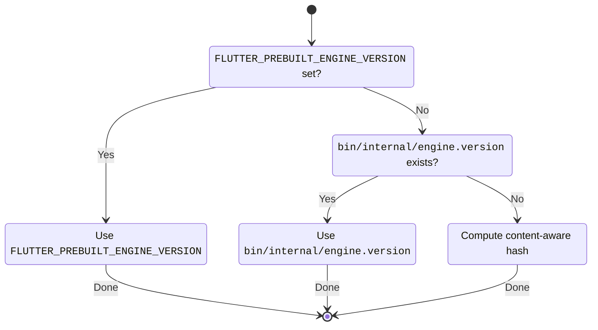

# How `flutter` fetches engine artifacts

[flutter.dev/to/engine-artifacts](https://flutter.dev/to/engine-artifacts)

While in the same repository, the `flutter` (tool), which is used to run and
test the framework, needs to know how to download the engine artifacts for the
current platform and target device. Engine artifacts include `dart` (the
standalone Dart SDK), which runs `flutter` itself, and per-platform and build
mode prebuilt engines (which include the C++ compiled engine, and the embedders
for Android, iOS, and so-on).


When using a _released_ version of Flutter, i.e. from a channel such as `stable`,
[`bin/internal/engine.version`](../../bin/internal/engine.version) is set to the
content hash SHA for a merged commit in `https://github.com/flutter/flutter`, where
the engine artifacts have already been pre-built and uploaded.

When using the `master` channel, or _contributing_ to Flutter (which is typically
as a fork of Flutter's `master` channel), the engine SHA is _computed_ by
generating a content-aware hash of files that affect the engine build (such as
`DEPS` and the `engine` directory itself).

For _advanced_ use-cases, such as on CI platforms, or for custom 1-off testing
using a pre-built Flutter engine (to use a _locally_ built Flutter engine see
[locally built engines](../contributing/testing/Running-and-writing-tests.md#locally-built-engines)), the environment variable `FLUTTER_PREBUILT_ENGINE_VERSION` can be set,
again to a engine SHA for a merged commit in `flutter/flutter`. This is only needed
if different artifacts from the content sha are desired:

```sh
$ FLUTTER_PREBUILT_ENGINE_VERSION=abc123 flutter --version
..
Engine • revision abc123 ..
..
```



## Flutter CI/CD Testing

On Cocoon (Flutter's internal CI/CD) we _often_ set
`FLUTTER_PREBUILT_ENGINE_VERSION` to the following:

| Branch                    | Presubmit     | Merge Queue   | Postsubmit    |
| ------------------------- | ------------- | ------------- | ------------- |
| `main`                    | `content.sha` | `content.sha` | `content.sha` |
| `flutter-x.x-candidate.x` | `content.sha` | N/A[^1]       | `content.sha` |
| `stable` or `beta`        | N/A[^3]       | N/A[^1]       | N/A[^3]       |
| _anything else_[^2]       | `content.sha` | `content.sh`  | `content.sha` |

> To generate a new `engine.version`:
>
> ```sh
> ./bin/internal/content_aware_hash.sh > ./bin/internal/engine.version
> ```
>
> As of [`b0ccfb53801abc9b0aa93e7cca3a3841513c3086`](https://flutter.googlesource.com/recipes/+/b0ccfb53801abc9b0aa93e7cca3a3841513c3086) (May 6 2025), the packaging release process will refuse to let you publish a
> release with an out of date `engine.version`.

[^1]: Does not use a merge queue.
[^2]: I.e. experimental branches that do not fall into one of the above.
[^3]: Only updated through `flutter-x.x-candidate.x` branches.

## Content Hashing

The content hash is a fingerprint of the assets used in producing engine artifacts.
These include:

- `DEPS`: Used to pull third_party dependencies.
- `engine/`: The entire engine subfolder[^4].
- `bin/internal/release-candidate-branch.version`: A signal for release builds, keeping builds hermetic.

The Flutter project has a plethora of users: engineers working from local branches, release branches, GitHub merge queues, and downstream shallow consumers to name the known ones. The following table shows where the content hash is calculated from:

| Branch                  | Hashed From                                                          |
| ----------------------- | -------------------------------------------------------------------- |
| `main`,`master`         | HEAD                                                                 |
| `stable`, `beta`        | HEAD                                                                 |
| GitHub Merge Queue      | HEAD                                                                 |
| `flutter-*-candidate.x` | HEAD                                                                 |
| `HEAD`                  | HEAD                                                                 |
| Shallow Clones          | HEAD                                                                 |
| **Everything Else**.    | `merge-base` between `HEAD` and`(origin or upstream)/(main or master)` |

[^4]: This is suboptimal from an artifact building perspective, but optimal for the speed of each `dart` and `flutter` call. Flutter is called more often than it is built.

## References

The script(s) that compute (and test the computation of) the engine version:

- [`bin/internal/update_engine_version.sh`](../../bin/internal/update_engine_version.sh)
- [`bin/internal/update_engine_version.ps1`](../../bin/internal/update_engine_version.ps1)
- [`dev/tools/test/update_engine_version_test.dart`](../../dev/tools/test/update_engine_version_test.dart)
- [`bin/internal/last_engine_commit.sh`](../../bin/internal/last_engine_commit.sh)
- [`bin/internal/last_engine_commit.ps1`](../../bin/internal/last_engine_commit.ps1)
- [`dev/tools/test/last_engine_commit_test.dart`](../../dev/tools/test/last_engine_commit_test.dart)
- [`bin/internal/content_aware_hash.sh`](../../bin/internal/content_aware_hash.sh)
- [`bin/internal/content_aware_hash.ps1`](../../bin/internal/content_aware_hash.ps1)
- [`dev/tools/test/content_aware_hash_test.dart`](../../dev/tools/test/content_aware_hash_test.dart)

The tool uses the engine version in the following locations:

- [`lib/src/artifacts.dart`](../../packages/flutter_tools/lib/src/artifacts.dart)
- [`lib/src/build_system/source.dart`](../../packages/flutter_tools/lib/src/build_system/source.dart)
