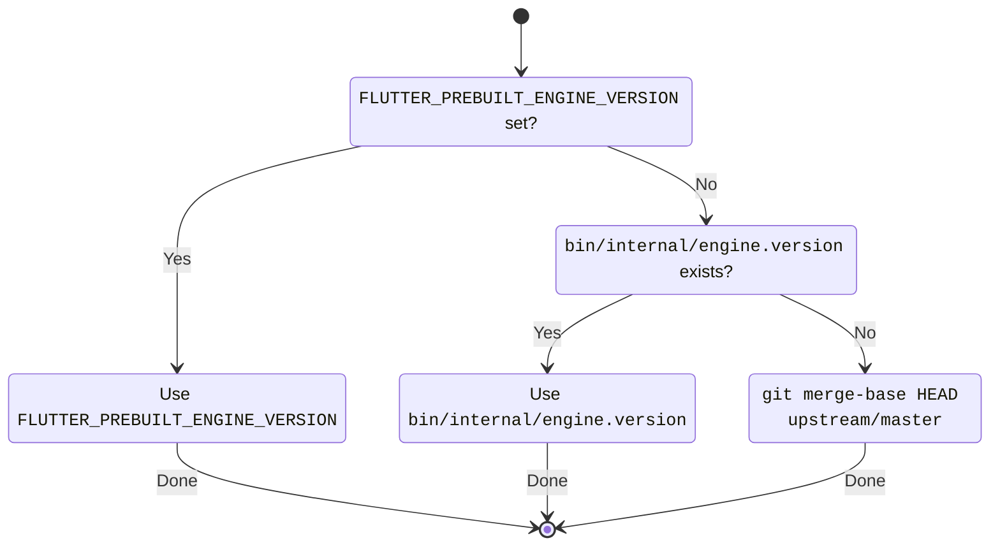

# How `flutter` fetches engine artifacts

While in the same repository, the `flutter` (tool), which is used to run and
test the framework, needs to know how to download the engine artifacts for the
current platform and target device. Engine artifacts include `dart` (the
standalone Dart SDK), which runs `flutter` itself, and per-platform and build
mode prebuilt engines (which include the C++ compiled engine, and the embedders
for Android, iOS, and so-on).


When using a _released_ version of Flutter, i.e. from a channel such as `stable`,
[`bin/internal/engine.version`](../../bin/internal/engine.version) is set to the
git commit SHA for a merged commit in `https://github.com/flutter/flutter`, where
the engine artifacts have already been pre-built and uploaded.

When using the `master` channel, or _contributing_ to Flutter (which is typically
as a fork of Flutter's `master` channel), the git commit SHA is _computed_ by
using `git merge-base HEAD upstream/master` (falling back to `git merge-base HEAD origin/master`
to support direct forks or `flutter/flutter`).

For _advanced_ use-cases, such as on CI platforms, or for custom 1-off testing
using a pre-built Flutter engine (to use a _locally_ built Flutter engine see
[locally built engines](../contributing/testing/Running-and-writing-tests.md#locally-built-engines)), the environment variable `FLUTTER_PREBUILT_ENGINE_VERSION` can be set,
again to a git commit SHA for a merged commit in `flutter/flutter`:

```sh
$ FLUTTER_PREBUILT_ENGINE_VERSION=abc123 flutter --version
..
Engine • revision abc123 ..
..
```



## References

The script(s) that compute (and test the computation of) the engine version:

- [`bin/internal/update_engine_version.sh`](../../bin/internal/update_engine_version.sh)
- [`bin/internal/update_engine_version.ps1`](../../bin/internal/update_engine_version.ps1)
- [`dev/tools/test/update_engine_version_test.dart`](../../dev/tools/test/update_engine_version_test.dart)

The tool uses the engine version in the following locations:

- [`lib/src/artifacts.dart`](../../packages/flutter_tools/lib/src/artifacts.dart)
- [`lib/src/build_system/source.dart`](../../packages/flutter_tools/lib/src/build_system/source.dart)
