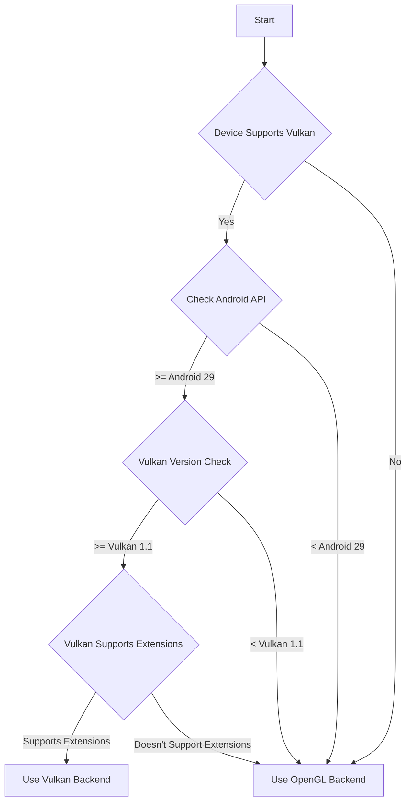
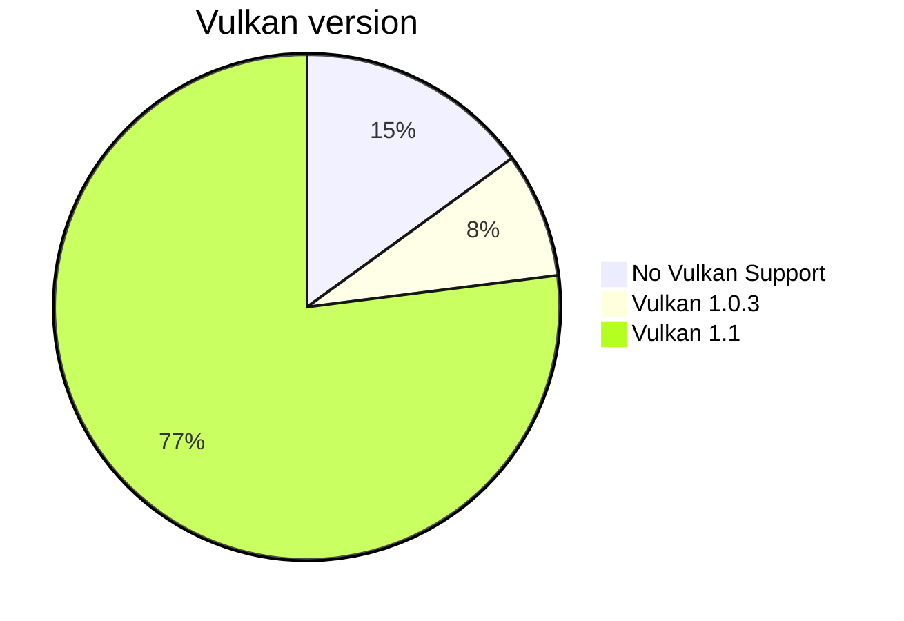
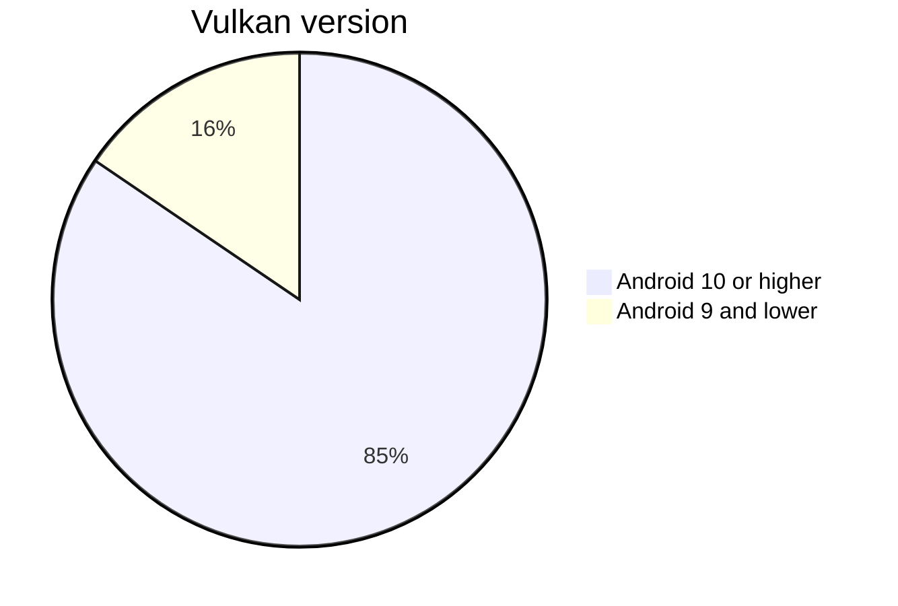

# Android

## Rendering Backend Selection

> [!IMPORTANT]
> During the preview period, while the team focuses on production readiness, Flutter will fallback to the Skia OpenGL ES backend instead of Impellers OpenGL backend.

Impeller supports both Vulkan and Open GL ES rendering on Android. Impeller will prefer rendering with Vulkan and fallback to OpenGL ES 2.0 for compatibility. With both the Vulkan and OpenGL ES, Impeller supports rendering on [all existing Android versions supported by Flutter](https://docs.flutter.dev/reference/supported-platforms).

The rough logic for backend selection on Android is depicted below.

### Vulkan Version

For Vulkan, Impeller needs at least Vulkan version 1.1. As of January 06, 2023, this includes 77% of all Android devices per the [Android Distribution dashboard](https://developer.android.com/about/dashboards#Vulkan).

Impeller could theoretically support older version of Vulkan but at a significant cost of implementation and for ultimately diminishing returns on investment. The team would rather spend that time improving the OpenGL ES backend.

Besides older devices still in use, devices you can buy new that don't support Vulkan are configurations with 64-bit kernels and 32-bit user-spaces (`armv7l`) or other RAM constrained devices.

### Android Version

For Vulkan support, Impeller needs at least Android 10, API level 29 (Q, Quince Tart). Cumulative usage of Android 10 as of June 04, 2024 is 84.5% per [apilevels.com](https://apilevels.com/).

Android 9 and older will unconditionally use OpenGL.

Android 10, API level 29 provides necessary support to work with [`HardwareBuffer`](https://developer.android.com/reference/android/hardware/HardwareBuffer)s  efficiently. This is critical to support platform views.

### Vulkan Extensions

Besides the Vulkan and Android versions. On Android, Impeller needs some extensions for interoperability with the underlying platform to support features like platform views and external texture composition. The expectation is that very Android devices will be filtered out in this check because support for extensions like `VK_ANDROID_external_memory_android_hardware_buffer` [is almost universal on devices with Android 10](https://vulkan.gpuinfo.org/listextensions.php?platform=android) and above.

## Platform Views

Android Platform Views (i.e. an android.view.View embedded inside a Flutter app)
are supported in both GLES and Vulkan backends and the Engine manages this
automatically.

## SurfaceTexture

Flutter's Java API allows for developers to register custom SurfaceTexture
backed textures that can be rendered inside of a Flutter application. See
`TextureRegistry.registerSurfaceTexture` and `TextureRegistry.createSurfaceTexture`.

### GLES

There are no issues with SurfaceTextures when using the GLES backend.

### Vulkan

We do not currently support rendering these textures when using the Vulkan
backend. Supporting this will require adding support for importing GL textures
into Vulkan textures which will have performance implications.
