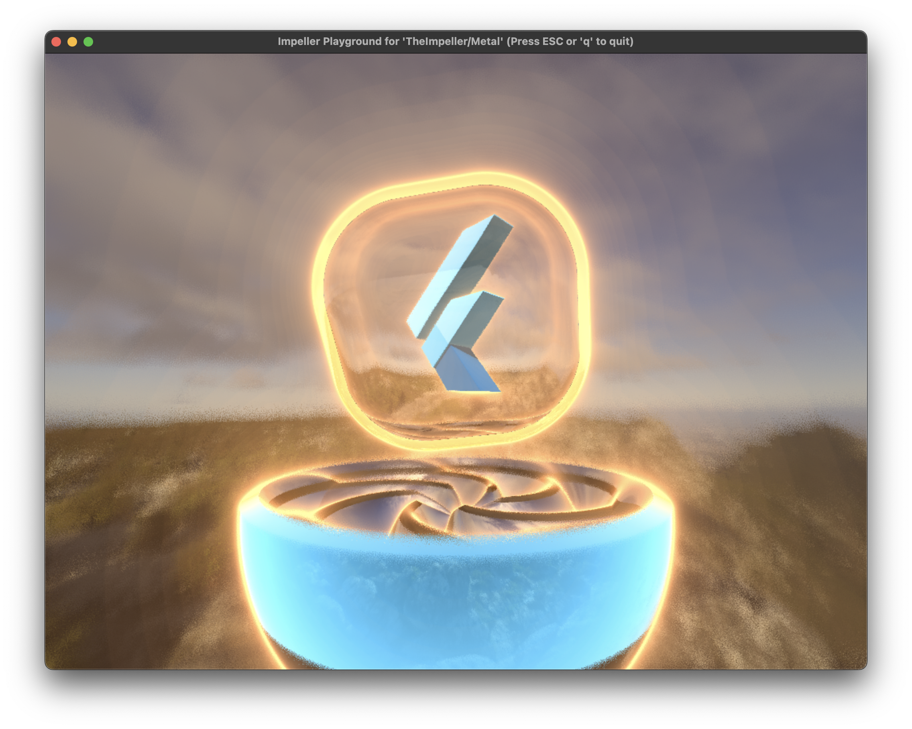
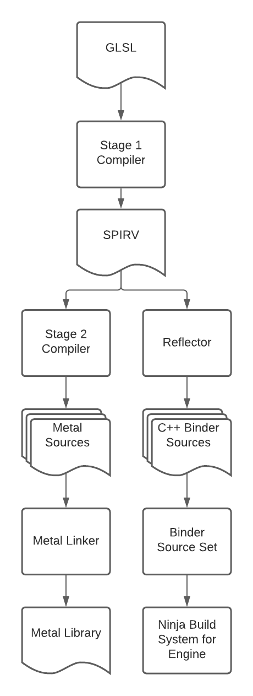

```
--------------------------------------------------------------------------------
--------------------------------------------------------------------------------
-----------------   ___                      _ _            --------------------
-----------------  |_ _|_ __ ___  _ __   ___| | | ___ _ __  --------------------
-----------------   | || '_ ` _ \| '_ \ / _ \ | |/ _ \ '__| --------------------
-----------------   | || | | | | | |_) |  __/ | |  __/ |    --------------------
-----------------  |___|_| |_| |_| .__/ \___|_|_|\___|_|    --------------------
-----------------                |_|                        --------------------
--------------------------------------------------------------------------------
--------------------------------------------------------------------------------
```



Impeller is a rendering runtime for Flutter with the following objectives:

* **Predictable Performance**: All shader compilation and reflection is
  performed offline at build time. All pipeline state objects are built upfront.
  Caching is explicit and under the control of the engine.
* **Instrumentable**: All graphics resources (textures, buffers, pipeline state
  objects, etc..) are tagged and labeled. Animations can be captured and
  persisted to disk without affecting per-frame rendering performance.
* **Portable**: Not tied to a specific client rendering API. Shaders are
  authored once and converted as necessary.
* **Uses Modern Graphics APIs Effectively**: Makes heavy use of (but doesn’t
  depend on) features available in Modern APIs like Metal and Vulkan.
* **Makes Effective Use of Concurrency**: Can distribute single-frame workloads
  across multiple threads if necessary.

## Project Organization

Impeller is a meta-framework. While a user of Impeller may choose to include the
whole enchilada (in `//impeller/:impeller`), the various sub-frameworks have
clearly defined responsibilities and adhere to a strict hierarchy.

Impeller itself may not depend on anything in `//flutter` except `//flutter/fml`
and `flutter/display_list`. FML is a base library for C++ projects and Impeller
implements the display list dispatcher interface to make it easy for Flutter to
swap the renderer with Impeller. Impeller is meant to be used by the Flow
(`//flutter/flow`) subsystem. Hence the name. The tessellator and geometry
libraries are exceptions - they unconditionally may not depend on anything from
`//flutter`.

An overview of the major sub-frameworks, their responsibilities, and, relative
states of completion:

* **`//impeller/compiler`**: The offline shader compiler. Takes GLSL 4.60 shader
  source code and converts it into a backend specific shader representation
  (like Metal Shading Language). It also generates C++ bindings that callers can
  include as a GN `source_set`s so there is no runtime shader reflection either.
  The target is an executable called `impellerc` which is never shipped into the
  binary or as an artifact.
* **`//impeller/renderer`**: The very lowest level of the renderer that is still
  backend agnostic. Allows users to build a renderer from scratch with few
  restrictions. Has utilities for creating allocators, generating pipeline state
  objects from bindings generated by `//impeller/compiler`, setting up render
  passes, managing jumbo uniform-buffers, tessellators, etc..
  * **`//impeller/renderer/backend`**: Contains all the implementation details
      for a specific client rendering API. The interfaces in these targets are
      meant to be private for non-WSI user targets. No Impeller sub-frameworks
      may depend on these targets.
* **`//impeller/archivist`**: Allows persisting objects to disk as performantly
  as possible (usually on a background thread). The framework is meant to be
  used for storing frame meta-data and related profiling/instrumentation
  information. Collection of information should succeed despite process crashes
  and retrieval of traces must not use inordinate amounts of time or memory
  (which usually leads to crashes).
* **`//impeller/geometry`**: All (or, most of) the math! This C++ mathematics
  library is used extensively by Impeller and its clients. The reasonably
  interesting bit about this library is that all types can be used
  interchangeably in device and host memory. Various Impeller subsystems
  understand these types and can take care of packing and alignment concerns
  w.r.t these types.
* **`//impeller/playground`**: When working with graphics APIs, it is often
  necessary to visually verify rendering results as a specific feature is being
  worked upon. Moreover, it is useful to attach frame debuggers or profilers to
  specific test cases. The playground framework provides Google Test fixtures
  that open the current state of various rendering related objects in a window
  in which rendering results can be visualized, or, to which frame debuggers can
  be attached. Most Impeller sub-frameworks that have a test harness also have a
  custom playground subclass. This sub-framework is only meant to provide
  utilities for tests and will not be compiled into any shipping binary.
* **`//impeller/entity`:** Sits one level above `//impeller/renderer` and
  provides a framework for building 2D renderers. Most of the pipeline state
  objects generated from shaders authored at build time reside in this
  framework. The render-pass optimization and pass-rewriting framework also
  resides there. This allows authoring composable 2D rendering optimizations
  (like collapsing passes, or, eliding them completely).
* **`//impeller/aiks`**: Aiks wraps `//impeller/entity` into an API that
  resembles Skia. This makes it easy to mechanically replace Skia calls with
  their Impeller counterparts even though the `//impeller/entity` framework API
  is different from Skia. This presence of this sub-framework is probably
  short-lived as integration of Impeller into Flutter should likely happen via a
  custom Display List implementation in `//impeller/display_list`. The
  roadblocks to this today are graphics package agnosticism in the Display List
  interface.
* **`//impeller/display_list`**: The replacement for `//impeller/aiks` to serve
  in the integration of Impeller in `//flutter/flow`. This is pending graphics
  package agnosticism in the Impeller interface. This sub-framework primarily
  provides a custom implementation of the `flutter::DisplayListDispatcher` that
  forwards Flutter rendering intent to Impeller.
* **`//impeller/base`**: Contains C++ utilities that are used throughout the
  Impeller family of frameworks. Ideally, these should go in `//flutter/fml` but
  their use is probably not widespread enough to at this time.
* **`//impeller/image`**: The Impeller renderer works with textures whose memory
  is resident in device memory. However, pending the migration of
  `//flutter/display_list` to graphics package agnosticism and the subsequent
  migration of the image decoders to work with the package agnostic types, there
  needs to be a way for tests and such to decode compressed image data. This
  sub-framework provides that functionality. This sub-framework is slated for
  removal and must not be used outside of tests.
* **`//fixtures`**: Contains test fixtures used by the various test harnesses.
  This depends on `//flutter/testing`.
* **`//tools`**: Contains all GN rules and python scripts for working with
  Impeller. These include GN rules processing GLSL shaders, including reflected
  shader information as source set targets, and, including compiled shader
  intermediate representations into the final executable as binary blobs for
  easier packaging.

## The Offline Shader Compilation Pipeline

* Shaders are authored once in GLSL 4.60. This choice of shading language is
  consistent across all backends. Shader code resides in the Impeller source
  tree like any other source file.
* At build time, the Impeller Shader Compiler (`impellerc`) converts the GLSL
  into SPIRV. No optimizations are performed on the generated SPIRV at this
  stage. This is to preserve all debugging and instrumentation information.
* Using the SPIRV, a backend specific transpiler converts the SPIRV to the
  appropriate high-level shading language. This is controlled using flags to the
  `impellerc`.
* All the files generated in the high-level shading language are compiled,
  optimized, and linked into a single binary blob.
* The binary blob containing the compiled and optimized high-level shading
  language is included as a hex dump (see `xxd.py`) into a C source file with a
  generated GN target. Executable targets that want to include the compiled code
  in their binaries just need to depend on the generated GN target. This eases
  any shader packaging concerns.
* In parallel, the SPIRV is processed by a reflector. This produces C++
  translation units that allow for the easy creation of pipeline state objects
  at runtime. The headers for these translation units include any structs (with
  appropriate padding and alignment) such that uniform data as well as vertex
  information can be specified to the shader without having to deal with
  bindings, vertex descriptors, etc.. This also makes iterating on shaders
  easier as changes to the shader interface lead to compile time errors.
* The C++ translation units generated from reflected shader information are made
  available to callers as a generated GN target that callers may use if
  necessary. It is possible for callers to perform reflection at runtime but
  there are no Impeller components that do this currently.



## Try Impeller in Flutter

Impeller is available under the `--enable-impeller` flag on iOS and Android.
This flag can be specified to `flutter run`.

If the application needs to be launched with Impeller enabled without using the
Flutter tool, follow the platform specific steps below.

### iOS

To your `Info.plist` file, add under the top-level `<dict>` tag:
```
  <key>FLTEnableImpeller</key>
  <true/>
```

### Android

To your `AndroidManifest.xml` file, add under the `<application>` tag:
```
  <meta-data
    android:name="io.flutter.embedding.android.EnableImpeller"
    android:value="true" />
```

## Documentation, References, and Additional Reading

* [Frequently Asked Questions](docs/faq.md)
* [Impellers Coordinate System](docs/coordinate_system.md)
* [How to Setup Xcode for GPU Frame Captures with Metal.](docs/xcode_frame_capture.md)
* [How to Setup RenderDoc Frame Captures with Vulkan.](docs/renderdoc_frame_capture.md)
* [Learning to Read GPU Frame Captures](docs/read_frame_captures.md)
* [How to Enable Metal Validation for Command Line Apps.](docs/metal_validation.md)
* [How Impeller Works Around The Lack of Uniform Buffers in Open GL ES 2.0.](docs/ubo_gles2.md)
* [Guidance for writing efficient shaders](docs/shader_optimization.md)
* [How color blending works in Impeller](docs/blending.md)
* [Enabling Vulkan Validation Layers on Android](docs/android_validation_layers.md)
