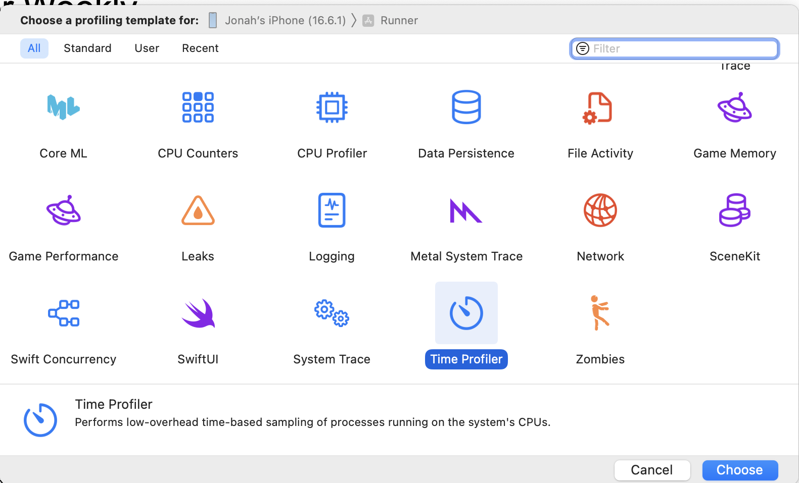
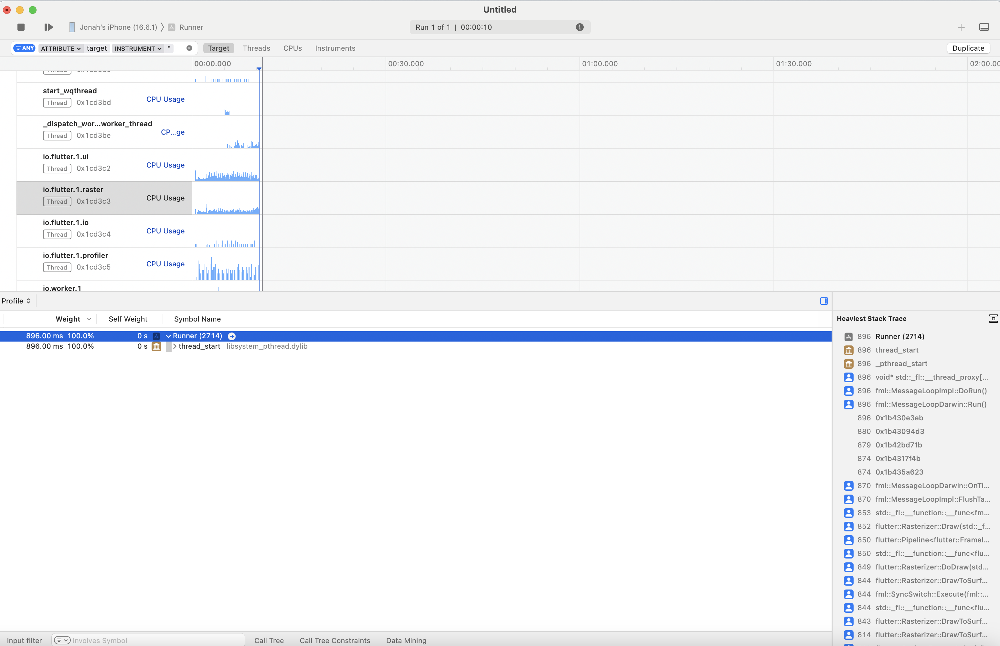
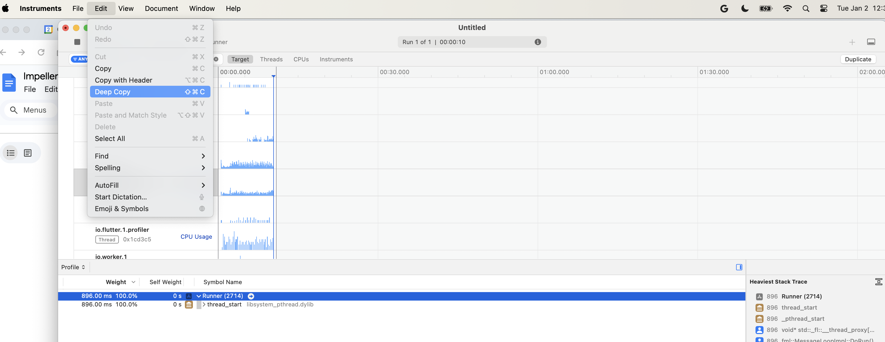
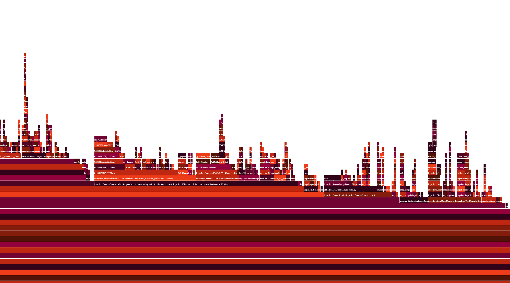

# iOS CPU Profiling

XCode has a number of built in profiling tools that can easily be used with local or prebuilt engines. This document is focused on creating flame graph charts, which is not a part of XCode but provides a useful way to look at aggregate performance. Compared to the Android Studio flame graph this one is a little wonky, but still useful.

1. Clone the "FlameGraph" swift package from `https://github.com/lennet/FlameGraph`
2. Start a "Time Profiler" based profile session.

  Click the red dot to begin and record as much profile data as you want, then press stop to conclude the trace.

3. Select the thread to investigate, in this case you want io.flutter.raster. IMPORTANT: also select the trace root.

4. Copy the trace with the keyboard shortcut (⇧⌘C) or the menu ("Edit" -> "Deep Copy").

5. On the command line, run `swift run FlameGraph --html output.html`

A new browser tab will open with the flame graph. It may require some zooming to be useful.

