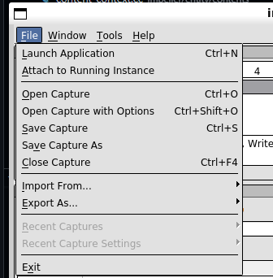

# Frame Capture with RenderDoc

[RenderDoc](https://renderdoc.org/) is a graphics debugger that can be used to capture frames. With Impeller starting to support gles and Vulkan backends, RenderDoc can provide insights into the application's frames.

1. First step is to set up RenderDoc. Follow the instructions [here](https://renderdoc.org/docs/getting_started/quick_start.html). For the purposes of this guide it is assumed that you are able to get RenderDoc running.
2. The next step would be to run the application you wish the capture the frames of. Typically these would be one of the playground tests. To build these, do:

```bash
# In your $ENGINE_SRC folder, do:

./flutter/tools/gn --unopt --no-lto --enable-impeller-playground\
   --target-dir host_debug_impeller_vulkan
autoninja -C out/host_debug_impeller_vulkan/
```

3. Start RenderDoc, and click the "Launch Application" button.



4. Fill out the following parameters, and click launch:
  - executable: `$ENGINE_SRC/out/host_debug_impeller_vulkan/impeller_unittests` (expand `ENGINE_SRC`).
  - args: `--gtest_filter="*CanDrawRect/Vulkan*"`
  - working dir: `$ENGINE_SRC` (expand `ENGINE_SRC`)

5. For the frame you wish to capture, press `F12`, you will now be able to see the frame capture and inspect the state.


