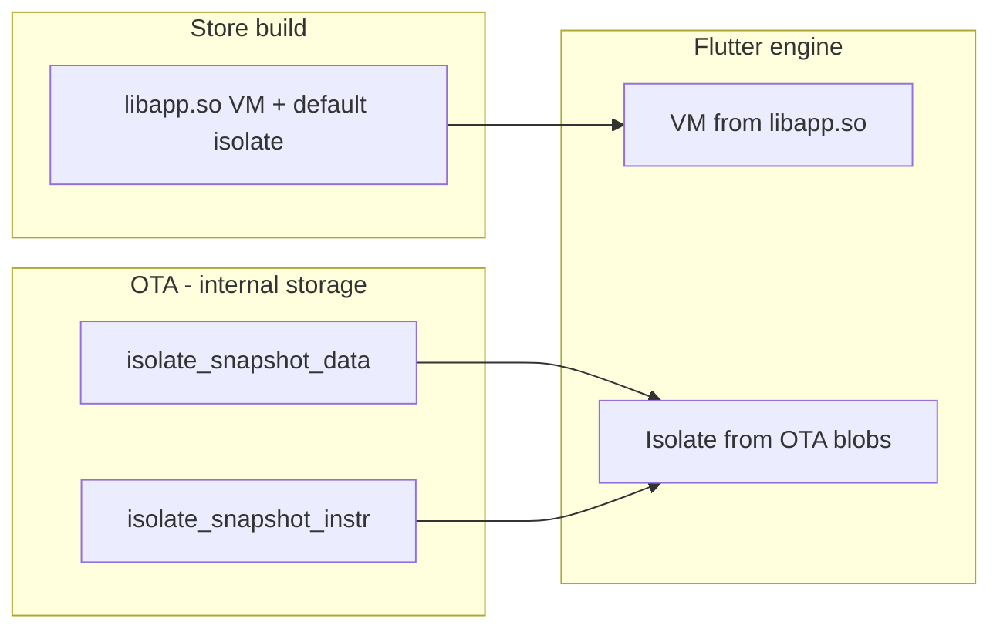

# Flutter OTA Code Push (Dart Isolate Snapshots)

Over-the-air updates for **Dart application code only** on Android and iOS. Patches replace the application **isolate AOT snapshot** (`isolate_snapshot_data` + `isolate_snapshot_instr`). The store-shipped native libraries (`libapp.so`, `App.framework`, `libflutter.so`) are **never** downloaded or replaced.

This requires a **custom Flutter engine** built from this repository plus the `flutter_code_push` plugin in your app.

**Want a walkthrough of every source file?** See [docs/code_push/CODE_README.md](../../docs/code_push/CODE_README.md).

---

## Table of contents

1. [How it works](#how-it-works)
2. [Repository layout](#repository-layout)
3. [Prerequisites](#prerequisites)
4. [Build the custom engine](#build-the-custom-engine)
5. [Integrate into your app](#integrate-into-your-app)
6. [Run the example app](#run-the-example-app)
7. [Create and publish a patch](#create-and-publish-a-patch)
8. [Patch server API](#patch-server-api)
9. [Runtime storage paths](#runtime-storage-paths)
10. [Engine implementation details](#engine-implementation-details)
11. [Limitations and policy notes](#limitations-and-policy-notes)
12. [Comparison with Shorebird](#comparison-with-shorebird)
13. [Troubleshooting](#troubleshooting)

---

## How it works

### Release build (store)

```
APK / IPA
├── libflutter.so          ← engine (unchanged by code push)
├── libapp.so              ← VM snapshot + default isolate (bundled)
└── assets/...
```

### After OTA patch (next cold start)

```
Internal storage (app-private)
└── code_push/active/
    ├── isolate_snapshot_data    ← OTA Dart heap snapshot
    ├── isolate_snapshot_instr   ← OTA Dart AOT instructions
    └── patch_manifest.json      ← metadata + sizes
```

On startup the engine:

1. Loads the **VM** from the bundled `libapp.so` (same as stock Flutter).
2. Loads the **application isolate** from the OTA blob files (if present and valid).
3. Falls back to the bundled isolate inside `libapp.so` if no patch is active.



### Update flow (in-app)

1. App calls `CodePushUpdater.checkForUpdate()` → your API returns patch metadata.
2. `downloadPatch()` → downloads both blobs, verifies SHA-256, writes to `code_push/staging/`.
3. `applyStagedPatch()` → moves staging → `code_push/active/`.
4. User **fully quits and reopens** the app (cold start).
5. Engine picks up blobs from `active/` automatically.

---

## Repository layout

| Path | Purpose |
|------|---------|
| `packages/flutter_code_push/` | Dart plugin + Android/iOS updaters + CLI |
| `packages/flutter_code_push/tool/code_push.dart` | Extract blobs from `app.so`, package artifacts |
| `examples/code_push_example/` | Minimal integration sample |
| `docs/code_push/README.md` | Custom engine setup and platform build commands |
| **Engine** | |
| `engine/src/flutter/shell/common/switches.cc` | Isolate snapshot paths when using `libapp.so` |
| `engine/src/flutter/shell/common/code_push_config.h` | Shared directory/blob names |
| `engine/.../loader/CodePushSnapshotResolver.java` | Resolve active patch on Android |
| `engine/.../loader/FlutterLoader.java` | Pass `--isolate-snapshot-*` flags |
| `engine/.../FlutterEngineFlags.java` | `ISOLATE_SNAPSHOT_INSTR` flag |
| `engine/.../FlutterDartProject.mm` | Resolve active patch on iOS |

---

## Prerequisites

- Flutter SDK from **this** repo (not only stock stable, unless you merge engine changes upstream).
- Ability to build the Flutter engine (`et` / `ninja`; see [engine README](https://github.com/flutter/flutter/blob/master/engine/README.md)).
- Android: NDK/toolchain as required by engine docs.
- macOS + Xcode for iOS engine and device builds.
- Patch CDN + API you control (HTTPS strongly recommended).

---

## Build the custom engine

Engine changes must be compiled before `--local-engine` apps can load OTA snapshots.

1. Set up the engine development environment (depot_tools, `gclient sync`, etc.) per `engine/README.md`.

2. Build host + target artifacts, for example:

   ```bash
   cd engine/src
   # Example — adjust config names for your host/target (see engine ci builders)
   et build -c android_release_arm64
   et build -c ios_release
   ```

3. Note the output directory for your config (e.g. `out/android_release_arm64`).

4. Run your app against that engine:

   ```bash
   flutter run --release \
     --local-engine=android_release_arm64 \
     --local-engine-host=host_release
   ```

   Use the iOS/Android config names that match your `et` build.

Without this custom engine, isolate snapshot override flags are ignored in release AOT mode.

---

## Integrate into your app

### 1. Add the dependency

```yaml
# pubspec.yaml
dependencies:
  flutter_code_push:
    path: ../packages/flutter_code_push   # adjust path to this repo
```

Run `flutter pub get`.

### 2. Use the updater (Dart)

```dart
import 'package:flutter_code_push/flutter_code_push.dart';

final CodePushUpdater updater = CodePushUpdater();

Future<void> checkForCodePushUpdate() async {
  const String releaseVersion = '1.0.0+1'; // must match store build
  final Uri checkUrl = Uri.parse('https://your-api.example.com/v1/patches');

  final UpdateCheckResult result = await updater.checkForUpdate(
    checkUrl: checkUrl,
    releaseVersion: releaseVersion,
  );

  if (!result.hasUpdate || result.availablePatch == null) {
    return;
  }

  await updater.downloadPatch(result.availablePatch!);
  await updater.applyStagedPatch();

  // Show UI: "Update ready — restart the app to apply."
}
```

**Do not** block app launch on the network call; check in the background after the first frame.

### 3. Optional: clear patch (rollback)

```dart
await updater.clearActivePatch();
// Cold restart → bundled isolate from libapp.so is used again.
```

### 4. Platform notes

- **Android**: Blobs must end up under `context.getFilesDir()/code_push/active/` (the plugin handles this). Engine only accepts paths under internal storage.
- **iOS**: Blobs live under `Documents/code_push/active/`. Validate App Store policy for your distribution model.

---

## Run the example app

```bash
cd examples/code_push_example

flutter run --release \
  --local-engine=<your_engine> \
  --local-engine-host=<your_host_engine> \
  --dart-define=CODE_PUSH_CHECK_URL=https://your-api.example.com/v1/patches \
  --dart-define=CODE_PUSH_RELEASE_VERSION=1.0.0+1
```

The example UI can check, download, stage, and clear patches. Point `CODE_PUSH_CHECK_URL` at a server implementing the [patch API](#patch-server-api).

---

## Create and publish a patch

### Step 1 — Ship a store release

Build and upload to Play Store / App Store using the **same custom engine** you will use for patches:

```bash
flutter build apk --release \
  --local-engine=android_release_arm64 \
  --local-engine-host=host_release

# iOS
flutter build ipa --release \
  --local-engine=ios_release \
  --local-engine-host=host_release
```

Record `release_version` (e.g. `1.0.0+1`) — patches are tied to this version.

### Step 2 — Make Dart changes

Change only Dart code (no new plugins with native code, no asset-only fixes that require store assets, etc.).

### Step 3 — Rebuild and extract isolate blobs

Android (`app.so` path varies by ABI; find yours under `build/app/intermediates/flutter/`):

```bash
dart run packages/flutter_code_push/tool/code_push.dart extract \
  --elf build/app/intermediates/flutter/release/arm64-v8a/app.so \
  --output build/code_push/patch_work

dart run packages/flutter_code_push/tool/code_push.dart artifact \
  --isolate-data build/code_push/patch_work/isolate_snapshot_data \
  --isolate-instr build/code_push/patch_work/isolate_snapshot_instr \
  --release-version 1.0.0+1 \
  --patch-number 1 \
  --output build/code_push/patch_1
```

`extract` uses `nm` to read `kDartIsolateSnapshotData` / `kDartIsolateSnapshotInstructions` from the ELF. Requires `nm` on your PATH (macOS/Linux).

Repeat for each ABI you ship (`armeabi-v7a`, `arm64-v8a`, `x86_64`) with separate blob sets or ABI-specific CDN paths.

### Step 4 — Upload to CDN

Upload from `build/code_push/patch_1/`:

- `isolate_snapshot_data`
- `isolate_snapshot_instr`

Serve over HTTPS. Put URLs and hashes in your patch API response (see below).

### Step 5 — Clients download and restart

Apps on `release_version` `1.0.0+1` with `current_patch < 1` receive the new manifest, download blobs, and apply after restart.

---

## Patch server API

### Check for update

**Request**

```http
GET /v1/patches?release_version=1.0.0+1&current_patch=0
```

| Query param | Description |
|-------------|-------------|
| `release_version` | Must match the installed store build |
| `current_patch` | Optional; highest patch already applied |

**Response — up to date**

```http
HTTP/1.1 204 No Content
```

**Response — patch available**

```http
HTTP/1.1 200 OK
Content-Type: application/json
```

```json
{
  "patch_number": 1,
  "release_version": "1.0.0+1",
  "data_download_url": "https://cdn.example.com/patches/1.0.0+1/1/isolate_snapshot_data",
  "instr_download_url": "https://cdn.example.com/patches/1.0.0+1/1/isolate_snapshot_instr",
  "isolate_data_sha256": "hex-sha256-of-data-blob",
  "isolate_instr_sha256": "hex-sha256-of-instr-blob",
  "isolate_data_length_bytes": 1234567,
  "isolate_instr_length_bytes": 8901234,
  "enabled": true
}
```

Field names match `PatchInfo` in `lib/src/models/patch_info.dart`.

### On-device manifest (`patch_manifest.json`)

Written by the plugin when a patch is staged/applied:

```json
{
  "patch_number": 1,
  "release_version": "1.0.0+1",
  "isolate_data_sha256": "...",
  "isolate_instr_sha256": "...",
  "isolate_data_length_bytes": 1234567,
  "isolate_instr_length_bytes": 8901234,
  "enabled": true
}
```

---

## Runtime storage paths

| Platform | Active patch directory |
|----------|------------------------|
| Android | `{filesDir}/code_push/active/` |
| iOS | `{Documents}/code_push/active/` |

| File | Description |
|------|-------------|
| `isolate_snapshot_data` | Application isolate heap snapshot |
| `isolate_snapshot_instr` | Application isolate AOT instructions |
| `patch_manifest.json` | Version, hashes, sizes, `enabled` flag |

Staging uses `code_push/staging/` until `applyStagedPatch()` promotes to `active/`.

---

## Engine implementation details

### Android (`FlutterLoader`)

In release mode, before default `libapp.so` arguments:

1. `CodePushSnapshotResolver.resolveActiveIsolateSnapshotPaths()` reads `active/patch_manifest.json` and both blobs.
2. If valid, inserts at the front of shell args:
   - `--isolate-snapshot-data=<canonical-path>`
   - `--isolate-snapshot-instr=<canonical-path>`
3. Default `--aot-shared-library-name=libapp.so` remains for VM resolution.

### iOS (`FlutterDartProject.mm`)

If both blobs exist under `Documents/code_push/active/`, sets:

- `settings.isolate_snapshot_data_path`
- `settings.isolate_snapshot_instr_path`

Bundled `App.framework` remains on `application_library_paths` for VM / fallback.

### C++ (`switches.cc`)

When `aot-shared-library-name` is set (normal release), isolate snapshot CLI flags are still applied. Absolute paths (leading `/`) are used as-is; relative paths join `snapshot-asset-path` if set.

### Dart API (`CodePushUpdater`)

| Method | Description |
|--------|-------------|
| `readCurrentPatchNumber()` | Active `patch_number` or `null` |
| `checkForUpdate(...)` | HTTP GET to your API |
| `downloadPatch(patch)` | Native download + SHA-256 verify + stage |
| `applyStagedPatch()` | Promote staging → active |
| `clearActivePatch()` | Remove OTA blobs |
| `downloadUpdateIfAvailable(...)` | Check + download convenience |

Platform channel: `dev.flutter.codepush/updater`.

---

## Limitations and policy notes

1. **Cold start only** — no hot reload / in-process swap in release.
2. **Same Flutter engine / SDK** — patch `app.so` must be built with the same engine as the store release.
3. **No arbitrary cross-release mixing** — isolate blobs from a full recompile are not linked against the old base (unlike Shorebird). Test patches on real devices.
4. **Dart-only** — native code, new plugins with JNI, Gradle/Pod changes, and many asset updates need a store build.
5. **Multi-ABI Android** — ship per-ABI blob pairs or one API that selects ABI.
6. **Play / App Store** — you are not replacing `libapp.so`, but `isolate_snapshot_instr` is still executable machine code. Review [Google Play](https://support.google.com/googleplay/android-developer/answer/9888379) and [Apple guidelines](https://developer.apple.com/app-store/review/guidelines/) for your use case. This doc is not legal advice.
7. **Security** — plugin verifies SHA-256 only; add TLS, signing, and rollout controls in production.

---

## Comparison with Shorebird

| | This project | Shorebird |
|---|--------------|-----------|
| Native `.so` OTA | No | No (uses custom snapshots) |
| Dart VM fork / linker | No (stock `gen_snapshot`) | Yes |
| Patch size | Full isolate blobs | Optimized diffs / linking |
| iOS strategy | AOT isolate blobs | Interpreter + linking |
| Integration | Custom engine + plugin | `shorebird` CLI + hosted service |

To approach Shorebird-level safety and size, you would fork `third_party/dart` and extend `gen_snapshot` — out of scope for this MVP.

---

## Troubleshooting

| Symptom | Likely cause |
|---------|----------------|
| Patch ignored after restart | Stock engine (no `switches.cc` change); paths not under internal storage (Android) |
| Crash on startup with patch | Blob from wrong ABI, wrong Flutter version, or incompatible `gen_snapshot` output |
| `extract` fails | `nm` missing; wrong `app.so` path; symbols stripped from `libapp.so` |
| Download fails | Bad URL, TLS, or SHA-256 / size mismatch |
| Still on old Dart code | Warm restart only — need **full process kill** |
| iOS patch not loaded | Files not in `Documents/code_push/active/`; missing custom engine |

Enable engine logging and verify shell args contain `--isolate-snapshot-data=` pointing at your active files (Android logcat: `FlutterLoader`).

---

## CLI reference

```bash
# Extract isolate blobs from release app.so
dart run packages/flutter_code_push/tool/code_push.dart extract \
  --elf <path-to-app.so> \
  --output <dir>

# Package blobs + manifest for upload
dart run packages/flutter_code_push/tool/code_push.dart artifact \
  --isolate-data <path> \
  --isolate-instr <path> \
  --release-version <version> \
  --patch-number <n> \
  --output <dir>

dart run packages/flutter_code_push/tool/code_push.dart help
```

---

## License

Same as the Flutter project (BSD-style). Engine files retain Flutter copyright headers.
