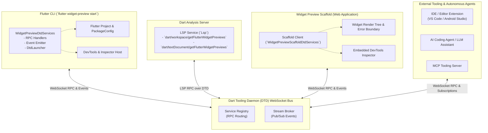
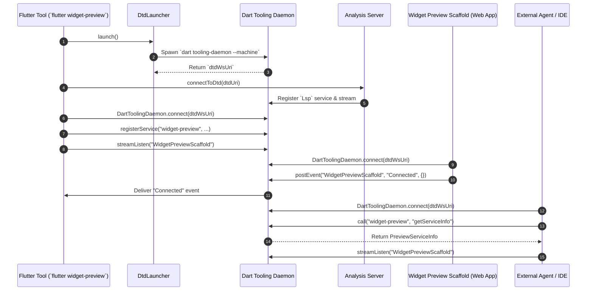
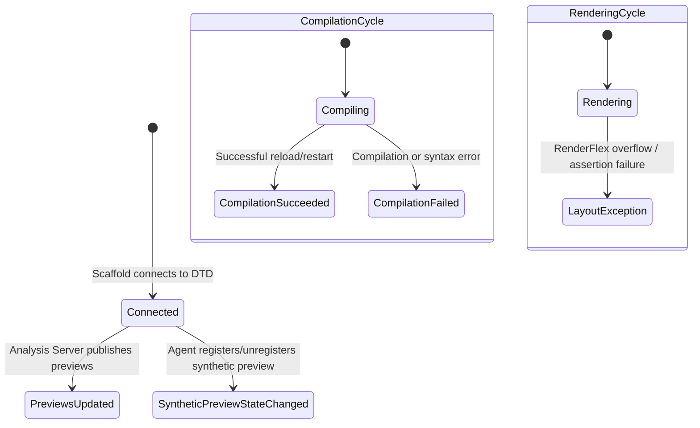
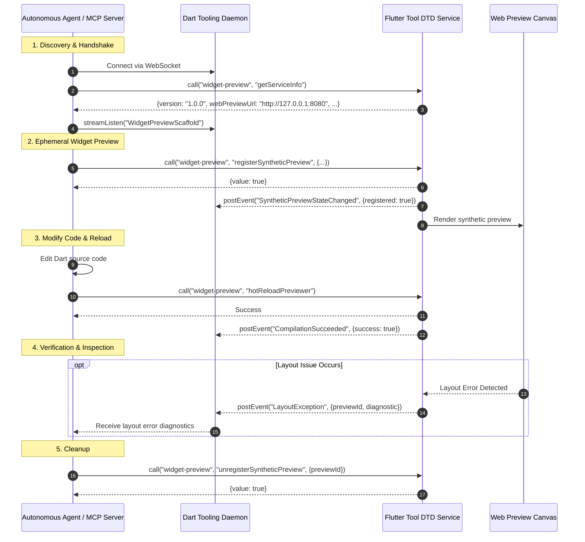

# Dart Tooling Daemon (DTD) Services & RPC Protocol for Widget Preview

## Overview

The Flutter Widget Preview environment provides a real-time, isolated runtime canvas for previewing and iterating on Flutter UI components. To enable seamless bidirectional communication between the preview runner, the host Flutter CLI tool, the Dart Analysis Server, IDEs, and autonomous AI agents (such as MCP servers and coding assistants), Flutter uses the **Dart Tooling Daemon (DTD)**.

DTD serves as a centralized WebSocket-based RPC and event pub/sub bus. The widget preview subsystem registers dedicated DTD services and streams under the `WidgetPreview` and `WidgetPreviewScaffold` domains.

### Source References
- Host DTD service implementation: [`packages/flutter_tools/lib/src/widget_preview/dtd_services.dart`](file:///usr/local/google/home/bkonyi/.gemini/jetski/worktrees/flutter/enable_widget_preview_agents/packages/flutter_tools/lib/src/widget_preview/dtd_services.dart)
- Type definitions and serialization schemas: [`packages/flutter_tools/lib/src/widget_preview/dtd_types.dart`](file:///usr/local/google/home/bkonyi/.gemini/jetski/worktrees/flutter/enable_widget_preview_agents/packages/flutter_tools/lib/src/widget_preview/dtd_types.dart)
- Scaffold-side DTD client: [`packages/flutter_tools/templates/widget_preview_scaffold/lib/src/dtd/dtd_services.dart.tmpl`](file:///usr/local/google/home/bkonyi/.gemini/jetski/worktrees/flutter/enable_widget_preview_agents/packages/flutter_tools/templates/widget_preview_scaffold/lib/src/dtd/dtd_services.dart.tmpl)
- Hermetic test suite: [`packages/flutter_tools/test/commands.shard/hermetic/widget_preview/dtd_services_test.dart`](file:///usr/local/google/home/bkonyi/.gemini/jetski/worktrees/flutter/enable_widget_preview_agents/packages/flutter_tools/test/commands.shard/hermetic/widget_preview/dtd_services_test.dart)

---

## 1. Architecture & Lifecycle

### Component Architecture



### Service Identification & UUID Namespacing

To avoid collision when multiple widget preview sessions or projects are connected to the same shared DTD instance, the preview service and stream names optionally include an isolated UUID:

- **Service Name**: `widget-preview` (or `widget-preview-<UUID>` when `addUuidToServiceName` is enabled).
- **Stream Name**: `WidgetPreviewScaffold` (or `WidgetPreviewScaffold-<UUID>`).

When launching `flutter widget-preview start`, the `--disable-dtd-service-uuid` flag can be specified to pin the service and stream names strictly to the root strings `widget-preview` and `WidgetPreviewScaffold`.

### Connection & Bootstrapping Sequence



---

## 2. `WidgetPreview` DTD Service Endpoints

All methods are registered under the service name `widget-preview` (or `widget-preview-<UUID>`). Clients invoke these methods via standard JSON-RPC 2.0 through DTD (`dtd.call(serviceName, methodName, params: ...)`).

### Protocol Metadata

| Constant | Value | Description |
|---|---|---|
| `kProtocolVersion` | `"1.0.0"` | Current protocol schema version. |
| `kNoValueForKey` | `200` | Error code returned when a requested key does not exist. |

---

### Endpoint Reference

#### 1. `getServiceInfo`
Retrieves discovery metadata and status regarding the active widget preview service, DTD endpoint, and web runtime.

- **Method**: `getServiceInfo`
- **Parameters**: None (`{}`)
- **Response**: [`PreviewServiceInfo`](#previewserviceinfo)

```json
{
  "dtdUri": "ws://127.0.0.1:42135/xyz123=",
  "serviceName": "widget-preview",
  "version": "1.0.0",
  "webPreviewUrl": "http://127.0.0.1:8080"
}
```

---

#### 2. `getWebPreviewUrl`
Returns the network endpoint where the widget preview web application is currently being served.

- **Method**: `getWebPreviewUrl`
- **Parameters**: None (`{}`)
- **Response**: [`WebPreviewUrlResult`](#webpreviewurlresult)
- **Error Codes**: Throws `RpcException` code `200` if the web preview server URL is not yet ready or unavailable.

```json
{
  "host": "127.0.0.1",
  "port": 8080,
  "url": "http://127.0.0.1:8080"
}
```

---

#### 3. `hotReloadPreviewer`
Triggers an incremental compilation and hot reload of the running widget preview scaffold. Useful when source code files have been modified.

- **Method**: `hotReloadPreviewer`
- **Parameters**: None (`{}`)
- **Response**: `Success` (`{"type": "Success"}`)

```json
{
  "type": "Success"
}
```

---

#### 4. `hotRestartPreviewer`
Triggers a full rebuild and hot restart of the preview application state.

- **Method**: `hotRestartPreviewer`
- **Parameters**: None (`{}`)
- **Response**: `Success` (`{"type": "Success"}`)

```json
{
  "type": "Success"
}
```

---

#### 5. `registerSyntheticPreview`
Dynamically registers an ephemeral widget preview without requiring an explicit `@Preview` annotation in user source code. Enables AI agents and tools to preview ad-hoc configurations or constructor calls on the fly.

- **Method**: `registerSyntheticPreview`
- **Parameters**: [`SyntheticPreviewDetails`](#syntheticpreviewdetails)

| Parameter | Type | Required | Description |
|---|---|---|---|
| `constructorExpression` | `String` | Yes | Dart instantiation expression (e.g. `PrimaryButton(label: 'Submit')`). |
| `filePath` | `String` | Yes | Absolute path to the source file where the widget class is declared. |
| `previewId` | `String` | Yes | Unique identifier assigned to this synthetic preview. |
| `widgetName` | `String` | Yes | Name of the widget class. |
| `wrappers` | `List<String>` | No | Wrapper widgets to apply around the preview (e.g. `["Material", "Directionality"]`). Default is `[]`. |

- **Response**: `BoolResponse` (`{"type": "BoolResponse", "value": true}`)
- **Side Effect**: Emits a [`SyntheticPreviewStateChanged`](#5-syntheticpreviewstatechanged) event with `registered: true` on the `WidgetPreviewScaffold` stream.

```json
// Request Params
{
  "constructorExpression": "CustomCard(title: 'Agent Test', elevation: 4.0)",
  "filePath": "/path/to/project/lib/card.dart",
  "previewId": "agent_preview_card_01",
  "widgetName": "CustomCard",
  "wrappers": ["Material"]
}

// Response
{
  "type": "BoolResponse",
  "value": true
}
```

---

#### 6. `unregisterSyntheticPreview`
Removes a previously registered synthetic preview by its unique preview identifier.

- **Method**: `unregisterSyntheticPreview`
- **Parameters**:

| Parameter | Type | Required | Description |
|---|---|---|---|
| `previewId` | `String` | Yes | The identifier of the synthetic preview to remove. |

- **Response**: `BoolResponse` (`{"type": "BoolResponse", "value": true}`)
- **Side Effect**: Emits a [`SyntheticPreviewStateChanged`](#5-syntheticpreviewstatechanged) event with `registered: false` on the `WidgetPreviewScaffold` stream.

```json
// Request Params
{
  "previewId": "agent_preview_card_01"
}

// Response
{
  "type": "BoolResponse",
  "value": true
}
```

---

#### 7. `clearSyntheticPreviews`
Purges all registered synthetic previews simultaneously.

- **Method**: `clearSyntheticPreviews`
- **Parameters**: None (`{}`)
- **Response**:

| Field | Type | Description |
|---|---|---|
| `clearedCount` | `int` | The number of synthetic previews cleared. |

```json
{
  "clearedCount": 3
}
```

---

#### 8. `isWindows`
Checks whether the host operating system executing the Flutter CLI is Windows (for filesystem path separators and platform behaviors).

- **Method**: `isWindows`
- **Parameters**: None (`{}`)
- **Response**: `BoolResponse` (`{"type": "BoolResponse", "value": false}`)

---

#### 9. `resolveUri`
Resolves a `package:` URI into an absolute `file://` URI using the host project's `PackageConfig`.

- **Method**: `resolveUri`
- **Parameters**:

| Parameter | Type | Required | Description |
|---|---|---|---|
| `uri` | `String` | Yes | The URI to resolve (e.g. `package:my_app/src/widget.dart`). |

- **Response**: `StringResponse` (`{"type": "StringResponse", "value": "file:///path/to/my_app/lib/src/widget.dart"}`)

---

#### 10. `setPreference` / `getPreference`
Persists and retrieves arbitrary UI or tool preferences in a local JSON storage cache.

- **`setPreference`**:
  - Parameters: `key` (`String`), `value` (`Object?`)
  - Response: `Success`
- **`getPreference`**:
  - Parameters: `key` (`String`)
  - Response: `StringResponse` or `BoolResponse`
  - Error Codes: Throws `RpcException` code `200` (`kNoValueForKey`) if the key is not stored.

---

#### 11. `getDevToolsUri`
Returns the active DevTools URI configured to embed the Widget Inspector targeting the preview application.

- **Method**: `getDevToolsUri`
- **Parameters**: None (`{}`)
- **Response**: `StringResponse` (`{"type": "StringResponse", "value": "http://127.0.0.1:9100/inspector?embedMode=one&uri=..."}`)

---

## 3. Event Stream Subscriptions (`WidgetPreviewScaffold`)

Clients subscribe to the `WidgetPreviewScaffold` stream (or `WidgetPreviewScaffold-<UUID>`) using `dtd.streamListen(streamName)` and listen for incoming `DTDEvent` notifications.



### Event Catalog

| Event Kind | Description | Payload Schema |
|---|---|---|
| `Connected` | Fired by the web preview scaffold once initialized and connected to DTD. | `{}` |
| `LayoutException` | Fired when a widget layout failure or render exception occurs inside the preview canvas. | `{"previewId": String, "diagnostic": Map<String, Object?>}` |
| `CompilationSucceeded` | Fired after a successful compilation/reload cycle. | `{"success": true, "durationMs": int?}` |
| `CompilationFailed` | Fired when compilation or build fails. | `{"success": false, "error": String?, "durationMs": int?}` |
| `PreviewsUpdated` | Fired when the set of available widget previews changes. | `{"count": int, "previews": List<Map<String, Object?>>}` |
| `SyntheticPreviewStateChanged` | Fired when a synthetic preview is registered or unregistered. | `{"previewId": String, "registered": bool}` |

---

### Detailed Event Payloads

#### 1. `Connected`
Indicates that the web scaffold client has established its DTD connection and is ready for commands.

```json
{
  "stream": "WidgetPreviewScaffold",
  "event": "Connected",
  "data": {}
}
```

#### 2. `LayoutException`
Transmits diagnostic details about layout issues (e.g. unbounded height, RenderFlex overflow) captured by the previewer error boundary.

```json
{
  "stream": "WidgetPreviewScaffold",
  "event": "LayoutException",
  "data": {
    "previewId": "agent_preview_card_01",
    "diagnostic": {
      "summary": "A RenderFlex overflowed by 42 pixels on the bottom.",
      "renderedWidth": 320.0,
      "renderedHeight": 480.0
    }
  }
}
```

#### 3. `CompilationSucceeded` / `CompilationFailed`
Signals the status of incremental builds initiated via hot reload or hot restart.

```json
// CompilationSucceeded
{
  "stream": "WidgetPreviewScaffold",
  "event": "CompilationSucceeded",
  "data": {
    "success": true,
    "durationMs": 142
  }
}

// CompilationFailed
{
  "stream": "WidgetPreviewScaffold",
  "event": "CompilationFailed",
  "data": {
    "success": false,
    "durationMs": 310,
    "error": "lib/card.dart:24:5: Error: The getter 'invalidProperty' isn't defined for the class 'CardTheme'."
  }
}
```

#### 4. `PreviewsUpdated`
Provides a list of all active preview declarations discovered in the workspace or file.

```json
{
  "stream": "WidgetPreviewScaffold",
  "event": "PreviewsUpdated",
  "data": {
    "count": 1,
    "previews": [
      {
        "functionName": "previewCustomCard",
        "hasError": false,
        "dependencyHasErrors": false,
        "isBuilder": false,
        "isMultiPreview": false,
        "packageName": "my_app",
        "position": {"character": 0, "line": 42},
        "previewAnnotation": "Preview()",
        "scriptUri": "file:///path/to/lib/card.dart",
        "libraryUri": "package:my_app/card.dart"
      }
    ]
  }
}
```

#### 5. `SyntheticPreviewStateChanged`
Notifies listeners when a dynamic preview is added or removed.

```json
{
  "stream": "WidgetPreviewScaffold",
  "event": "SyntheticPreviewStateChanged",
  "data": {
    "previewId": "agent_preview_card_01",
    "registered": true
  }
}
```

---

## 4. Type-Safe Data Structures & Schemas

The following classes are defined in [`dtd_types.dart`](file:///usr/local/google/home/bkonyi/.gemini/jetski/worktrees/flutter/enable_widget_preview_agents/packages/flutter_tools/lib/src/widget_preview/dtd_types.dart) and provide bidirectional JSON serialization:

### `SyntheticPreviewDetails`
Encapsulates all metadata required to dynamically instantiate and render a widget without modifying user source code.

```dart
class SyntheticPreviewDetails {
  const SyntheticPreviewDetails({
    required this.constructorExpression,
    required this.filePath,
    required this.previewId,
    required this.widgetName,
    this.wrappers = const <String>[],
  });

  final String constructorExpression;
  final String filePath;
  final String previewId;
  final String widgetName;
  final List<String> wrappers;
}
```

### `WebPreviewUrlResult`
Specifies connection coordinates for the previewer HTTP web server.

```dart
class WebPreviewUrlResult {
  const WebPreviewUrlResult({
    required this.host,
    required this.port,
    required this.url,
  });

  final String host;
  final int port;
  final String url;
}
```

### `PreviewServiceInfo`
Metadata payload returned by `getServiceInfo`.

```dart
class PreviewServiceInfo {
  const PreviewServiceInfo({
    required this.dtdUri,
    required this.serviceName,
    required this.version,
    this.webPreviewUrl,
  });

  final String dtdUri;
  final String serviceName;
  final String version;
  final String? webPreviewUrl;
}
```

### `FlutterWidgetPreviews` & `FlutterWidgetPreviewDetails`
Data models returned by the Analysis Server LSP endpoints (`dart/workspace/getFlutterWidgetPreviews` and `dart/textDocument/getFlutterWidgetPreviews`).

---

## 5. Integration Guide: IDEs, AI Agents, & MCP Servers

### Autonomous AI Agent & MCP Server Workflow

AI agents interacting through an MCP server can preview changes and verify UI layouts autonomously:



### Best Practices for Integrations

1. **Service Name Resolution**:
   - Always query `dtd.getRegisteredServices()` or inspect `getServiceInfo` to handle instances with UUID suffixes (e.g. `widget-preview-4a8b...`).
2. **Headless Execution for CI & Agents**:
   - When running headless or inside automated containers, launch the previewer with:
     ```sh
     flutter widget-preview start --web-server --disable-dtd-service-uuid
     ```
3. **Resilient Event Handling**:
   - Always listen for `CompilationFailed` and `LayoutException` when triggering `hotReloadPreviewer` to quickly detect syntax errors or layout overflows.
4. **Synthetic Preview Teardown**:
   - Always call `unregisterSyntheticPreview` or `clearSyntheticPreviews` upon session completion to prevent stale preview entries from lingering in the previewer.
